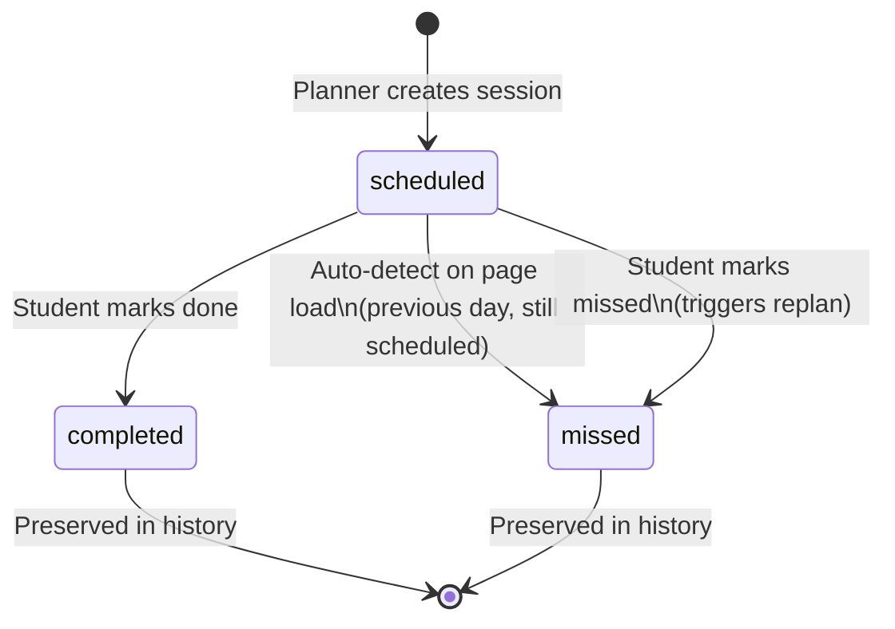

# Missed Sessions and Passed Exams

**What this covers:** How Pace handles study sessions that were never completed, and exams that have already taken place — preserving historical data while keeping the active plan focused on what is still ahead.

---

## Two Separate Concepts

These are often discussed together, but they are handled independently:

- **Missed sessions** — a scheduled study block that the student did not complete.
- **Passed exams** — an exam date that has gone by, whether or not the student was fully prepared.

Both situations require Pace to recognise a change and respond appropriately without disrupting the student's remaining plan or deleting useful history.

---

## Missed Study Sessions

### How previous-day sessions are detected as missed

Every time the Today page loads, Pace silently checks for any sessions that:
- Were scheduled on a **previous day** (before today's local midnight), and
- Are still marked as `scheduled` — meaning the student never tapped "Done" or "Missed."

Any sessions matching this description are automatically updated to `missed`. This happens before the page renders, so session cards always show an accurate status.

**This check is idempotent.** The next time the page loads, those sessions are already `missed`, so the check finds nothing and returns immediately. There is no double-processing.

### Why today's sessions are intentionally left alone

The auto-detection boundary is today's local midnight — not the current time of day.

A session scheduled for 9:00 AM is left as `scheduled` even if it is now 5:00 PM. This is deliberate:

- A student may have done the session late and simply not marked it done yet.
- A student might still intend to do it before the day ends.
- Automatically marking a session missed mid-afternoon removes the student's ability to record it as completed later.

Today's sessions remain `scheduled` until the student acts on them or until the next day, when they become eligible for auto-detection.

### Why missed sessions are preserved, not deleted

A missed session is never deleted from the database. Its status changes from `scheduled` to `missed`, and it remains in the student's history with its original date and time.

This serves two purposes:

1. **Plan generation context** — when Pace generates a new plan after a missed session, it knows which topics were scheduled but skipped and can account for them in the updated schedule.
2. **Historical record** — the student's plan page shows a complete picture of what happened, not just what is coming up.

### Example — a missed session

> A student had a Biology session scheduled for Monday at 4:00 PM. They forgot about it and didn't open the app until Tuesday morning.
>
> When they open Today on Tuesday, Pace silently marks Monday's Biology session as `missed`. The session appears in the Plan page history with a "Missed" badge. The student's schedule for Tuesday onwards is unchanged.
>
> If the student then explicitly marks Tuesday's Chemistry session as missed using the card, Pace runs a replan and generates a new schedule. The Biology session from Monday is not re-scheduled — it is recorded as missed history.

---

## Passed Exams

### Kept in the database

When an exam date passes, the subject and its exam date remain in the database exactly as stored. Nothing is deleted or archived. The student can still see that subject on their Subjects page and continue to adjust its difficulty and confidence values.

### Excluded from the upcoming exam widget

The Today page shows a countdown widget for the student's next exam. This widget only queries for exam dates that are **on or after today's date**. Subjects with past exam dates do not appear in the widget, so the student is never shown a countdown to an exam they have already sat.

### Excluded from urgency calculations

The priority formula that drives recommendations multiplies three factors: difficulty, confidence inverse, and urgency. Urgency is based on days until the exam.

When an exam date has passed:
- The days-until-exam value is negative.
- Pace explicitly treats any negative value as urgency **1** — the same as a subject with no exam date at all.

This means a subject whose exam was last week does not get artificially elevated priority. It competes on difficulty and confidence alone, which is the appropriate behaviour — the student may still want to study the subject, but the urgency of an imminent exam no longer applies.

> **Before this fix was added:** The code used `Math.max(1, days)` which silently turned -5 days into 1, and then 1 ≤ 7 triggered the highest urgency tier (10). A subject whose exam was last week was treated with the same urgency as one with an exam tomorrow. This has been corrected.

### Example — a passed exam

> A student had a History exam on 1 September. It is now 5 September.
>
> - The Today page's upcoming exam widget does not show History (exam date is in the past).
> - The recommendation engine calculates History's urgency as 1 — the same as if no exam date were set.
> - History remains in the student's subject list. Its difficulty (Hard) and confidence (35%) are still stored and still contribute to its priority via those two factors: Hard (3) × urgency (1) × confidence-inverse (35% → 4) = priority 12.
> - If History has the highest priority of all subjects, it may still be recommended — but because it is a hard, low-confidence subject, not because of an exam that has passed.

---

## Difference Between Historical Data and Active Planning

| | Historical data | Active planning |
|---|---|---|
| Missed sessions | Kept with `missed` status, visible in plan history | Not re-scheduled; inform future replan context |
| Completed sessions | Kept with `completed` status | Passed to plan generator to avoid re-scheduling |
| Past exam dates | Kept on the subject record | Excluded from upcoming exam widget; treated as urgency 1 |
| Scheduled sessions (future) | — | Only these are regenerated during a replan |

The separation is deliberate: history is immutable (statuses move forward, never back), while active planning only concerns what remains to be done.

---

## Session State Transitions

---

## Current Behavior Summary

| Situation | What Pace does |
|---|---|
| Session scheduled yesterday, never marked done | Auto-marked `missed` on Today page load |
| Session scheduled today, time has passed | Left as `scheduled` — student retains control |
| Missed session after auto-detection | Status updated; **no replan** |
| Student explicitly marks a session missed | Status updated; **replan triggered** |
| Exam date has passed | Kept in DB; excluded from upcoming widget; urgency = 1 |
| Past exam subject still in list | Can still be recommended based on difficulty + confidence only |

---

## Why This Matters

Students should not have to manually clean up their plan after a busy week. Pace handles the detection and status updates automatically, so the Plan and Today pages always reflect reality.

At the same time, Pace does not overreach. It does not silently replan the student's week without their knowledge, and it does not discard historical data that could be useful later. The student stays in control; Pace keeps the records clean.
