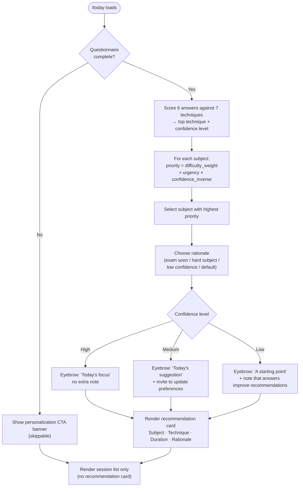

# The Personalized Today Page

**What this covers:** How Pace's Today page works, what it shows each student, and why it differs from a generic study checklist.

---

## What the Today Page Is For

The Today page is the student's daily starting point. It answers one question: **"What should I do right now?"**

A generic planner shows a list of tasks for the day. Pace's Today page goes further: it tells the student which subject to focus on, why, and exactly how to study it — based on what Pace knows about the student's subjects, confidence levels, exam timeline, and study style.

---

## What the Page Shows

When a student opens Today, they see up to four elements:

1. **Upcoming exam widget** — a countdown to the student's next exam (shown only when one is set and still in the future).
2. **Personalization prompt** — a one-time call to action to complete the study style questionnaire (shown only if the student hasn't done it and hasn't dismissed it).
3. **Recommendation card** — the main feature: what to study today and how.
4. **Session list** — the scheduled study sessions for today from the student's active plan.

---

## How Pace Decides What to Recommend

The recommendation is built from two layers of information:

### Layer 1 — Study style (from the questionnaire)

When a student completes the six-question personalization questionnaire, Pace scores their answers against seven evidence-based study techniques. The top-scoring technique becomes the one Pace recommends.

The questionnaire covers: focus span, current study habits, biggest challenge, goal, memory self-rating, and age group. See `docs/personalization-study-techniques.md` for the full technique catalog and scoring detail.

### Layer 2 — Subject priority (from difficulty, confidence, and exam dates)

Once Pace knows which technique fits the student, it needs to know which subject to apply it to. It ranks all the student's subjects using a priority formula:

```
priority = difficulty × confidence_inverse × urgency
```

The subject with the highest score becomes the recommended subject for today. The rationale shown on the card explains why that subject came out on top — whether it's an imminent exam, low confidence, or a particularly challenging subject.

See `docs/subject-intelligence.md` for the full priority formula and `docs/recommendation-decision-logic.md` for the end-to-end flow.



---

## The Recommendation Card

The recommendation card appears only when the student has completed the study style questionnaire and has at least one subject. It shows:

- **Eyebrow label** — a small line above the card that varies by how confident Pace is in the recommendation (see below).
- **Subject and technique** — e.g. "Chemistry — Active Recall"
- **Duration** — the student's preferred session length (set during onboarding: 25, 45, or 60 minutes)
- **Rationale** — one sentence explaining why this subject was chosen today
- **Session instruction** — a concrete description of exactly how to study for this session
- **Optional note** — additional context shown when Pace's confidence is medium or low

### How the rationale is chosen

Pace picks the most relevant explanation from three options:

| Signal | Rationale text |
|---|---|
| Exam ≤ 7 days away | "Chemistry is the highest priority today — the exam is very soon (3 days until the exam)." |
| Subject is Hard | "Physics is the highest priority today, as a challenging subject it benefits from regular attention." |
| Confidence below 50% | "Biology is the highest priority today — your confidence here is lower and focused practice will help." |
| None of the above | "English is the highest priority today." |

---

## How Confidence Level Changes the Card

Pace's scoring engine produces a confidence level (high, medium, or low) representing how clearly the student's answers point to one technique. This changes how the card is framed — not what is recommended, but how it is presented.

| Confidence level | Eyebrow label | Extra note shown? |
|---|---|---|
| High | "Today's focus" | No |
| Medium | "Today's suggestion" | Yes — invites the student to update preferences if it doesn't feel right |
| Low | "A starting point" | Yes — explains that recommendations sharpen as the student answers more questions |

A student who just answered all six questions clearly will see "Today's focus." A student whose answers were more ambiguous will see "Today's suggestion" with a soft prompt to revisit settings.

---

## The Session List

Below the recommendation, Today shows all scheduled study sessions for the current local day. Each session card shows the subject, topic, time range, and duration. Students can mark a session as done or missed directly from the card.

Sessions from previous days that were never marked done or missed are automatically marked as missed before the page loads — silently, with no notification. See `docs/missed-sessions-and-passed-exams.md` for how this works.

---

## How Today Differs From a Generic Checklist

| Generic planner | Pace Today |
|---|---|
| Shows all tasks for the day | Surfaces the highest-priority task first |
| Tells you what to do | Tells you what to do and exactly how to do it |
| Static — same structure for every student | Adapts to the student's subjects, confidence, and study style |
| No explanation for task ordering | Shows a rationale for every recommendation |
| Does not account for exam urgency | Exam countdown affects which subject surfaces first |

---

## Current Behavior

- The recommendation requires the personalization questionnaire to have been completed. Students who skip it do not see a recommendation card.
- The study technique shown is fixed to the student's top-scoring technique — it does not rotate daily.
- The recommendation does not include a specific topic within a subject, only the subject itself.
- The upcoming exam widget shows the **next** upcoming exam only (soonest date, excluding past exam dates).

---

## Why This Matters

A student who opens a blank planner each morning has to decide: which subject? How long? What should I actually do? That decision cost is real, and students routinely avoid studying because starting is hard.

The Today page removes those decisions. The student opens the app and sees one clear action, explained plainly. That lowers the barrier to starting — which is where most study sessions are won or lost.

---

## Example

A student named Priya has:
- Completed the questionnaire (top technique: Active Recall, high confidence)
- Three subjects: Chemistry (Hard, 20% confidence), English (Medium, 55% confidence), PE (Easy, 85% confidence)
- Chemistry exam in 9 days

What Priya sees on Today:

> **TODAY'S FOCUS**
> Chemistry — Active Recall · 45 min
>
> Chemistry is the highest priority today — the exam is very soon (9 days until the exam).
>
> *Close your notes. Write down everything you remember about the topic, then check. Repeat until you can recall it cleanly.*
