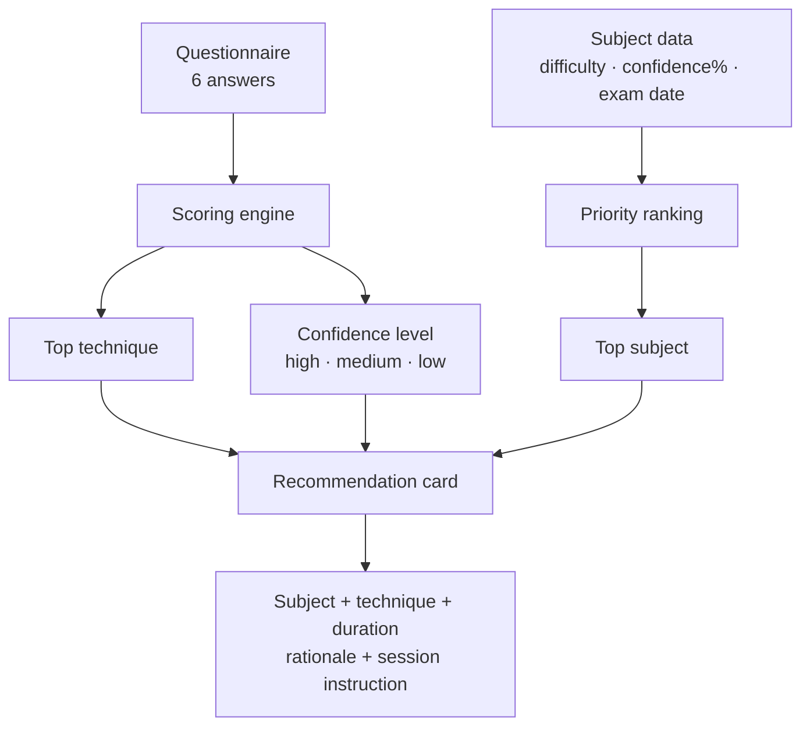

# Recommendation Decision Logic

**What this covers:** An end-to-end explanation of how Pace generates a study recommendation — from student data to the card shown on Today.

---

## The Flow at a Glance



```
Student data
  ├── Study style questionnaire (6 answers)
  │     └── Scoring engine
  │           ├── Top study technique  ──────────────────────────┐
  │           └── Confidence level (high / medium / low) ────────┤
  │                                                               │
  └── Subject data (for each subject)                            │
        ├── Difficulty (easy / medium / hard)                    │
        ├── Confidence % (0–100)                                 │
        └── Exam date (optional)                                 │
              └── Priority ranking                               │
                    └── Top subject ──────────────────────────────┤
                                                                  ▼
                                                  Recommendation card
                                                  ├── Subject name
                                                  ├── Study technique
                                                  ├── Duration
                                                  ├── Rationale
                                                  ├── Session instruction
                                                  └── Card framing (eyebrow + note)
```

---

## Step 1 — Study Style Questionnaire

The student answers six questions about how they study. The answers are scored against seven evidence-based study techniques:

| Technique | Best for |
|---|---|
| Active Recall | Memory, exam preparation |
| Spaced Repetition | Large fact sets, vocabulary |
| Practice Testing | Exam readiness, spotting gaps |
| Pomodoro | Focus problems, building habits |
| Deep Work | Complex understanding, long focus spans |
| Feynman Technique | Conceptual depth, passive learners |
| Interleaving | Managing many subjects, flexible recall |

Each answer contributes a weighted score to each technique. The scores are normalised to 0–100. The technique with the highest score becomes the student's **top technique** — the method Pace recommends in every session.

See `docs/personalization-study-techniques.md` for the full technique descriptions and weight matrix.

---

## Step 2 — Confidence Level

The scoring engine also produces a **confidence level** — how clearly the student's answers point toward one technique over the others.

| Level | Condition | What it means |
|---|---|---|
| High | Top score ≥ 55 and gap to second ≥ 15 | Strong, clear signal |
| Medium | Top score ≥ 35 | Reasonable signal |
| Low | Below medium threshold | Ambiguous answers |

The confidence level does not change which technique is recommended. It changes how the recommendation is presented (see Step 4).

---

## Step 3 — Subject Priority Ranking

Once Pace knows which technique to recommend, it needs to pick the subject. Every subject is scored using:

```
priority = difficulty_weight × urgency × confidence_inverse
```

### Difficulty weight

| Difficulty | Weight |
|---|---|
| Hard | 3 |
| Medium | 2 (default if not set) |
| Easy | 1 |

### Urgency (from exam date)

| Days until exam | Urgency |
|---|---|
| 7 or fewer | 10 |
| 8 – 14 | 7 |
| 15 – 30 | 5 |
| 31 – 60 | 3 |
| More than 60 / no date | 1 |
| Exam has already passed | 1 |

### Confidence inverse

| Student confidence | Weight |
|---|---|
| 0 – 20% | 5 |
| 21 – 40% | 4 |
| 41 – 60% | 3 |
| 61 – 80% | 2 |
| 81 – 100% | 1 |
| Not set | 2 (moderate default) |

All subjects are ranked by their priority score. The top subject is used for the recommendation.

---

## Step 4 — Recommendation Card

The recommendation card is assembled from the top subject and top technique:

| Card element | Source |
|---|---|
| Subject name | Highest-priority subject |
| Technique name | Student's top technique from scoring |
| Duration | Student's preferred session length (25 / 45 / 60 min) |
| Rationale | Rule-based: exam urgency → difficulty → confidence → default |
| Session instruction | Fixed per technique (e.g. "Close your notes. Write down everything you remember…") |
| Eyebrow label | Varies by confidence level (see below) |
| Optional note | Shown for medium and low confidence |

### Card framing by confidence level

| Confidence | Eyebrow | Note shown? |
|---|---|---|
| High | "Today's focus" | No |
| Medium | "Today's suggestion" | Yes — nudges student to update preferences if it feels wrong |
| Low | "A starting point" | Yes — explains that recommendations improve with more answers |

---

## How Passed Exams Are Handled

A subject whose exam date has already passed receives an urgency score of **1** — the same as a subject with no exam date. This prevents past exams from artificially inflating a subject's priority.

The subject is still included in the ranking and may still be recommended — but only because of its difficulty and confidence values, not because of an expired deadline.

---

## How Missed Sessions Are Handled

Missed sessions do not directly affect the recommendation. The recommendation system works entirely at the subject level — it ranks subjects, not individual sessions.

However, missed sessions affect the study plan (via adaptive replanning), and if a student's plan is replanned after a missed session, the new schedule reflects the updated context. The recommendation on Today is always generated fresh from the current subject data.

---

## Why Recommendations Are Deterministic

The entire recommendation — from technique selection to subject ranking — uses fixed rules and explicit weights. There is no AI involved in the recommendation itself.

This means:
- The same student answers will always produce the same technique.
- The same subject data will always produce the same ranking.
- The recommendation can always be fully explained: "We suggested this because your answers pointed clearly to Active Recall, and Chemistry is your highest-priority subject given its difficulty and low confidence."

This is a deliberate design decision. A black-box recommendation that students cannot understand is harder to trust and harder to improve.

---

## Three Concrete Examples

### Example 1 — High confidence, imminent exam

**Student:** Answers clearly point to Active Recall (score: 78, gap: 22). Confidence: high.

**Subjects:**
| Subject | Difficulty | Confidence | Exam | Priority |
|---|---|---|---|---|
| Chemistry | Hard (3) | 20% (5) | 5 days (10) | 3 × 10 × 5 = **150** |
| English | Medium (2) | 60% (3) | None (1) | 2 × 1 × 3 = 6 |
| PE | Easy (1) | 85% (1) | None (1) | 1 × 1 × 1 = 1 |

**Recommendation card:**
> **TODAY'S FOCUS** · Chemistry — Active Recall · 45 min
> Chemistry is the highest priority today — the exam is very soon (5 days until the exam).
> *Close your notes. Write down everything you remember about the topic, then check. Repeat until you can recall it cleanly.*

---

### Example 2 — Medium confidence, no exams

**Student:** Answers lean toward Feynman (score: 48, gap: 8). Confidence: medium.

**Subjects:**
| Subject | Difficulty | Confidence | Exam | Priority |
|---|---|---|---|---|
| Physics | Hard (3) | 35% (4) | None (1) | 3 × 1 × 4 = **12** |
| History | Medium (2) | 50% (3) | None (1) | 2 × 1 × 3 = 6 |
| Art | Easy (1) | 75% (2) | None (1) | 1 × 1 × 2 = 2 |

**Recommendation card:**
> **TODAY'S SUGGESTION** · Physics — Feynman Technique · 45 min
> Physics is the highest priority today, as a challenging subject it benefits from regular attention.
> *Write an explanation of this topic as if you were teaching it to someone who knows nothing...*
> *Update your study style preferences in Settings if this doesn't feel like the right fit.*

---

### Example 3 — Past exam, no inflation

**Student:** Same answers, same technique.

**Subjects:**
| Subject | Difficulty | Confidence | Exam | Urgency | Priority |
|---|---|---|---|---|---|
| History | Hard (3) | 20% (5) | Passed (–3 days) | **1** | 3 × 1 × 5 = **15** |
| Biology | Medium (2) | 40% (4) | 20 days (5) | 5 | 2 × 5 × 4 = **40** |

Biology is recommended despite History's harder difficulty and lower confidence — because Biology has a real upcoming exam (20 days), giving it the urgency edge. History's past exam contributes urgency 1, not 10.
