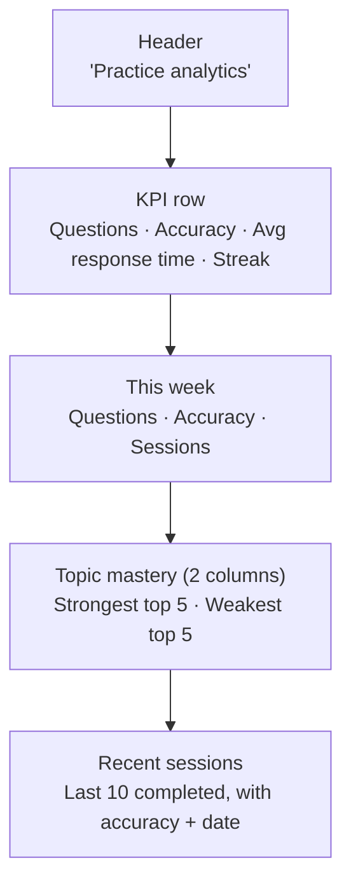

# Practice Analytics — Requirements

## Purpose

Show a student how their coursework practice is building mastery over time: accuracy, response speed, practice streak, topic-level mastery, and a history of recent sessions.

## Scope

- Overall stats: questions answered, accuracy, average response time, practice streak
- This-week summary: questions, accuracy, completed sessions in the last 7 days
- Topic mastery breakdown: top 5 strongest and top 5 weakest topics
- Recent practice session history (last 10 completed sessions)

Out of scope (MVP): study session analytics (plan sessions are not shown here), streak-recovery mechanics, goal-setting, export, sharing.

---

## User story

> As a student, I want to see how my practice sessions are going so that I can understand which topics I know well and which ones need more work.

---

## Functional requirements

| ID | Requirement |
|---|---|
| AN-1 | `/analytics` requires an authenticated, onboarded user |
| AN-2 | All data is loaded server-side (no client-side fetches); queries run in parallel via `Promise.all` |
| AN-3 | **Questions answered**: total count of `practice_attempts` rows for the user |
| AN-4 | **Overall accuracy**: percentage of `is_correct = true` attempts across all time |
| AN-5 | **Average response time**: mean of `response_time_ms` across all attempts with a positive value, converted to seconds |
| AN-6 | **Practice streak**: number of consecutive calendar days (backwards from today) on which at least one attempt was recorded |
| AN-7 | **This week**: questions, accuracy, and completed sessions in the last 7 days (today − 6 days) |
| AN-8 | **Strongest topics**: top 5 `topic_mastery` rows for the user, ordered by `mastery_pct` descending; topic names are resolved via a topics + subjects join |
| AN-9 | **Weakest topics**: bottom 5 `topic_mastery` rows, ordered by `mastery_pct` ascending |
| AN-10 | **Recent sessions**: last 10 completed `practice_sessions` rows, showing subject, topic, accuracy, date |
| AN-11 | If no practice data exists, a friendly empty state is shown with a link to `/coursework` |
| AN-12 | Each data fetch failure is handled gracefully — empty/null values are used, the page does not crash |

---

## Non-functional requirements

| ID | Requirement |
|---|---|
| AN-NF-1 | Four DB queries run in parallel on page load: `practice_sessions` (limit 100), `practice_attempts` (limit 500), `topic_mastery`, `topics` |
| AN-NF-2 | No server action is used; the page component reads directly and is a React Server Component |
| AN-NF-3 | The page is read-only; no writes are performed |

---

## Data sources

| Stat | Source table | Filter |
|---|---|---|
| Questions answered | `practice_attempts` | All rows for user |
| Accuracy | `practice_attempts` | `is_correct` field |
| Avg response time | `practice_attempts` | `response_time_ms > 0` |
| Practice streak | `practice_attempts` | `created_at` date (calendar day) |
| This week | `practice_attempts` + `practice_sessions` | `created_at >= today - 6 days` |
| Strongest / weakest topics | `topic_mastery` | `mastery_pct` ordering |
| Topic names | `topics` JOIN `subjects` | All topics for user |
| Recent sessions | `practice_sessions` | `status = completed`, newest first, limit 10 |

---

## Database interactions

| Table | Operation | Limit | Notes |
|---|---|---|---|
| `practice_sessions` | SELECT | 100 | id, created_at, subject_name, topic_name, questions_answered, correct_count, status |
| `practice_attempts` | SELECT | 500 | is_correct, response_time_ms, difficulty, created_at |
| `topic_mastery` | SELECT | all | mastery_pct, sessions_completed, sessions_total, last_session_at |
| `topics` | SELECT | all | id, name + subjects(name) join |

---

## Security

- Page uses `createClient` (user-scoped RLS); all queries are filtered by `user.id` via RLS automatically
- No service-role client; no data from other users is accessible

---

## User journey

1. Student opens **Analytics** from the app nav
2. If no practice has been done, an empty state prompts them to upload a coursework item
3. Otherwise, KPI cards show overall stats at a glance
4. Scrolling down reveals this week's summary, topic mastery bars, and recent session history
5. The student can identify weak topics and use them to guide their next practice session

---

## Page layout

---

## Acceptance criteria

- [ ] A student with no practice data sees an empty state with a link to `/coursework`
- [ ] KPI cards update to reflect accurate counts after a new practice session
- [ ] Practice streak increments when the student practices on consecutive calendar days and resets on a gap
- [ ] Strongest and weakest topics show topic names (not raw IDs), with the correct mastery percentage
- [ ] Recent sessions show the correct accuracy per session
- [ ] The page renders without error even when some queries return empty results

---

## Test requirements

- Unit: streak calculation — consecutive days, gap in the middle, no data
- Unit: `computeSubjectProgress()` (in `src/lib/progress.ts`) — all sessions missed, all completed, mix
- Functional: complete a practice session → verify accuracy and session count appear on `/analytics`
