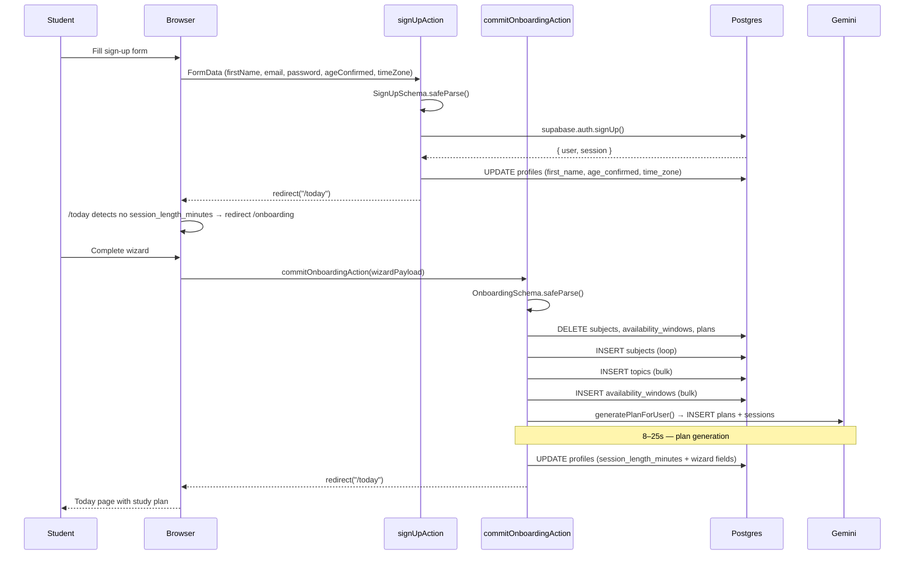

# Authentication & Onboarding — Requirements

## Purpose

Allow a student to create an account, log in, and complete a one-time onboarding wizard that captures the information needed to generate their first personalized study plan.

## Scope

- Sign-up: first name, email, password, age confirmation (13+), time zone
- Log-in: email and password
- Log-out
- Onboarding wizard: subjects + topics, exam dates, availability windows, session length, learning preferences (age band, study habits, goals, challenges, memory score)
- Plan generation at wizard completion
- Re-onboarding: wizard wipes previous data and starts fresh (idempotent)

Out of scope (MVP): email confirmation flow, social login (Google/GitHub), password reset, parent verification, two-factor authentication.

---

## User story

> As a student, I want to create an account and tell Pace about my subjects and schedule so that it can build a study plan tailored to me.

---

## Functional requirements

### Authentication

| ID | Requirement |
|---|---|
| AU-1 | Sign-up requires: first name (non-empty), valid email, password (min 8 chars), age confirmation checkbox, time zone |
| AU-2 | Successful sign-up creates a Supabase Auth user AND updates the profile with `first_name`, `age_confirmed_13_plus`, and `time_zone` |
| AU-3 | A database trigger (`on_auth_user_created`) inserts a minimal `profiles` row on auth user creation |
| AU-4 | Email confirmation is disabled at the project level for prototype; sign-up establishes a session immediately |
| AU-5 | Successful sign-up redirects to `/today` |
| AU-6 | Successful log-in redirects to `/today` |
| AU-7 | Log-out signs out the Supabase session and redirects to `/login` |
| AU-8 | Auth errors (wrong password, email taken, etc.) are mapped to user-friendly messages via `friendlyAuthError()` |
| AU-9 | Auth actions use the `useActionState` (React 19) pattern: they return `null` on success via redirect, or `{ ok: false; error: string }` on failure |

### Onboarding wizard

| ID | Requirement |
|---|---|
| OB-1 | The wizard collects: subjects (name, exam date, difficulty, confidence), topics per subject, workload items (exams, homework, etc.), availability windows (day + start + end), session length (25/45/60 min), age band, study habits, study challenges, goal ranking, memory score |
| OB-2 | The wizard payload is validated server-side against `OnboardingSchema` (Zod) before any DB writes |
| OB-3 | On submission, previous subjects, availability windows, and plans are deleted first (idempotent re-submission) |
| OB-4 | Writes happen in dependency order: subjects → topics → workload tasks → availability → plan generation → profile update |
| OB-5 | The "onboarded" flag (`session_length_minutes` set) is written LAST; until it is set, `/today` redirects to `/onboarding` |
| OB-6 | If plan generation fails, the onboarded flag is NOT set; the student can retry from `/onboarding` |
| OB-7 | On success, the student is redirected to `/today` with their first study plan |
| OB-8 | All onboarding failures are logged to `app_errors` via `logAppError()` |
| OB-9 | An `analytics_events` row is inserted on completion (best-effort, non-fatal) |

---

## Non-functional requirements

| ID | Requirement |
|---|---|
| AU-NF-1 | No Postgres transaction spans the onboarding write sequence (PostgREST limitation); recovery is by write order and retry |
| AU-NF-2 | On mid-flow failure, a best-effort cleanup deletes the partial data inserted so far |
| AU-NF-3 | Workload task insert failure is non-fatal (table may not exist in all environments) |

---

## Inputs

### `signUpAction(_prev, FormData)`
- `firstName`: string
- `email`: string
- `password`: string
- `ageConfirmed13Plus`: "on" | absent
- `timeZone`: string (default "UTC")

### `logInAction(_prev, FormData)`
- `email`: string
- `password`: string

### `commitOnboardingAction(_prev, raw: unknown)`
- Full wizard payload matching `OnboardingSchema`:
  - `subjects[].name`, `.examDate`, `.difficulty`, `.confidencePct`, `.topics[].name`, `.workloadItems[]`
  - `availability[]`: `dayOfWeek`, `startsAt`, `endsAt`
  - `sessionLengthMinutes`: 25 | 45 | 60
  - `ageBand`, `studyHabits`, `studyChallenges`, `goalRanking`, `memoryScore` (all optional)

---

## Outputs

- Auth actions: redirect on success, `{ ok: false; error: string }` on failure
- `commitOnboardingAction`: redirect to `/today` on success, `{ ok: false; error: string }` on failure

---

## Validation rules

### Sign-up
1. First name: non-empty
2. Email: valid format
3. Password: minimum 8 characters
4. Age confirmation: must be checked (true)

### Onboarding
1. At least one subject with a name
2. Each subject must have an exam date (validated by Zod schema)
3. At least one availability window
4. `sessionLengthMinutes` must be 25, 45, or 60
5. Plan feasibility checked before LLM call (see planning.md)

---

## Error cases

| Scenario | Behaviour |
|---|---|
| Email already taken | Friendly error from `friendlyAuthError()` |
| Wrong password | Friendly error from `friendlyAuthError()` |
| Email confirmation required (if re-enabled) | "Almost there — check your email to confirm your account, then log in." |
| Profile update fails after sign-up | "We created your account but couldn't save your profile. Log in and try again." |
| Onboarding schema invalid | First Zod issue message |
| Not authenticated at onboarding commit | "You need to be signed in." |
| Previous-data wipe fails | "We couldn't reset your previous data. Try again." |
| Subject insert fails | "We couldn't save your subjects." |
| Topic insert fails | "We couldn't save your topics." |
| Availability insert fails | "We couldn't save your availability." |
| Plan generation fails | Error from `generatePlanForUser()` |
| Profile update (onboarded flag) fails | "We couldn't finish setting up your account. Try again." |

---

## Database interactions

| Table | Operation | Notes |
|---|---|---|
| `auth.users` | INSERT | Supabase Auth creates the row |
| `profiles` | INSERT (trigger) | `on_auth_user_created` seeds a minimal row |
| `profiles` | UPDATE | Sign-up: first_name, age_confirmed, time_zone |
| `subjects` | DELETE | Wipe previous state on re-submission |
| `subjects` | INSERT (per-subject loop) | One at a time to preserve ID ordering |
| `topics` | INSERT (bulk) | Flattened with parent subject_id |
| `subject_tasks` | INSERT (bulk) | Best-effort; non-fatal if table missing |
| `availability_windows` | DELETE | Wipe previous state |
| `availability_windows` | INSERT (bulk) | |
| `plans` | DELETE | Wipe previous active plan |
| `plans` | INSERT | Via `generatePlanForUser` |
| `sessions` | INSERT (bulk) | Via `generatePlanForUser` |
| `profiles` | UPDATE | session_length_minutes + extended wizard fields (commit point) |
| `app_errors` | INSERT | On any mid-flow failure |
| `analytics_events` | INSERT | On completion (best-effort) |

---

## Security

- No auth action exposes secrets or raw Supabase error details to the client
- `friendlyAuthError()` maps all Supabase auth error codes to user-readable strings
- The `profiles` RLS policy restricts reads and writes to `auth.uid() = id`
- All onboarding writes are scoped to the authenticated user's `user.id`

---

## User journey

1. Student visits `/signup`
2. Fills in first name, email, password, ticks age confirmation
3. `signUpAction` creates the Supabase user + updates the profile → redirects to `/today`
4. `/today` detects `session_length_minutes = null` → redirects to `/onboarding`
5. Student works through the multi-step wizard (subjects, availability, preferences)
6. Student clicks Finish → `commitOnboardingAction` fires
7. DB writes happen in order; plan is generated (8–25s)
8. Profile's `session_length_minutes` is set (commit point)
9. Student lands on `/today` with their first plan

---

## Sequence diagram

---

## Acceptance criteria

- [ ] A new student can sign up, pass through onboarding, and see their study plan on `/today`
- [ ] Submitting the onboarding wizard twice (re-onboarding) produces a clean plan with no duplicate subjects or sessions
- [ ] An invalid email or short password on sign-up shows a clear inline error
- [ ] A failed plan generation during onboarding does not mark the user as onboarded; `/onboarding` is still accessible
- [ ] Log-out clears the session and redirects to `/login`
- [ ] A logged-out user who visits `/today` is redirected to `/login`

---

## Test requirements

- Unit: `SignUpSchema` validation — missing name, invalid email, short password, missing age confirmation
- Unit: `OnboardingSchema` validation — missing subject, no exam date, invalid session length
- Functional: complete sign-up + onboarding → verify `session_length_minutes` is set in DB
- Functional: re-submit onboarding → verify no duplicate subjects remain
- Regression: unauthenticated call to `commitOnboardingAction` returns `{ ok: false }`
