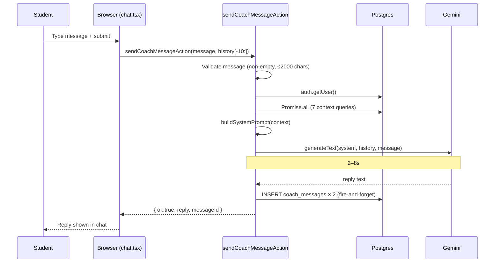

# AI Coach — Requirements

## Purpose

Provide students with a personalized, context-aware AI study coach they can chat with at any time. The coach understands the student's subjects, exam schedule, past session performance, practice accuracy, and weak topics — and uses this context to give relevant, motivating advice.

## Scope

- Send a message and receive an AI reply in a conversational chat interface
- Coach has context: subjects, upcoming exams, session completion rate, coursework, practice accuracy, weak topics (mastery < 50%)
- Chat history is persisted (last 20 messages loaded on open)
- History is scrollable in the session; the LLM receives the last 10 messages for context

Out of scope (MVP): multi-session memory beyond 20 messages, file/image sharing with the coach, coach-initiated messages, coach recommending specific sessions, moderation filtering.

---

## User story

> As a student, I want to ask my AI coach for study advice so that I can get help that's specific to my subjects, exam schedule, and how I've been doing.

---

## Functional requirements

| ID | Requirement |
|---|---|
| CO-1 | User must be authenticated to send a message |
| CO-2 | Message must be non-empty (trimmed) |
| CO-3 | Message length is capped at 2000 characters |
| CO-4 | The coach reads the student's context before generating each reply |
| CO-5 | Coach context includes: first name, age band, subjects + exam dates + confidence, session completion rate, upcoming tasks, recent coursework (ready items), recent practice stats (7 days), weak topics (mastery < 50%) |
| CO-6 | The LLM receives the last 10 messages of history as context |
| CO-7 | Both the student's message and the AI reply are persisted in `coach_messages` (fire-and-forget; non-fatal) |
| CO-8 | Chat history is loaded on open: last 20 messages, ordered oldest-first |
| CO-9 | A quota or rate-limit error from Gemini returns a user-friendly message |
| CO-10 | An invalid API key returns a user-friendly message |
| CO-11 | An empty reply from Gemini is replaced with a fallback prompt |

---

## Non-functional requirements

| ID | Requirement |
|---|---|
| CO-NF-1 | Reply latency: 2–8s under normal Gemini conditions |
| CO-NF-2 | Coach context is built in a single `Promise.all` call (7 parallel DB queries) |
| CO-NF-3 | `coach_messages` insert is fire-and-forget; a failure does not block the reply |
| CO-NF-4 | `maxRetries: 0` — quota and auth errors are definitive; retrying wastes quota |

---

## Inputs

- `sendCoachMessageAction(userMessage: string, history: CoachMessage[])`
- `loadCoachHistoryAction()` — returns the last 20 messages for the current user

---

## Outputs

- `SendCoachMessageResult`: `{ ok: true; reply: string; messageId: string }` or `{ ok: false; error: string }`
- `CoachMessage[]` from `loadCoachHistoryAction`

---

## Validation rules

1. `userMessage` must not be empty (after trimming)
2. `userMessage` length ≤ 2000 characters

---

## Error cases

| Scenario | Behaviour |
|---|---|
| Not authenticated | `{ ok: false, error: "Not authenticated." }` |
| Empty message | `{ ok: false, error: "Message is empty." }` |
| Message too long | `{ ok: false, error: "Message too long." }` |
| Gemini quota exceeded | User-friendly rate-limit message |
| Gemini API key invalid | "AI service is not configured. Contact support." |
| Any other Gemini error | "Coach is temporarily unavailable. Please try again." |
| Gemini returns empty string | Fallback: "I'm not sure how to answer that — could you rephrase?" |

---

## Coach context built per-message

Seven parallel DB queries, all scoped to the authenticated user:

| Data | Source | Notes |
|---|---|---|
| First name, age band, session length | `profiles` | Used to personalise tone |
| Subjects (name, exam date, confidence, difficulty) | `subjects` | Upcoming exam pressure |
| Session history (completed / missed) | `sessions` | Completion rate |
| Upcoming tasks (top 5, by due date) | `subject_tasks` | Tasks due soon |
| Recent coursework (top 5, ready) | `coursework_items` | What the student is studying |
| Practice stats (last 7 days) | `practice_sessions` | Average accuracy |
| Weak topics (mastery < 50%, top 5) | `topic_mastery` | Where to focus |

---

## Database interactions

| Table | Operation | Notes |
|---|---|---|
| `profiles` | SELECT | first_name, age_band, session_length_minutes |
| `subjects` | SELECT | name, exam_date, confidence_pct, difficulty |
| `sessions` | SELECT | status (completed/missed) — all historical |
| `subject_tasks` | SELECT | incomplete, ordered by due_date, limit 5 |
| `coursework_items` | SELECT | status=ready, newest first, limit 5 |
| `practice_sessions` | SELECT | completed, last 7 days |
| `topic_mastery` | SELECT | mastery_pct < 50, ordered asc, limit 5 |
| `coach_messages` | INSERT | user message + AI reply (fire-and-forget) |
| `coach_messages` | SELECT | load history (last 20, desc, then reversed) |

---

## Security

- Requires authenticated session via `createClient` + `supabase.auth.getUser()`
- All DB queries use the user's RLS session (scoped to `user.id` via RLS)
- No admin/service-role client used; no data from other users is accessible

---

## User journey

1. Student opens the Coach tab
2. Last 20 messages load (oldest at top)
3. Student types a message and submits
4. Loading indicator shown while reply is generated (2–8s)
5. Reply appears in the chat
6. Both messages are silently saved to `coach_messages`
7. Student continues the conversation

---

## Sequence diagram

---

## Acceptance criteria

- [ ] Typing and submitting a message produces a reply within 10 seconds
- [ ] The reply mentions at least one piece of student-specific context (a subject name, exam date, or completion rate)
- [ ] A quota error returns a friendly message, not a raw error object
- [ ] Chat history persists across page reloads (last 20 messages)
- [ ] A second user cannot read the first user's coach messages (RLS enforced)

---

## Test requirements

- Unit: `buildCoachContext()` — verify it returns a CoachContext with the correct shape
- Unit: `buildSystemPrompt()` — verify it includes expected context fields in the output
- Functional: send a message → receive a non-empty reply → verify both rows in `coach_messages`
- Regression: unauthenticated call to `sendCoachMessageAction` returns `{ ok: false }`
