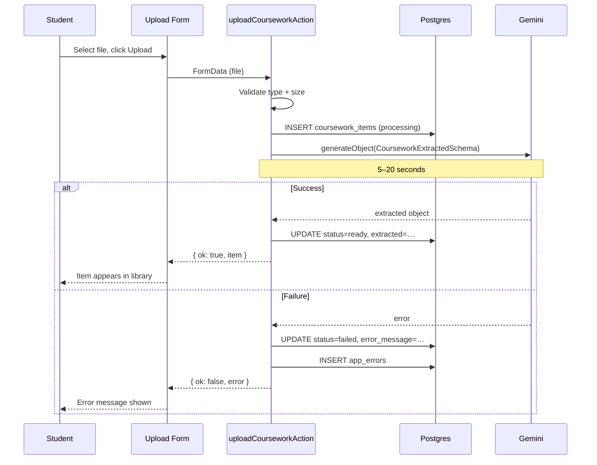

# Coursework — Requirements

## Purpose

Allow students to upload study material (notes, textbook pages, past papers) so Pace can extract structured learning content and generate practice questions from it.

## Scope

- Upload a file (image, PDF, or plain text)
- AI extracts: title, subject, difficulty, topics, definitions, key facts, concept relationships
- Student can view the extracted content
- Student can start adaptive practice based on the extracted content
- Failed extractions show an error state; student can retry by uploading again

Out of scope (MVP): editing extracted content, multiple files per item, collaborative notes, re-processing a failed item without re-uploading.

---

## User story

> As a student, I want to upload my study notes so that Pace can understand what I'm learning and help me practise it through questions.

---

## Functional requirements

| ID | Requirement |
|---|---|
| CW-1 | User must be authenticated to upload or view coursework |
| CW-2 | Accepted file types: JPEG, PNG, WebP, GIF, PDF, plain text |
| CW-3 | Maximum file size: 5 MB |
| CW-4 | A processing record is inserted immediately on upload so the library shows "Processing…" |
| CW-5 | AI extraction produces: title, subjectName, difficulty, topics[], definitions[], keyFacts[], relationships[] |
| CW-6 | Extracted data is validated against `CourseworkExtractedSchema` before being stored |
| CW-7 | On extraction success, status becomes `ready` and extracted JSON is stored |
| CW-8 | On extraction failure, status becomes `failed` and an error_message is stored |
| CW-9 | Failed extraction is logged to `app_errors` for admin visibility |
| CW-10 | All `coursework_items` rows are scoped to the owning user via RLS and `user_id` query constraints |
| CW-11 | The library lists the user's own items only, ordered newest first, limit 50 |
| CW-12 | The detail page shows extracted topics, definitions, and key facts |
| CW-13 | A "Start practice" button is only shown when status is `ready` |

---

## Non-functional requirements

| ID | Requirement |
|---|---|
| CW-NF-1 | Upload + extraction must complete within 30 seconds under normal conditions |
| CW-NF-2 | AI extraction uses `maxRetries: 0`; a single failure terminates the upload with an error |
| CW-NF-3 | Sensitive AI errors (API key, quota) are mapped to user-friendly messages |
| CW-NF-4 | The file is never stored on disk or in Supabase Storage — only the extracted JSON is persisted |

---

## Inputs

- File (multipart/form-data, field name: `coursework`)
- Authenticated session cookie

## Outputs

- `UploadCourseworkResult`: `{ ok: true, item: CourseworkItem }` or `{ ok: false, error: string }`
- Database row in `coursework_items` with `status = ready | failed`

---

## Validation rules

1. File must be present and non-empty
2. File size ≤ 5 MB
3. MIME type must be in the allowed set (resolved from extension if browser reports `application/octet-stream`)
4. Extracted schema must match `CourseworkExtractedSchema` (Zod)

---

## Error cases

| Scenario | Behaviour |
|---|---|
| Not authenticated | Returns `{ ok: false, error: "You need to be signed in." }` |
| No file selected | Returns `{ ok: false, error: "Please select a file." }` |
| File too large | Returns `{ ok: false, error: "File too large — 5 MB maximum." }` |
| Unsupported type | Returns `{ ok: false, error: "Unsupported file type…" }` |
| DB insert fails | Returns `{ ok: false, error: "Could not create entry. Try again." }` |
| AI quota exhausted | Returns `{ ok: false, error: "AI service is at capacity. Try again shortly." }` |
| AI key invalid | Returns `{ ok: false, error: "AI service is not configured." }` |
| AI returns malformed output | `generateObject` throws; returns `{ ok: false, error: "Could not extract content…" }` |

---

## Database interactions

| Table | Operation | Condition |
|---|---|---|
| `coursework_items` | INSERT | Status = processing immediately |
| `coursework_items` | UPDATE | Status = ready + extracted on success |
| `coursework_items` | UPDATE | Status = failed + error_message on failure |
| `app_errors` | INSERT | On any extraction failure |

---

## Authentication / authorization

- Requires a valid Supabase session
- All DB writes scoped to `user.id`
- RLS policy `"Users manage own coursework"` enforces row-level isolation

---

## User journey

1. Student navigates to `/coursework`
2. Student clicks "Upload notes"
3. Student selects a file
4. Upload form submits; "Uploading…" state shown
5. Server inserts a processing row; returns immediately
6. AI extraction runs (3–20s)
7. On success: library refreshes, new item shows "Ready"
8. Student taps the item to open the detail page
9. Student sees topics, definitions, key facts
10. Student taps "Start practice"

---

## Sequence diagram

---

## Acceptance criteria

- [ ] Upload of a JPEG, PNG, PDF, and .txt file all complete successfully
- [ ] Files over 5 MB are rejected with the correct error message
- [ ] Unsupported types (e.g. `.docx`) are rejected
- [ ] A processing item appears immediately in the library; status changes to ready or failed after extraction
- [ ] Failed items show an error state, not a spinner
- [ ] A second user cannot access another user's coursework item (RLS enforced)
- [ ] The detail page shows the extracted topics, definitions, and key facts
- [ ] The "Start practice" button is absent for failed/processing items

---

## Test requirements

- Unit: `resolveFileType()` with various MIME types and extensions
- Unit: validation logic (size, type)
- Functional: upload a real text file and verify status transitions in the database
- Functional: upload an oversized file and verify rejection
- Regression: second user cannot read first user's items
