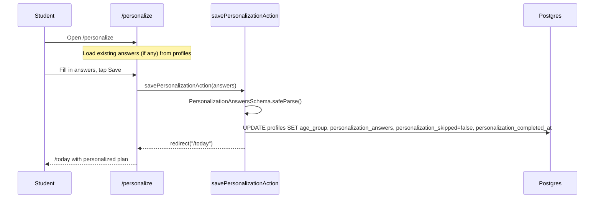

# Personalization Questionnaire — Requirements

## Purpose

Capture a student's study style preferences after onboarding so the plan generator and AI coach can tailor recommendations to how the student learns best. Completing the questionnaire is always optional.

## Scope

- Six-question study style questionnaire (age group, study habits, challenges, goals, memory style, confidence)
- Answers stored in `profiles` and fed to the plan generator and coach
- Student can skip the questionnaire at any time
- Student can return to update their answers

Out of scope (MVP): machine-learning model updates based on questionnaire results, adaptive question ordering, sharing preferences.

---

## User story

> As a student, I want to tell Pace about how I study so that it can give me more relevant advice and recommendations.

---

## Functional requirements

| ID | Requirement |
|---|---|
| PE-1 | `/personalize` requires an authenticated, onboarded user |
| PE-2 | If the student has already answered the questionnaire, the form is pre-filled with their existing answers |
| PE-3 | `savePersonalizationAction`: validates the submitted answers against `PersonalizationAnswersSchema` |
| PE-4 | `savePersonalizationAction`: updates `profiles` with `age_group`, `personalization_answers` (full JSON), `personalization_skipped = false`, and `personalization_completed_at` |
| PE-5 | On success, `savePersonalizationAction` redirects to `/today` |
| PE-6 | `skipPersonalizationAction`: sets `personalization_skipped = true` on the profile; does not clear any existing answers |
| PE-7 | Both saving and skipping require authentication |
| PE-8 | Personalization answers are read by the plan generator (`PL-7` in planning.md) and the AI coach context builder (`CO-5` in coach.md) |

---

## Non-functional requirements

| ID | Requirement |
|---|---|
| PE-NF-1 | The questionnaire is always optional; skipping it does not prevent access to any other feature |
| PE-NF-2 | The questionnaire can be completed or updated at any time from `/personalize` |

---

## Inputs

### `savePersonalizationAction(_prev, raw: unknown)`
Payload matching `PersonalizationAnswersSchema`:
- `ageGroup`: age band string (e.g. `"14-15"`)
- `studyHabits`: string[] (multi-select)
- `studyChallenges`: string[] (multi-select)
- `goalRanking`: string[] (ordered preference list)
- `memoryScore`: number (0–100 scale from memory game or self-report)
- `topTechnique`: string (derived or selected)

### `skipPersonalizationAction()`
- No inputs; updates the authenticated user's profile only

---

## Outputs

- `savePersonalizationAction`: redirect to `/today` on success; `{ ok: false; error: string }` on validation or DB failure
- `skipPersonalizationAction`: `{ ok: true }` or `{ ok: false; error: string }`

---

## Validation rules

1. Submitted answers must pass `PersonalizationAnswersSchema` (Zod)
2. User must be authenticated

---

## Error cases

| Scenario | Behaviour |
|---|---|
| Not authenticated (save) | `{ ok: false, error: "You need to be signed in." }` |
| Schema validation fails | `{ ok: false, error: <first Zod issue message> }` |
| Profile update fails | `{ ok: false, error: "Could not save your preferences. Try again." }` |
| Not authenticated (skip) | `{ ok: false, error: "Not authenticated." }` |
| Skip profile update fails | `{ ok: false, error: "Could not save preference." }` |

---

## Database interactions

| Table | Operation | Notes |
|---|---|---|
| `profiles` | SELECT | Page load — check onboarded + load existing answers |
| `profiles` | UPDATE | Save: age_group, personalization_answers, personalization_skipped, personalization_completed_at |
| `profiles` | UPDATE | Skip: personalization_skipped = true |

---

## Security

- Both actions use `createClient` (user-scoped RLS) and call `supabase.auth.getUser()`
- All profile updates are scoped to `.eq("id", user.id)`
- No personalization answers are accessible to other users

---

## How answers influence the plan

The `personalization_answers` column is read by:
- **Plan generator** (`generatePlanForUser`): passed as a profile field into the LLM prompt, influencing which study techniques and session structure the plan recommends
- **AI coach** (`buildCoachContext`): age band and session length inform the coach's tone and recommendations

Specifically, these fields feed the plan LLM:
- `age_band` — student's age range for appropriate pacing
- `study_habits` — preferred techniques (e.g. Pomodoro, flashcards, practice problems)
- `study_challenges` — known difficulties (e.g. procrastination, concentration)
- `goal_ranking` — what the student prioritises
- `memory_score` — self-reported memory confidence

---

## User journey

1. Student (newly onboarded) is optionally directed to `/personalize`
2. Sees six questions about study style; form is blank for first-time visitors
3. Student answers all questions and taps **Save** → redirected to `/today`
4. Alternatively, student taps **Skip** → `personalization_skipped` is set; student goes to `/today`
5. Student can return to `/personalize` at any time to update their answers

---

## Sequence diagram

---

## Acceptance criteria

- [ ] Submitting the questionnaire saves the answers and redirects to `/today`
- [ ] Skipping the questionnaire sets `personalization_skipped = true` and does not block other features
- [ ] Returning to `/personalize` after completing it shows the previous answers pre-filled
- [ ] Updating answers overwrites the previous values
- [ ] An unauthenticated user is redirected to `/login`

---

## Test requirements

- Unit: `PersonalizationAnswersSchema` — valid payload, missing required fields
- Integration: `savePersonalizationAction` → verify `personalization_completed_at` set in DB
- Regression: unauthenticated call returns `{ ok: false }`
