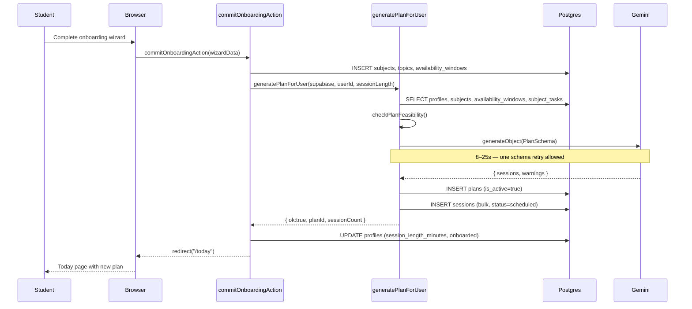

# Plan Generation & Adaptive Re-planning — Requirements

## Purpose

Generate a personalized, day-by-day study plan for a student based on their subjects, topics, exam dates, availability windows, and learning preferences. When circumstances change (sessions missed, availability updated, subjects added), the plan is automatically regenerated so the student never has to rebuild it manually.

## Scope

- Initial plan generation (triggered on onboarding completion)
- Adaptive re-plan (triggered when marking a session missed, updating availability, or changing subjects)
- Plan feasibility pre-check before calling the LLM
- Diff overlay showing what changed after a re-plan
- Personalization: study habits, challenges, difficulty, confidence, memory score are fed to the LLM

Out of scope (MVP): manual drag-to-reschedule, multi-plan support, plan history, batch re-plan, peer comparison.

---

## User story

> As a student, I want my study plan to automatically update when I miss a session or change my availability, so I never have to rebuild my schedule by hand.

---

## Functional requirements

| ID | Requirement |
|---|---|
| PL-1 | Initial plan is generated at the end of onboarding, before the "onboarded" flag is set |
| PL-2 | Re-plan reuses the existing active plan row; only future scheduled sessions are replaced |
| PL-3 | Completed and missed sessions are never deleted during a re-plan |
| PL-4 | Re-plan is triggered automatically when: a session is marked missed, availability is updated, a subject is added/deleted |
| PL-5 | Feasibility is checked before calling the LLM: past exam dates, windows shorter than session length, and zero subjects are caught locally |
| PL-6 | If feasibility fails, the user receives a specific, actionable error; no LLM call is made |
| PL-7 | The LLM is called with: subjects + topics, exam dates, availability windows, session length, time zone, completed sessions, subject_tasks, and the personalization profile |
| PL-8 | The LLM output is validated against the plan Zod schema; one schema-validation retry is allowed |
| PL-9 | Generated sessions are stored in `sessions` with `status = scheduled` |
| PL-10 | After a re-plan, a diff overlay is computed and returned for display |
| PL-11 | Warnings from the LLM (e.g., "not enough time before exam") are stored on the plan row and shown to the student |
| PL-12 | All plan writes are scoped to the authenticated user |

---

## Non-functional requirements

| ID | Requirement |
|---|---|
| PL-NF-1 | Plan generation typically takes 8–25s; the UI must show a loading state during this period |
| PL-NF-2 | One LLM retry is allowed on schema-validation failure (D9) |
| PL-NF-3 | Failed plan generation is logged to `app_errors` |
| PL-NF-4 | No plan generation call runs inside a true Postgres transaction (PostgREST limitation); partial failure recovery is by write order and retry from /onboarding |

---

## Inputs

### `generatePlanForUser(supabase, userId, sessionLengthMinutes)`
- Called from `commitOnboardingAction` after all onboarding data is saved
- `sessionLengthMinutes`: 25 | 45 | 60

### `rePlanForUser(supabase, userId)`
- Called from session-mark actions and settings save
- Reads `session_length_minutes` from the active profile
- Reads `is_active = true` plan from `plans`

---

## Outputs

- `PlanGenerationResult`: `{ ok: true; planId; sessionCount; warningCount }` or `{ ok: false; error }`
- `RePlanResult`: `{ ok: true; changes: PlanChange[]; warnings: PlanWarning[] }` or `{ ok: false; error }`
- Database: new rows in `sessions` (status=scheduled), updated `plans.warnings` and `plans.last_replanned_at`

---

## Feasibility checks (run locally, before LLM)

| Check | Error returned |
|---|---|
| Zero subjects | "You need at least one subject to generate a plan." |
| All exam dates are in the past or today | "All your exam dates are in the past." |
| All availability windows are shorter than session length | "Your availability windows are too short for your session length." |

---

## Error cases

| Scenario | Behaviour |
|---|---|
| Not onboarded (no session_length_minutes) | "Finish onboarding before re-planning." |
| No active plan | "No active plan to update." |
| Profile unreadable | "Could not read profile for plan generation." |
| Subjects unreadable | "Could not read subjects for plan generation." |
| Availability unreadable | "Could not read availability for plan generation." |
| Feasibility check fails | Specific error from `checkPlanFeasibility()` |
| LLM call fails (quota, key, schema) | LLM-level error from `generatePlan()` |
| `plans` insert fails | "Could not save the generated plan." |
| `sessions` insert fails | "Could not save your study sessions." |
| Delete of scheduled sessions fails | "Could not update your schedule. Try again." |

---

## Personalization inputs to the LLM

The `profile` field of `PlanInput` is populated from any available combination of:
- `age_band` (from onboarding wizard)
- `study_habits` (multi-select from wizard)
- `study_challenges` (multi-select from wizard)
- `goal_ranking` (ranked list from wizard)
- `memory_score` (numeric from wizard)
- `topTechnique` (derived from old personalization questionnaire or first study habit)
- `subjectIntelligence` (per-subject difficulty + confidence_pct)

All fields are additive and optional; a missing field is simply omitted from the prompt.

---

## Database interactions

| Table | Operation | Notes |
|---|---|---|
| `profiles` | SELECT | time_zone, session_length_minutes, personalization fields |
| `subjects` | SELECT | names, exam_date, difficulty, confidence_pct, topics |
| `availability_windows` | SELECT | day_of_week, starts_at, ends_at |
| `subject_tasks` | SELECT | incomplete tasks for the user |
| `sessions` | SELECT | completed sessions (for re-plan context) |
| `plans` | INSERT | initial plan |
| `sessions` | INSERT (bulk) | scheduled sessions for the new plan |
| `sessions` | DELETE | status=scheduled rows only (re-plan swap) |
| `plans` | UPDATE | last_replanned_at, warnings (re-plan) |
| `app_errors` | INSERT | on any plan-generation failure |

---

## Known architectural limitation (race condition)

If two re-plans fire concurrently (e.g., marking a session missed while saving availability), both may:
1. Delete the current scheduled sessions (step 5)
2. Each insert a different set of new sessions

The result is two overlapping or conflicting session sets with no rollback. This cannot be fixed without server-side transactions, which PostgREST does not support across multiple HTTP calls. The risk is accepted at prototype scale and documented in `docs/technical/architecture.md`.

---

## User journey

1. Student completes the onboarding wizard
2. `commitOnboardingAction` saves subjects, topics, availability, then calls `generatePlanForUser`
3. Gemini receives the prompt; returns a structured plan (8–25s)
4. Sessions are inserted; student is redirected to `/today`
5. Student marks a session missed → `rePlanForUser` fires
6. New scheduled sessions replace the old ones
7. A diff overlay shows what changed ("3 sessions moved, 1 removed")
8. Student updates availability in Settings → `rePlanForUser` fires again

---

## Sequence diagram

---

## Acceptance criteria

- [ ] Onboarding generates a plan and redirects to `/today` with sessions visible
- [ ] Marking a session missed triggers a re-plan without deleting completed sessions
- [ ] Updating availability in Settings triggers a re-plan
- [ ] A diff overlay is shown after re-plan
- [ ] A past exam date produces a clear error before the LLM is called
- [ ] A plan generation failure is surfaced to the student with a human-readable message

---

## Test requirements

- Unit: `checkPlanFeasibility()` — past exam, short windows, zero subjects, valid input
- Unit: `diffSessionsForOverlay()` — added, removed, moved, unchanged sessions
- Functional: complete onboarding → verify sessions exist in DB with correct user_id scope
- Regression: re-plan after marking missed → completed sessions remain, scheduled sessions replaced
