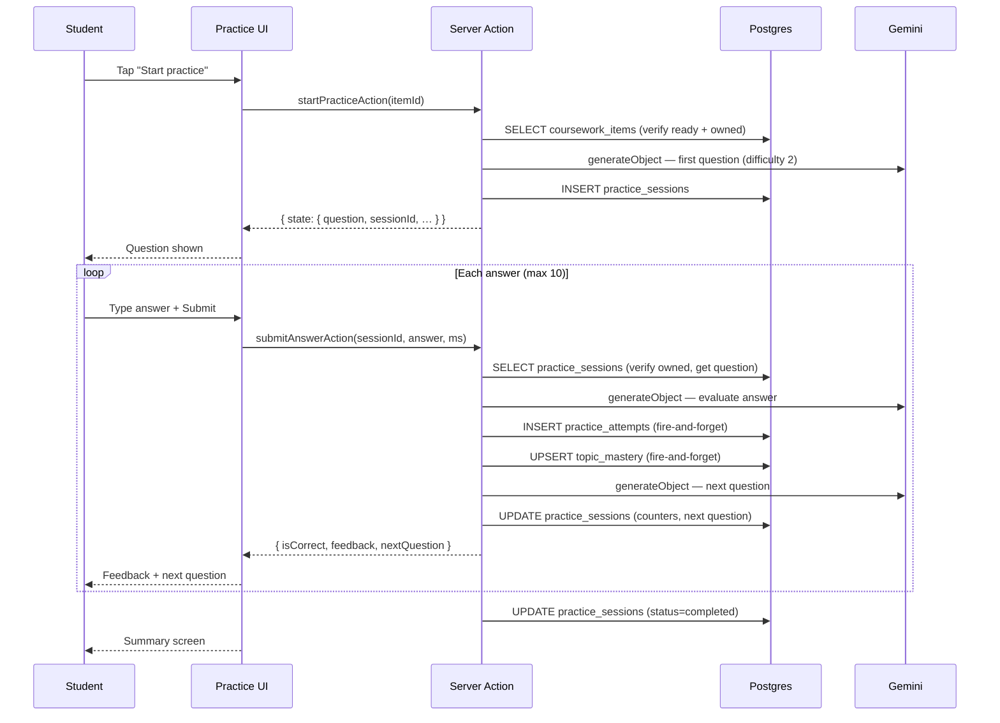

# Adaptive Practice — Requirements

## Purpose

Allow students to practise the content extracted from their coursework through an adaptive question-and-answer session that adjusts difficulty based on their performance.

## Scope

- Start a practice session from a ready coursework item
- Generate questions using the extracted content (topics, definitions, key facts)
- Evaluate answers with AI; provide friendly feedback
- Adjust question difficulty based on correctness and response time
- Update topic mastery after each answer
- End session after 10 questions or when the student quits
- Show a summary on completion

Out of scope (MVP): custom question count, flashcard mode, re-doing a completed session, sharing results.

---

## User story

> As a student, I want to answer questions about my coursework so that I can test my understanding and track how well I know each topic.

---

## Functional requirements

| ID | Requirement |
|---|---|
| PR-1 | User must be authenticated to start or continue a practice session |
| PR-2 | Only `ready` coursework items with extracted data can be used |
| PR-3 | The first question uses difficulty 2 (medium) |
| PR-4 | Questions are generated from extracted topics, definitions, and key facts |
| PR-5 | The AI evaluates each answer and provides 2–3 sentence feedback |
| PR-6 | If AI evaluation fails, a keyword-matching fallback is used |
| PR-7 | Difficulty adjusts after each answer based on correctness + response time |
| PR-8 | Each attempt is persisted in `practice_attempts` |
| PR-9 | If a topic_id can be resolved, `topic_mastery` is upserted after each answer |
| PR-10 | Session ends automatically after 10 questions |
| PR-11 | Student can end the session early via the UI |
| PR-12 | The expected answer is never sent to the browser (stored server-side only in `current_question`) |
| PR-13 | All session reads/writes are scoped to the authenticated user |
| PR-14 | The session-complete update includes `.eq("user_id", user.id)` |

---

## Non-functional requirements

| ID | Requirement |
|---|---|
| PR-NF-1 | Question generation: ≤ 10s under normal Gemini conditions |
| PR-NF-2 | Answer evaluation: ≤ 10s under normal conditions |
| PR-NF-3 | `practice_attempts` insert is fire-and-forget (`void`) — a failure does not block the user |
| PR-NF-4 | `topic_mastery` upsert is fire-and-forget — a failure does not block the user |
| PR-NF-5 | Max 10 questions per session (configurable via `MAX_QUESTIONS` constant) |

---

## Inputs

- `startPracticeAction(courseworkItemId: string)`
- `submitAnswerAction(sessionId: string, userAnswer: string, responseTimeMs: number)`
- `endPracticeAction(sessionId: string)`

## Outputs

- `StartPracticeResult`: session state including first question (no expected answer)
- `SubmitAnswerResult`: correctness, feedback, next question (or null if complete)
- `EndPracticeResult`: summary (questions answered, correct count, accuracy %)

---

## Validation rules

1. Coursework item must exist, be owned by the user, and have `status = ready`
2. `userAnswer` must be non-empty (trimmed)
3. Session must exist, be owned by the user, and have `status = active`
4. Session must not already be `completed`

---

## Error cases

| Scenario | Behaviour |
|---|---|
| Not authenticated | `{ ok: false, error: "You need to be signed in." }` |
| Coursework not ready | `{ ok: false, error: "This item is not ready for practice." }` |
| Empty answer | `{ ok: false, error: "Please write an answer first." }` |
| Session not found / already completed | `{ ok: false, error: "Session not found or already completed." }` |
| AI question generation fails | `{ ok: false, error: "Could not generate a question. Try again." }` |
| AI evaluation fails | Falls back to keyword matching; session continues |
| AI next-question generation fails | `nextQuestion` is null; session effectively ends |

---

## Difficulty adjustment

Three difficulty levels: 1 (easy), 2 (medium), 3 (hard).

| Condition | Adjustment |
|---|---|
| Correct + fast response | Increase difficulty |
| Correct + slow response | Stay same or increase |
| Incorrect | Decrease difficulty |

Logic lives in `src/lib/practice/difficulty.ts`.

---

## Topic mastery update

After each answer, if `topic_id` is set on the session:
1. Load existing `topic_mastery` row (if any)
2. Compute new mastery percentage using `computeNewMastery(oldMastery, isCorrect)`
3. Upsert into `topic_mastery`

Mastery logic lives in `src/lib/mastery/update.ts`.

---

## Database interactions

| Table | Operation | Notes |
|---|---|---|
| `coursework_items` | SELECT | Verify ownership + ready status |
| `subjects` + `topics` | SELECT | Resolve `topic_id` by matching subject name |
| `practice_sessions` | INSERT | On start |
| `practice_sessions` | SELECT | On each submit |
| `practice_sessions` | UPDATE | After each answer (counters, next question, difficulty) |
| `practice_sessions` | UPDATE | On end (status=completed) |
| `practice_attempts` | INSERT | After each answer (fire-and-forget) |
| `topic_mastery` | SELECT + UPSERT | After each answer, if topic_id set (fire-and-forget) |

---

## Security

- `startPracticeAction`: coursework ownership verified via `.eq("user_id", user.id)`
- `submitAnswerAction`: session ownership verified via `.eq("user_id", user.id)` on SELECT; same constraint on UPDATE (both non-terminal and terminal)
- `endPracticeAction`: session ownership verified via `.eq("user_id", user.id)` on UPDATE
- Expected answer never leaves the server: stored in `current_question` (server-only JSONB) and returned to the client only as `ClientQuestion` (no `expectedAnswer` field)

---

## User journey

1. Student opens a coursework detail page
2. Student taps "Start practice"
3. First question appears (medium difficulty)
4. Student reads the question and types an answer
5. Student submits; feedback appears ("Correct! …" or "Not quite — …")
6. Next question appears at adjusted difficulty
7. After 10 questions, a summary screen shows accuracy and correct count
8. Student can tap "Finish early" at any point to see the summary

---

## Sequence diagram

---

## Acceptance criteria

- [ ] A ready coursework item shows a "Start practice" button
- [ ] Tapping it creates an active session and shows the first question
- [ ] Submitting an answer shows AI feedback within 10 seconds
- [ ] The next question appears at an appropriately adjusted difficulty
- [ ] After 10 questions, the summary screen shows correct count and accuracy
- [ ] A session belonging to user A cannot be submitted to by user B
- [ ] The expected answer is never visible in the browser (verify via DevTools)
- [ ] If the AI fails, a keyword-fallback evaluation is used and the session continues

---

## Test requirements

- Unit: `adjustDifficulty()` — all branches (correct fast, correct slow, incorrect)
- Unit: `computeNewMastery()` — initial state, incremental updates
- Unit: `resolveTopicId()` — match, no match, ambiguous name
- Unit: `toClientQuestion()` — expected answer is absent from output
- Unit: keyword fallback evaluation logic
- Functional: full session start → 10 answers → summary
- Regression: verify `current_question.expectedAnswer` absent from any client-facing response
