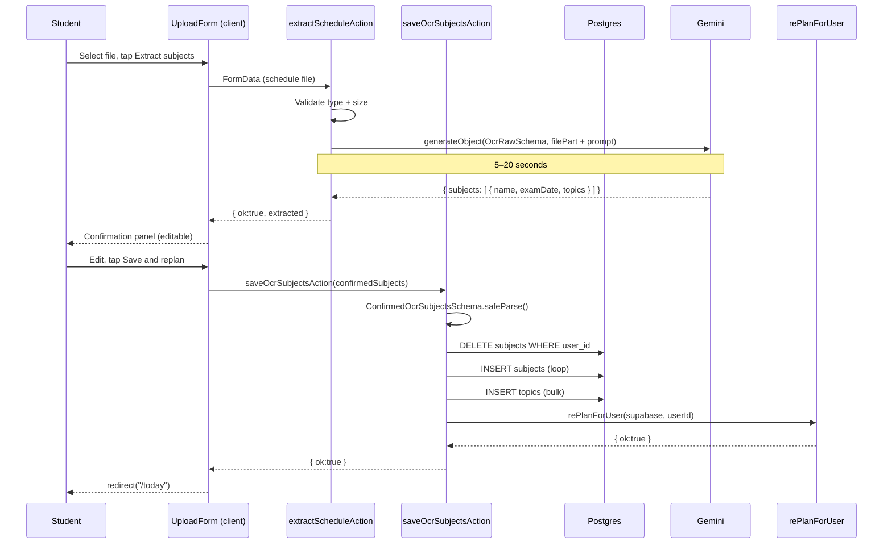

# Schedule Upload (OCR) — Requirements

## Purpose

Let a student upload a photo or PDF of their timetable or exam schedule. Pace reads it with AI, extracts subject names, exam dates, and topics, and presents them for review before saving. On confirmation, the subjects replace all existing ones and a new plan is generated.

## Scope

- Upload an image or PDF (JPEG, PNG, WebP, GIF, PDF, plain text; max 5 MB)
- AI extracts: subject names, exam dates (YYYY-MM-DD), topics
- Student reviews and edits the extracted data before saving
- On save: replaces all existing subjects (and their topics) and triggers a full replan

Out of scope (MVP): multi-file schedules, re-processing without re-uploading, storing the uploaded file, incremental (add-only) import.

---

## User story

> As a student, I want to upload a photo of my exam timetable so that Pace can read my subjects and exam dates automatically, without me entering them one by one.

---

## Functional requirements

| ID | Requirement |
|---|---|
| OCR-1 | `/upload-schedule` requires an authenticated, onboarded user |
| OCR-2 | Accepted file types: JPEG, PNG, WebP, GIF, PDF, plain text |
| OCR-3 | Maximum file size: 5 MB |
| OCR-4 | `extractScheduleAction`: validates auth, file type, and size; passes the file to Gemini as a binary `FilePart` (or plain text) via `generateObject` with `OcrRawSchema` |
| OCR-5 | Extraction returns subjects with: `name` (trimmed string), `examDate` (YYYY-MM-DD or null), `topics[]` (trimmed, non-empty strings) |
| OCR-6 | Extraction never invents content — the prompt instructs the model to only return what is visible in the file |
| OCR-7 | The file is never stored on disk or in Supabase Storage; only the extracted JSON is returned |
| OCR-8 | `extractScheduleAction` uses `maxRetries: 0` — quota and auth errors are definitive |
| OCR-9 | After extraction, the student sees a confirmation UI where they can edit subject names, exam dates, and topics before saving |
| OCR-10 | The student can add or remove subjects in the confirmation UI before saving |
| OCR-11 | `saveOcrSubjectsAction`: validates the confirmed payload against `ConfirmedOcrSubjectsSchema` |
| OCR-12 | `saveOcrSubjectsAction`: deletes all existing subjects (topics cascade via FK), inserts the new subjects and topics, then calls `rePlanForUser` |
| OCR-13 | `saveOcrSubjectsAction`: requires the user to be onboarded (`session_length_minutes` set); rejects otherwise |
| OCR-14 | Extraction failures are logged to `app_errors` |
| OCR-15 | On successful save, the user is redirected to `/today` |

---

## Non-functional requirements

| ID | Requirement |
|---|---|
| OCR-NF-1 | Extraction typically completes in 5–20s; the UI must show a loading state |
| OCR-NF-2 | Subject inserts are sequential (one at a time) to preserve ordering and allow rollback on failure |
| OCR-NF-3 | On subject insert failure, all inserted subjects are deleted and an error is returned |
| OCR-NF-4 | MIME type is resolved from the file extension when the browser reports `application/octet-stream` (mobile-browser workaround) |

---

## Inputs

### `extractScheduleAction(formData: FormData)`
- Field name: `schedule`
- File: binary (image / PDF) or plain text

### `saveOcrSubjectsAction(raw: unknown)`
- Array of confirmed subjects: `{ name, examDate, topics[], difficulty, confidencePct }`

---

## Outputs

- `OcrResult`: `{ ok: true; extracted: OcrExtracted }` or `{ ok: false; error: string }`
- `SaveOcrResult`: `{ ok: true }` or `{ ok: false; error: string }`
- On save success: redirect to `/today`

---

## Validation rules

### Extraction
1. File must be present and non-zero in size
2. File size ≤ 5 MB
3. MIME type must be in the allowed set (with extension fallback)

### Save
1. At least one subject must be present
2. Each subject must have a non-empty `name`
3. `examDate` must be YYYY-MM-DD or null (validated by `ConfirmedOcrSubjectsSchema`)
4. `difficulty` must be `"easy" | "medium" | "hard"` or null
5. `confidencePct` must be 0–100 or null
6. User must be onboarded

---

## Error cases

| Scenario | Behaviour |
|---|---|
| Not authenticated | `{ ok: false, error: "You need to be signed in." }` |
| No file selected | `{ ok: false, error: "Please select a file to upload." }` |
| File too large | `{ ok: false, error: "File is too large. Maximum size is 5 MB." }` |
| Unsupported type | `{ ok: false, error: "Unsupported file type…" }` |
| Gemini API key invalid | `{ ok: false, error: "AI service is not configured. Contact support." }` |
| Gemini quota exhausted | `{ ok: false, error: "The AI service has reached its usage limit. Please try again in a few minutes." }` |
| AI returns bad schema / no output | `{ ok: false, error: "Could not read a study schedule from this file…" }` |
| Any other extraction error | `{ ok: false, error: "Could not extract subjects from the file…" }` |
| Save — not onboarded | `{ ok: false, error: "Complete onboarding first." }` |
| Save — subject delete fails | `{ ok: false, error: "Could not reset your subjects. Try again." }` |
| Save — subject insert fails | Rollback; `{ ok: false, error: "Could not save your subjects." }` |
| Save — topic insert fails | Rollback; `{ ok: false, error: "Could not save your topics." }` |
| Save — replan fails | Error from `rePlanForUser` |

---

## Database interactions

| Table | Operation | Notes |
|---|---|---|
| `profiles` | SELECT | Verify onboarded (saveOcrSubjectsAction) |
| `subjects` | DELETE | Replace all existing subjects |
| `subjects` | INSERT (sequential) | One at a time; ID captured for topic FK |
| `topics` | INSERT (bulk) | Flattened from all confirmed subjects |
| `app_errors` | INSERT | On extraction failure |

---

## Security

- Both actions require authentication via `createClient` + `supabase.auth.getUser()`
- All DB writes include `user_id: user.id`
- The file bytes are processed server-side and never stored; extraction results are returned as plain JSON

---

## User journey

1. Student navigates to `/upload-schedule`
2. Selects a file (image of their timetable, PDF, or text file)
3. Taps **Extract subjects** — loading state shown (5–20s)
4. Extracted subjects appear in a confirmation panel; student can edit names, dates, and topics
5. Student taps **Save and replan** — existing subjects are replaced; replan runs (8–25s)
6. Student is redirected to `/today` with an updated plan

---

## Sequence diagram

---

## Acceptance criteria

- [ ] Uploading a clear timetable image returns the extracted subjects with names and exam dates
- [ ] The confirmation panel lets the student edit names, dates, topics, add and remove subjects
- [ ] Saving the confirmed subjects replaces all previous subjects and generates a new plan
- [ ] A file over 5 MB is rejected before extraction
- [ ] An unsupported file type is rejected
- [ ] A Gemini quota error returns a user-friendly message
- [ ] Saving with no subjects is rejected

---

## Test requirements

- Unit: `resolveFileType()` — MIME type from extension for PDF and images
- Unit: OCR validation (file size, MIME type)
- Integration: `saveOcrSubjectsAction` — subjects replaced, replan triggered
- Regression: unauthenticated call to `extractScheduleAction` returns `{ ok: false }`
