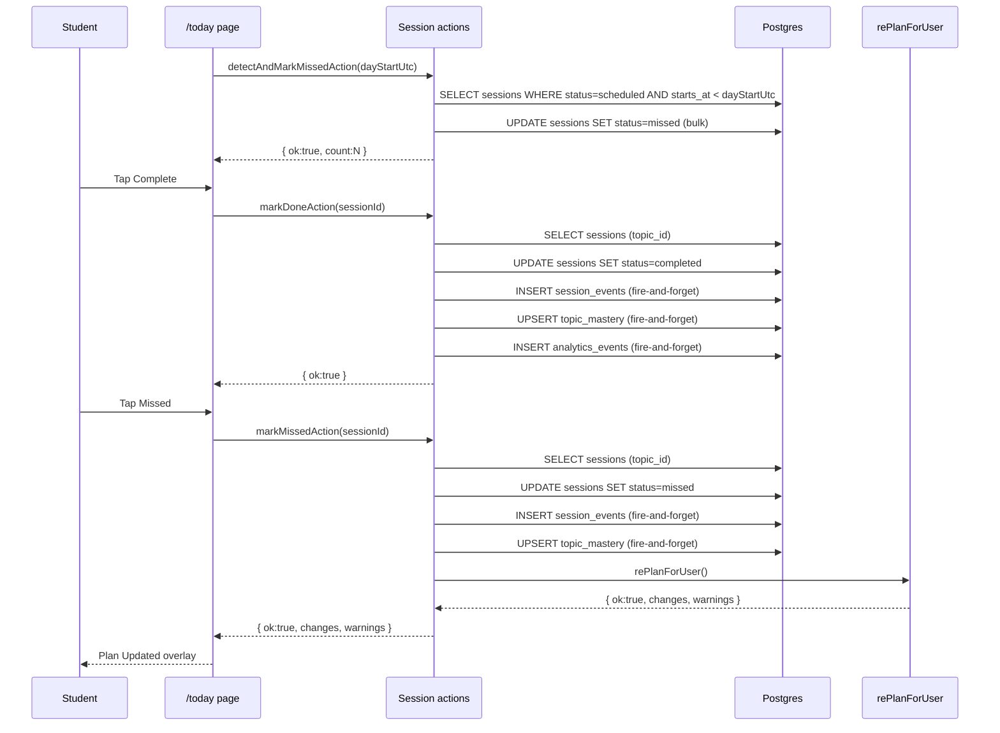

# Today's Dashboard & Session Actions — Requirements

## Purpose

Show a student's sessions for today, let them mark sessions complete or missed, and silently detect sessions that were missed on previous days so history stays accurate.

## Scope

- Today's dashboard: list today's sessions in chronological order
- Mark a session done: update status, record events, update topic mastery
- Mark a session missed: update status, record events, update topic mastery, trigger adaptive replan
- Auto-detect missed sessions from previous days (no replan, no overlay)

Out of scope (MVP): bulk actions, drag-to-reschedule, session search, session comments.

---

## User story

> As a student, I want to see what I need to study today, mark sessions done or missed, and have my plan automatically updated when I miss something.

---

## Functional requirements

| ID | Requirement |
|---|---|
| SE-1 | `/today` shows only sessions with `starts_at` on the current calendar day, in chronological order |
| SE-2 | Each session card shows: subject, topic, time slot, instruction, and status accent |
| SE-3 | `markDoneAction`: marks the session `status = completed`, records `completed_at`, does not trigger a replan |
| SE-4 | `markDoneAction`: records a `session_events` row (event_type = `completed`) and an `analytics_events` row (fire-and-forget) |
| SE-5 | `markDoneAction`: upserts `topic_mastery` for the session's `topic_id` (if set), applying `computeNewMastery(old, true)` |
| SE-6 | `markMissedAction`: marks the session `status = missed`, records a `session_events` row (event_type = `abandoned`), upserts `topic_mastery` with `computeNewMastery(old, false)`, then triggers `rePlanForUser` |
| SE-7 | `markMissedAction`: returns the replan diff and warnings for display in the Session Missed / Plan Updated overlay |
| SE-8 | `detectAndMarkMissedAction`: finds all `scheduled` sessions with `starts_at < dayStartUtc`, marks them `missed`; does NOT trigger a replan |
| SE-9 | `detectAndMarkMissedAction` is called silently on `/today` page load; it never revalidates the path (forbidden during render) |
| SE-10 | All session mutations are idempotent in the re-marking sense: the `status = scheduled` guard on UPDATE means a second call is a no-op at the DB level |
| SE-11 | All session actions require authentication and scope all queries to `user.id` |

---

## Non-functional requirements

| ID | Requirement |
|---|---|
| SE-NF-1 | `session_events` and `analytics_events` inserts are fire-and-forget (`void`); failure does not block the action |
| SE-NF-2 | `topic_mastery` upsert is fire-and-forget; failure does not block the action |
| SE-NF-3 | `markMissedAction` returns after the replan completes (8–25s); the UI must show a loading/overlay state during this period |

---

## Inputs

- `markDoneAction(sessionId: string, focusLossCount?: number, elapsedSeconds?: number)`
- `markMissedAction(sessionId: string, elapsedSeconds?: number)`
- `detectAndMarkMissedAction(dayStartUtc: string)` — ISO-8601 UTC timestamp for the start of the current calendar day

---

## Outputs

- `DoneResult`: `{ ok: true }` or `{ ok: false; error: string }`
- `MissedResult`: `{ ok: true; changes: PlanChange[]; warnings: PlanWarning[] }` or `{ ok: false; error: string }`
- `DetectMissedResult`: `{ ok: true; count: number }` or `{ ok: false; error: string }`

---

## Validation

1. `sessionId` is validated as a UUID via `SessionIdSchema` before any DB operation
2. `dayStartUtc` is a non-empty string (no further schema validation — it comes from the server's own clock)

---

## Error cases

| Scenario | Behaviour |
|---|---|
| Not authenticated | `{ ok: false, error: "You need to be signed in." }` |
| Invalid session UUID | `{ ok: false, error: <Zod message> }` |
| Session UPDATE fails (markDone) | `{ ok: false, error: "We couldn't update that session. Try again." }` |
| Session UPDATE fails (markMissed) | `{ ok: false, error: "We couldn't mark that session missed. Try again." }` |
| Replan fails (markMissed) | Error from `rePlanForUser` |
| Detect-missed SELECT fails | `{ ok: false, error: "Could not check for missed sessions." }` |
| Detect-missed UPDATE fails | `{ ok: false, error: "Could not mark missed sessions." }` |

---

## Database interactions

| Table | Operation | Notes |
|---|---|---|
| `sessions` | SELECT | Fetch topic_id for mastery update (markDone + markMissed) |
| `sessions` | UPDATE | status = completed / missed; guarded by `.eq("status", "scheduled")` |
| `sessions` | SELECT + UPDATE (bulk) | detectAndMarkMissed: find past-scheduled, mark missed |
| `session_events` | INSERT | event_type = completed / abandoned (fire-and-forget) |
| `analytics_events` | INSERT | event_type = session_completed / session_abandoned (fire-and-forget) |
| `topic_mastery` | SELECT + UPSERT | mastery_pct, sessions_completed, sessions_total (fire-and-forget) |

---

## Security

- Both `markDoneAction` and `markMissedAction` use `createClient` (user-scoped RLS session)
- All `sessions` queries include `.eq("user_id", user.id)`
- `detectAndMarkMissedAction` scopes the UPDATE to `.in("id", ids).eq("user_id", user.id)`

---

## User journey

1. Student opens the app → lands on `/today`
2. `detectAndMarkMissedAction` runs silently to clean up any stale scheduled sessions from previous days
3. Today's sessions are displayed in chronological order
4. Student taps **Complete** on a session → `markDoneAction` fires, card shows "Completed"
5. Student taps **Missed** → `markMissedAction` fires; Session Missed overlay shown; replan runs; Plan Updated overlay shown with diff
6. Student opens a session card → navigates to the study session timer (see [study-session.md](./study-session.md))

---

## Sequence diagram

---

## Acceptance criteria

- [ ] `/today` shows only today's sessions in chronological order
- [ ] Tapping Complete marks the session completed and does not trigger a replan
- [ ] Tapping Missed triggers a replan and shows the Plan Updated overlay
- [ ] After marking missed, completed sessions from earlier are not deleted
- [ ] A session with a `topic_id` causes a `topic_mastery` upsert on Complete or Missed
- [ ] `detectAndMarkMissedAction` marks previous-day scheduled sessions as missed without triggering a replan

---

## Test requirements

- Unit: `SessionIdSchema` — valid UUID passes, non-UUID fails
- Integration: `markDoneAction` — session row transitions to `completed`; `markMissedAction` — triggers replan and returns diff
- Regression: unauthenticated call returns `{ ok: false }`
- Regression: user A cannot mark user B's session done (RLS)
