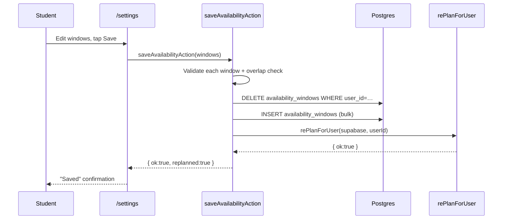

# Settings — Requirements

## Purpose

Let a student update their availability windows and preferred session length after onboarding. Both changes trigger an adaptive replan so the updated schedule takes effect immediately.

## Scope

- Edit availability time windows (replace all, no per-window updates)
- Change session length (25 / 45 / 60 minutes)
- Both changes trigger `rePlanForUser`
- Log out
- Link to the Subjects page for difficulty/confidence updates

Out of scope (MVP): delete account (UI present but disabled), notification preferences, timezone change.

---

## User story

> As a student, I want to update when I'm available to study and how long my sessions should be, so that my plan reflects my current schedule.

---

## Functional requirements

| ID | Requirement |
|---|---|
| ST-1 | `/settings` requires an authenticated, onboarded user (no `session_length_minutes` → redirect to `/onboarding`) |
| ST-2 | `saveAvailabilityAction`: replaces all `availability_windows` rows for the user, then calls `rePlanForUser` |
| ST-3 | `saveAvailabilityAction`: rejects if the windows array is empty (at least one window required) |
| ST-4 | `saveAvailabilityAction`: validates each window against `AvailabilityWindowSchema` (valid time format, end after start) |
| ST-5 | `saveAvailabilityAction`: rejects if any two windows on the same day overlap (`hasOverlappingWindows`) |
| ST-6 | `saveSessionLengthAction`: validates that `minutes` is 25, 45, or 60; updates `profiles.session_length_minutes`; calls `rePlanForUser` |
| ST-7 | The settings page pre-loads the current availability windows and session length, showing them as initial values in the editor |
| ST-8 | Replan failures from `rePlanForUser` are reflected in the result (`replanned: false`) but do not block the settings save |

---

## Non-functional requirements

| ID | Requirement |
|---|---|
| ST-NF-1 | Availability and session length are loaded in parallel (`Promise.all`) on page load |
| ST-NF-2 | Replan latency (8–25s) must be communicated to the user via a loading state |

---

## Inputs

### `saveAvailabilityAction(windows: AvailabilityWindowInput[])`
- `dayOfWeek`: 0–6 (Sunday = 0)
- `startsAt`: `HH:MM` string
- `endsAt`: `HH:MM` string

### `saveSessionLengthAction(minutes: number)`
- `minutes`: 25 | 45 | 60

---

## Outputs

- `SaveSettingsResult`: `{ ok: true; replanned: boolean }` or `{ ok: false; error: string }`

---

## Validation rules

1. At least one availability window must be provided
2. Each window must pass `AvailabilityWindowSchema` (valid `HH:MM` times, end > start)
3. No two windows on the same `dayOfWeek` may overlap
4. Session length must be exactly 25, 45, or 60

---

## Error cases

| Scenario | Behaviour |
|---|---|
| Not authenticated | `{ ok: false, error: "Not authenticated." }` |
| Empty windows array | `{ ok: false, error: "Add at least one availability window." }` |
| Invalid window (bad time, end ≤ start) | `{ ok: false, error: <Zod message> }` |
| Overlapping windows | `{ ok: false, error: "Availability windows overlap on the same day." }` |
| DB delete fails | `{ ok: false, error: "Could not update availability." }` |
| DB insert fails | `{ ok: false, error: "Could not save availability." }` |
| Invalid session length | `{ ok: false, error: "Session length must be 25, 45, or 60 minutes." }` |
| Profile update fails | `{ ok: false, error: "Could not save session length." }` |

---

## Database interactions

| Table | Operation | Notes |
|---|---|---|
| `availability_windows` | SELECT | Page load — pre-fill editor |
| `profiles` | SELECT | Page load — current session length |
| `availability_windows` | DELETE | Remove all existing rows for the user |
| `availability_windows` | INSERT (bulk) | New windows |
| `profiles` | UPDATE | `session_length_minutes` |

---

## Security

- Both actions use `createClient` (user-scoped RLS) and verify auth via `supabase.auth.getUser()`
- All availability writes include `.eq("user_id", user.id)`
- Profile update uses `.eq("id", user.id)`

---

## User journey

1. Student opens **Settings** from the app nav
2. Current availability windows and session length are pre-filled
3. Student edits windows (add, remove, change times)
4. Student taps **Save** — `saveAvailabilityAction` fires; loading state shown
5. Replan runs (8–25s); success message shown
6. Student also optionally changes session length — `saveSessionLengthAction` fires; replan runs again

---

## Sequence diagram

---

## Acceptance criteria

- [ ] Saving valid availability replaces all existing windows and triggers a replan
- [ ] An empty windows array is rejected before any DB operation
- [ ] Overlapping windows on the same day are rejected
- [ ] Changing session length updates the profile and triggers a replan
- [ ] The editor pre-fills with the current values on page load
- [ ] A replan failure leaves the saved windows in place (`replanned: false` returned, no error to user)

---

## Test requirements

- Unit: `hasOverlappingWindows()` — same-day overlap, cross-day windows, empty array
- Unit: `AvailabilityWindowSchema` — valid time, end ≤ start, invalid format
- Integration: save new windows → verify `availability_windows` rows replaced in DB → verify replan ran
- Regression: unauthenticated call to `saveAvailabilityAction` returns `{ ok: false }`
