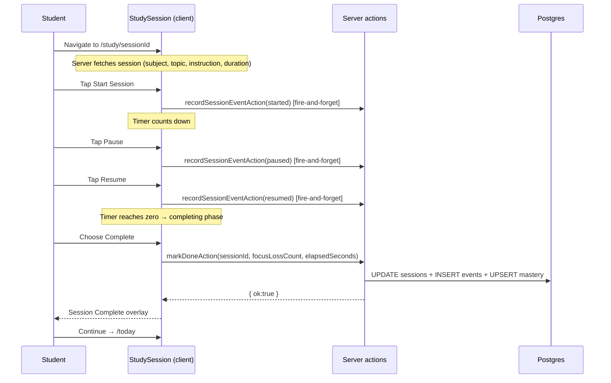

# Study Session Timer — Requirements

## Purpose

Give a student a focused, distraction-free screen to work through a single study session with a countdown timer, pause/resume controls, and a clear completion or missed flow.

## Scope

- Countdown timer for the session's duration (25 / 45 / 60 min)
- Start, Pause, Resume, Finish controls
- Focus-loss detection (tab/window visibility changes)
- Mark Complete or Missed on finish
- Session Complete overlay with "next up" info
- Plan Updated overlay when session is marked missed
- Timer state persisted in `localStorage` across same-session navigations

Out of scope (MVP): server-side timer persistence, multi-session queue, audio alerts, lock-screen timer.

---

## User story

> As a student, I want a focused timer screen when I'm studying so I can track how long I have left and mark the session done when I finish.

---

## Functional requirements

| ID | Requirement |
|---|---|
| SS-1 | `/study/[sessionId]` is a protected route; unauthenticated users are redirected to `/login` |
| SS-2 | The page fetches the session row (subject, topic, instruction, duration_minutes, status) and verifies `user_id` matches the authenticated user |
| SS-3 | Sessions with `status != scheduled` redirect back to `/today` |
| SS-4 | The screen shows: subject name, topic name, instruction, and a countdown timer initialized to `duration_minutes` |
| SS-5 | **Start** begins the countdown; the timer counts elapsed seconds up from 0 and computes remaining time as `durationSeconds - elapsed` |
| SS-6 | **Pause** halts the timer; **Resume** continues from where it stopped |
| SS-7 | When the timer reaches zero, the phase transitions automatically to `completing` (prompts Complete or Missed) |
| SS-8 | **Finish early** (before timer expires) also transitions to `completing` |
| SS-9 | Choosing **Complete** calls `markDoneAction(sessionId, focusLossCount, elapsedSeconds)` and shows the Session Complete overlay |
| SS-10 | Choosing **Missed** calls `markMissedAction(sessionId, elapsedSeconds)` and shows the Plan Updated overlay |
| SS-11 | Timer state (pausedElapsed + startedAt) is persisted to `localStorage` under the key `pace-study-{sessionId}` so that a page refresh resumes where the timer left off |
| SS-12 | Focus-loss events (`visibilitychange`) increment a `focusLossCount` counter, which is passed to `markDoneAction` as a signal for analytics |
| SS-13 | `recordSessionEventAction` is called fire-and-forget for `started`, `paused`, and `resumed` events |
| SS-14 | Closing the screen mid-session returns the user to `/today`; the session remains `scheduled` and the timer state is kept in `localStorage` |

---

## Non-functional requirements

| ID | Requirement |
|---|---|
| SS-NF-1 | The timer is entirely client-side; the server never stores elapsed time or pause state |
| SS-NF-2 | `recordSessionEventAction` failures are silent and non-blocking |
| SS-NF-3 | `localStorage` access is wrapped in try/catch to handle browsers with storage blocked |

---

## Inputs

- Route: `/study/[sessionId]` — `sessionId` is a UUID extracted from the URL
- `markDoneAction(sessionId, focusLossCount, elapsedSeconds)` — see [sessions.md](./sessions.md)
- `markMissedAction(sessionId, elapsedSeconds)` — see [sessions.md](./sessions.md)
- `recordSessionEventAction(sessionId, eventType, metadata)` — see events action

---

## Outputs

- Session Complete overlay: "Nice work! Session marked as complete." with next-session info and back-to-today link
- Plan Updated overlay: diff of changed sessions + warnings (from `markMissedAction`)
- On error: error phase shown with a message and a back-to-today link

---

## Phase state machine

```
idle → running → paused → running (resumed)
running → completing (timer reaches zero or Finish tapped)
paused → completing (Finish tapped)
completing → completed (Complete chosen)
completing → plan-updated (Missed chosen)
any → error (markDoneAction or markMissedAction fails)
```

---

## Database interactions

All DB interactions are delegated to `markDoneAction`, `markMissedAction`, and `recordSessionEventAction` — the study-session component itself makes no direct DB calls.

| Action | Tables touched |
|---|---|
| `markDoneAction` | sessions, session_events, topic_mastery, analytics_events |
| `markMissedAction` | sessions, session_events, topic_mastery, analytics_events, then replan |
| `recordSessionEventAction` | session_events |

---

## Security

- The page server component verifies `session.user_id === user.id` before rendering; mismatched sessions redirect to `/today`
- `sessionId` is sourced from the authenticated server context, not from client-controlled input beyond the URL segment

---

## User journey

1. Student taps a session card on `/today` → navigates to `/study/[sessionId]`
2. Screen shows subject, topic, instruction, and a stopped timer at `MM:SS`
3. Student taps **Start Session** — timer begins counting down
4. Student may tap **Pause** / **Resume** during the session
5. When the timer reaches zero (or student taps **Finish**), the screen asks: **Complete** or **Missed**
6. On **Complete** → Session Complete overlay → "Continue" or "View today's plan" → `/today`
7. On **Missed** → Session Missed overlay (loading) → Plan Updated overlay (diff) → `/today`

---

## Sequence diagram



---

## Acceptance criteria

- [ ] Navigating to a session belonging to another user redirects to `/today`
- [ ] A non-scheduled session (completed, missed) redirects to `/today`
- [ ] Start → timer counts down; Pause → timer halts; Resume → timer continues
- [ ] Completing the session marks it `completed` in the DB and shows the Session Complete overlay
- [ ] Marking missed triggers a replan and shows the Plan Updated overlay with the diff
- [ ] Timer state survives a page refresh (localStorage)
- [ ] Focus-loss count is included in `markDoneAction` metadata

---

## Test requirements

- Unit: `formatTime(totalSeconds)` — boundary cases (0, 60, 3600, negative)
- Integration: navigate to `/study/[sessionId]` → mark done → verify `status = completed` in DB
- Regression: visiting a session that belongs to another user is rejected
