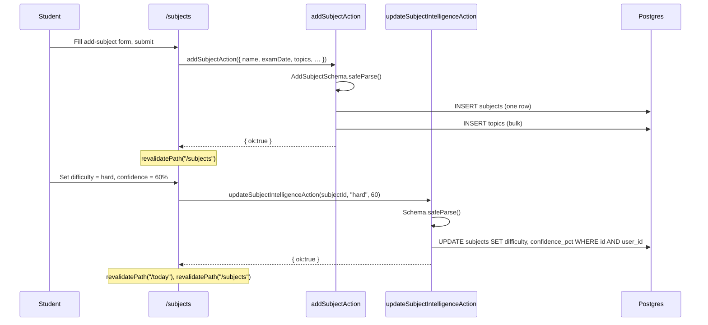

# Subjects Management — Requirements

## Purpose

Let a student view their subjects and topics, add a new subject, and rate each subject's difficulty and confidence level so the AI coach and plan generator can tailor recommendations.

## Scope

- View all subjects with their topics and exam dates
- Add a new subject (name, exam date, topics, difficulty, confidence)
- Update per-subject difficulty and confidence percentage (subject intelligence)

Out of scope (MVP): editing an existing subject name, removing a subject, reordering topics, bulk import from this page (use schedule upload instead).

---

## User story

> As a student, I want to add new subjects and rate how hard I find each one so that Pace can give me better study recommendations.

---

## Functional requirements

| ID | Requirement |
|---|---|
| SU-1 | `/subjects` requires an authenticated, onboarded user |
| SU-2 | The page lists all subjects for the user, ordered by `created_at` ascending, each showing name, exam date, topics, difficulty, and confidence |
| SU-3 | `addSubjectAction`: validates the input against `AddSubjectSchema` (name required, examDate optional, topics array, difficulty optional, confidencePct optional) |
| SU-4 | `addSubjectAction`: inserts the subject row, then bulk-inserts topics with the new `subject_id`; both are scoped to `user.id` |
| SU-5 | `addSubjectAction`: if the topic insert fails, the subject row is deleted as a best-effort rollback, then an error is returned |
| SU-6 | `addSubjectAction`: on success, revalidates `/subjects` so the list updates without a full reload |
| SU-7 | `updateSubjectIntelligenceAction`: updates `difficulty` and `confidence_pct` on an existing subject row, verifying ownership via `.eq("user_id", user.id)` |
| SU-8 | `updateSubjectIntelligenceAction`: accepts `null` for both fields (clearing the rating) |
| SU-9 | `updateSubjectIntelligenceAction`: on success, revalidates `/today` and `/subjects` |
| SU-10 | Subject intelligence (difficulty + confidence) is read by the plan generator and AI coach to personalize output |

---

## Non-functional requirements

| ID | Requirement |
|---|---|
| SU-NF-1 | Subject and topic inserts are separate DB calls (not a single transaction — PostgREST limitation) |
| SU-NF-2 | Topic insert failure triggers a best-effort subject delete; partial topic rows are not left behind |

---

## Inputs

### `addSubjectAction(raw: unknown)`
- `name`: string (non-empty)
- `examDate`: string (YYYY-MM-DD) or null
- `topics`: string[] (can be empty)
- `difficulty`: `"easy" | "medium" | "hard"` or null
- `confidencePct`: number (0–100) or null

### `updateSubjectIntelligenceAction(subjectId, difficulty, confidencePct)`
- `subjectId`: UUID
- `difficulty`: `"easy" | "medium" | "hard"` or null
- `confidencePct`: number (0–100, integer) or null

---

## Outputs

- `AddSubjectResult`: `{ ok: true }` or `{ ok: false; error: string }`
- `SubjectIntelligenceResult`: `{ ok: true }` or `{ ok: false; error: string }`

---

## Validation rules

1. `name` must be non-empty (validated by `AddSubjectSchema`)
2. `examDate` must be a valid YYYY-MM-DD date or null
3. `difficulty` must be `"easy" | "medium" | "hard"` or null
4. `confidencePct` must be an integer in [0, 100] or null
5. `subjectId` must be a valid UUID (validated by `Schema` in `updateSubjectIntelligenceAction`)

---

## Error cases

| Scenario | Behaviour |
|---|---|
| Not authenticated | `{ ok: false, error: "You need to be signed in." }` |
| Schema validation fails | `{ ok: false, error: <first Zod issue message> }` |
| Subject insert fails | `{ ok: false, error: "Could not save the subject. Try again." }` |
| Topic insert fails | Best-effort subject delete; `{ ok: false, error: "Could not save the topics. Try again." }` |
| Subject update fails | `{ ok: false, error: "Could not update subject. Try again." }` |

---

## Database interactions

| Table | Operation | Notes |
|---|---|---|
| `subjects` | SELECT | Page load — all rows with nested topics |
| `subjects` | INSERT | `addSubjectAction` — one row |
| `topics` | INSERT (bulk) | After subject insert — all topics for the new subject |
| `subjects` | DELETE | Best-effort rollback if topic insert fails |
| `subjects` | UPDATE | `difficulty`, `confidence_pct` fields |

---

## Security

- Both actions use `createClient` (user-scoped RLS) and verify auth
- `addSubjectAction`: all inserts include `user_id: user.id`
- `updateSubjectIntelligenceAction`: UPDATE guarded by `.eq("id", subjectId).eq("user_id", user.id)` — prevents updating another user's subject

---

## User journey

1. Student opens **Subjects** from the app nav (or via the Settings → Subjects link)
2. Existing subjects are listed with topics and exam dates
3. Student fills in the add-subject form (name, exam date, topics) and submits
4. New subject appears in the list
5. Student taps a difficulty and sets a confidence slider on any subject
6. Changes are saved immediately (optimistic on the form, confirmed by revalidation)

---

## Sequence diagram

---

## Acceptance criteria

- [ ] A student can add a new subject with topics; it appears in the list on the same page
- [ ] An empty subject name is rejected before any DB write
- [ ] A topic insert failure rolls back the subject row (no orphan subject left in DB)
- [ ] Setting difficulty and confidence on a subject saves immediately
- [ ] Clearing difficulty or confidence (setting to null) is accepted and saved
- [ ] User A cannot update user B's subject (ownership check)

---

## Test requirements

- Unit: `AddSubjectSchema` — missing name, invalid examDate, difficulty values
- Integration: `addSubjectAction` — inserts subject + topics; topics fail → subject rolled back
- Regression: `updateSubjectIntelligenceAction` with another user's `subjectId` returns `{ ok: false }` (RLS)
