# Pace — Market Research Report (High-School Adaptive Study Planner)

**Prepared for:** Founder / mentor / investor review
**Scope:** Problem validation, market sizing, competition, pricing, risks, and a go/no-go recommendation for **Pace** — an AI study planner for high-school students (~14–18) that automatically re-plans when a student misses a session or their availability changes. UK (GCSE/A-Level) and US (AP) focus.
**Last updated:** 2026-08-26

### How to read this report
Claims are labelled so opinion is never mistaken for evidence:
- **[Fact]** — supported by a cited, authoritative source (numbered, see [References](#references)).
- **[Analysis]** — our interpretation of the facts.
- **[Assumption]** — a plausible but unproven premise that must be tested.

**Sourcing standard & limits.** We prioritised primary/authoritative sources: Pew Research Center, the CDC, NIMH, the UK Department for Education (DfE), the US National Center for Education Statistics (NCES), peer-reviewed journals, official company/app-store pages, and named market-research firms. Two honest limitations: (1) commercial market-size reports (Grand View Research, IMARC, etc.) sit behind paywalls or blocked automated access — their figures are reproduced as **vendor estimates** and should be confirmed on the vendor page before external use; and (2) direct student-voice channels (e.g. Reddit) were not accessible during research, so demand signals lean on surveys, app-store data, and published studies rather than raw community discussion. Where a commonly-repeated statistic traced only to blogs or could not be verified, it was **removed or flagged**, not reported as fact.

---

## Executive Summary

**The problem is real but moderate, and the market is crowded and low-margin at the consumer tier.** High-school students are demonstrably overloaded and, by developmental neuroscience, are the age group least equipped to self-plan [5][6][7]. AI is now a mainstream part of their schoolwork and rising fast [1][2][3]. That combination makes an *AI planning aid for teens* timely.

**But three hard truths temper the opportunity:**
1. **The addressable market is far smaller than headline "EdTech" numbers.** The honest proxies — consumer education apps (~US$7–8bn, 2025) and US online tutoring (~US$4.3bn, 2024) — are a tiny fraction of the ~US$190–440bn EdTech figure, and firms disagree wildly on all of them [14][15][16][17].
2. **The category is crowded and cheap.** Established student planners are priced at roughly US$4–7/month or one-time, and several strong general tools are free [18–24]. No competitor ships true *adaptive re-planning*, which is the one defensible gap — but "planner" as a standalone paid product has weak willingness-to-pay.
3. **Teens rarely pay; parents pay for outcomes.** Monetisation realistically runs through parents and an exam/outcome frame, not through a generic "get organised" planner.

**Recommendation: BUILD, narrowly — anchor to a fixed-date exam context (AP or GCSE/A-Level) rather than a generic planner**, monetise via parents/family plans, and treat *retention* (not price) as the core business risk. Full reasoning in [§13](#13-recommendation--go--no-go).

---

## 1. Market Overview

Pace sits at the intersection of three markets, from broadest (least relevant) to narrowest (most relevant):

- **EdTech (broad):** the whole education-technology sector. Large but mostly irrelevant to a consumer study app — it includes LMS, hardware, and institutional software.
- **Consumer education / study apps (narrow, relevant):** direct-to-student mobile apps for studying, revision, and planning. **This is Pace's category.**
- **Test preparation & online tutoring (adjacent):** where the *money and willingness-to-pay* concentrate, especially around fixed exams.

**[Analysis]** The strategic implication is that Pace should be sized and positioned against the *consumer study-app* and *test-prep* markets, not the headline EdTech number. Using the big EdTech figure to imply a large opportunity would be misleading.

---

## 2. Market Size & Growth

> **Caution:** the dollar figures below are commercial market-sizing estimates. Different firms disagree by multiples (test-prep estimates span **~US$0.57bn to ~US$126bn** depending on scope; AI-in-education differs ~5× between firms). Treat them as directional ranges, not precise values, and note the named firm on each.

| Segment | Estimate (base year) | Growth (CAGR) | Source | Confidence |
|---|---|---|---|---|
| Global EdTech (headline; least relevant) | ~US$187bn (2025) → ~US$438bn (2033), or ~US$348bn by 2030 depending on report | ~10.8–13.3% | Grand View Research [16] | Vendor estimate; page access blocked — confirm before external use |
| **Consumer education apps (Pace's category)** | ~US$7–8bn (2025) | ~21% | IMARC / market aggregators [17] | Vendor estimate |
| **US online private tutoring (adjacent, US beachhead)** | ~US$4.32bn (2024) → ~US$8.08bn (2030) | ~11.1% | Grand View Research [14] | Vendor estimate |
| AI in education (fastest-growing adjacency) | ~US$5.9bn (2024) → ~US$32.3bn (2030) | ~32.8% | Grand View Research [15] | Vendor estimate; MarketsandMarkets scopes it ~5× smaller |
| Test preparation (global) | No clean figure — scope-dependent, ~US$0.57bn to ~US$126bn | ~4–7% | Multiple firms (conflicting) | Do not cite a single number |

**[Fact] Reachable audience (the most reliable sizing):** government population data is far more trustworthy than any vendor market figure.
- **United States:** ~**15.5 million** public high-school students (grades 9–12, fall 2022) plus ~**1.4 million** private ≈ **~16.9 million** [12].
- **England:** **9,032,426** total school pupils (Jan 2025); of which roughly **~3.9 million** in state-funded secondary Years 7–11 and **~0.9 million** in sixth form (Years 12–13) [13]. (England only; Scotland, Wales and NI add more.)

**[Analysis]** The exam-taking core (US AP-eligible high-schoolers + UK GCSE/A-Level students) is an order of magnitude more concrete than any contested dollar TAM. The market is **large in users but small and slow-growing in *test-prep dollars*, and fast-growing only in the *AI-in-education* framing** — which is why the AI-and-exam positioning matters commercially, not just technically.

---

## 3. Target Customer

**Primary user:** high-school students aged ~14–18. **Primary payer:** the parent (see [§8](#8-pricing--business-models)). This user/payer split shapes everything downstream.

Within HS students, three overlapping segments feel the problem most acutely:

1. **Exam-cohort students (fixed high-stakes dates):** GCSE/A-Level (UK), AP/SAT/ACT (US). **[Analysis]** The clearest wedge — a fixed exam date the student cannot move, against a life that constantly shifts, is exactly where adaptive re-planning earns its keep, and it maps onto an existing paid budget (test prep/tutoring).
2. **Students with ADHD / weak executive function:** adolescents (ages 12–17) carry the **highest ADHD prevalence** of any child age band [7], and planning/organisation deficits are central to the condition. Sharpest mechanistic fit; vocal parent-buyer community. **Caveat:** marketing to a medical demographic carries ethical/regulatory sensitivity.
3. **College-bound students** juggling grades, tests, extracurriculars and deadlines. Highest perceived parent value, but requires a larger product (multi-year roadmap).

**[Analysis]** The weakest target is the **generic "average HS student"** — the pain exists but is too diffuse and low-urgency to anchor a paid product.

---

## 4. Customer Problems (the evidence)

### The problem is real and quantified

- **[Fact] AI is already embedded in teen schoolwork, and rising fast.** The share of US teens (13–17) who used ChatGPT for schoolwork **doubled from 13% (2023) to 26% (2024)** [1]. By 2025, **54% of teens had used an AI chatbot to help with schoolwork**, **64% had ever used a chatbot**, and about **three-in-ten use one daily** [2][3]. **[Analysis]** This is the strongest signal in the report: a named, rising behaviour from the most authoritative source. A planner that does *not* integrate AI help will feel dated to this cohort quickly.
- **[Fact] Adolescents are developmentally least able to self-plan.** The prefrontal cortex — responsible for "planning, prioritizing, and making good decisions" — is among the last brain regions to mature, finishing in the mid-to-late 20s [5]; executive function is still rapidly developing through ages ~10–20 [6]. **[Analysis]** This is the single strongest *why-this-age-group* argument: Pace scaffolds a capacity teenagers' brains have not finished building. It is a defensible, evidence-based reason to target HS specifically rather than adults.
- **[Fact] ADHD is most prevalent in exactly this age band.** ~**11.3%** of US children/adolescents (5–17) had ever been diagnosed with ADHD (NHIS 2020–2022), with the **12–17 band higher** than younger children [7].
- **[Fact] Procrastination is widespread among students.** A peer-reviewed synthesis puts habitual academic procrastination at **at least ~50% of students** [8]. **Caveat:** the strongest prevalence figures (80–90%) come from *college* samples, not high school — do not present those as HS statistics.
- **[Fact] Academic stress and homework load are significant** (with caveats). Teens have reported school-year stress **higher than adults'** (5.8 vs 5.1 on a 10-point scale) [9]; a canonical study of high-performing US high schools found **56%** cited homework as a primary stressor with **~3.1 hours/night** [10]. **Caveats:** [9] is 2013 data; [10] is 2013 and sampled *privileged, high-performing* schools — both remain the best-cited peer-reviewed sources but should be read as indicative, not representative of all teens.
- **[Fact] Exam anxiety is material and gendered (UK data).** In a sample of English secondary-school students, **16.4%** were "highly test-anxious" — **22.5% of girls vs 10.3% of boys** [11].
- **[Fact] The attention environment is hostile.** Teens are heavy short-video users — about **six-in-ten** use TikTok, and YouTube reaches ~**90%** [3][4]. **[Analysis]** This supports the "time-poor and distracted" framing and means the product competes for attention against algorithmic feeds.

### Where the evidence is weaker (stated plainly)

- **[Assumption]** That the *specific* pain is "the plan breaks when I miss a session, and rebuilding it is the blocker." The mechanism is plausible from the procrastination/overwhelm literature, but **no study isolates this exact behaviour for high-schoolers.** This is the #1 thing to validate in user interviews before over-investing.
- **[Assumption]** That the core pain is *planning* rather than *task initiation* (starting). These are distinct problems; initiation may be the larger raw pain.
- Several widely-repeated figures (e.g. "61% of teens stressed about grades," a ~48% pooled exam-anxiety meta-analysis, "70% of youth stress is academic") **could not be verified against a primary source and are therefore excluded.**

**[Analysis]** Net: the problem is genuine, quantified, and developmentally grounded — but "stressed and overloaded" does not automatically equal "will adopt and pay for an adaptive re-planner." That leap is the central risk.

---

## 5. Industry & Technology Trends

- **[Fact] Mainstreaming of student AI use** — doubling year-on-year, now a majority behaviour for schoolwork help [1][2][3]. Tailwind for any AI-native study product; also lowers the novelty barrier.
- **[Fact] AI-in-education is the fastest-growing adjacent segment** (~32% CAGR by one major firm's estimate [15]), even though absolute size is contested. **[Analysis]** Rhetorically and commercially, "AI exam coach" is a stronger frame than "study planner."
- **[Analysis] Commoditisation risk from foundation models.** Because a basic "generate a study schedule" prompt now works in ChatGPT for free, the *generation* step is commoditised. Durable value must come from **adaptation, structure, retention, and trust**, not from the raw plan.
- **[Fact] Distribution is creator/social-led for this cohort** — teens live on short-video platforms [3][4]; a vendor case study reports a math-app acquiring installs via TikTok creators at materially lower cost-per-action [35] (vendor-reported; treat as illustrative, not independently audited).
- **[Fact] Regulatory tightening around minors' data** (see [§10](#10-risks--challenges)) is a structural trend that constrains ad-funded models and rewards privacy-first design [30][31][32].

---

## 6. Competitor Analysis

Pricing, ratings and features below were checked on official sites / app-store listings on **2026-08-25**. Prices change; confirm before quoting externally.

| Product | Pricing (verified) | Rating (store) | What it is | Adaptive re-plan? | Notable weakness |
|---|---|---|---|---|---|
| **MyStudyLife** | Free; MSL+ **$6.99/mo or $39.99/yr**; Family tiers up to $119.99/yr [18] | 4.5★, ~6.2K [18] | Student planner (timetables, homework, exams) + "Scout" AI | AI *generates* plans; **no auto re-plan on a missed session** | Free tier capped (5 active tasks); core features paywalled |
| **myHomework** | Free w/ ads; Premium **$4.99/year** (non-renewing) [19] | 4.5★, ~4.3K [19] | Assignment/homework tracker | No | List/deadline only; dated |
| **Structured** | Free; Pro **$6.99/mo, $29.99/yr, $99.99 lifetime** [20] | 4.8★, ~165K [20] | General daily time-blocking planner (+ "Replan" on iOS) | Partial (manual "replan"), not exam-aware | Not education-specific; no exam/availability model |
| **Power Planner** | Free; **$4.99 one-time lifetime** [21] | 4.8★, ~1.7K [21] | Student planner + GPA calculator | No | Feature-frozen |
| **Motion** | **$19/seat/mo (Pro AI), $29 (Business AI)** [23] | n/a (web) | AI auto-scheduling for professionals | Yes (auto-schedule), but **not for students/exams** and **expensive** | Priced for professionals; heavy setup; no school model |
| **Notion** | Free; Plus $10/seat/mo; **free for verified students** [22] | n/a | General workspace; heavy StudyTok template use | No | High setup cost; static plans; not a scheduler |
| **Quizlet** | Free; Plus **$9.99/mo or $44.99/yr** (App Store) [24] | 4.8★, ~1.1M [24] | Flashcards / adaptive practice (content, not planning) | No | Not a planner — complementary, not competitor |
| **Seneca (UK)** | Free; Premium **not publicly listed** (login-gated); £5.99/mo "Guarantee" add-on [25] | 3.3★, small sample [25] | GCSE/A-Level revision *content* | No | Content tool, no planning layer |
| **Astra AI** | Free; **$8/wk … $119.99/yr** [29] | 4.8★, ~3.3K [29] | AI tutor / homework solver | No | Solver, not a scheduler |

**Free, "good-enough" alternatives:** **Google Classroom / Calendar / Tasks** (free [28]) surface *what* is due but do not generate or adaptively recalculate a personalised study plan; **ChatGPT** (free) can draft a one-off schedule but cannot persist, track, or re-plan; **Khan Academy** (free [26]) is content, not planning.

**[Fact] Confirmed category gap:** none of the dedicated student planners ships **automatic re-planning when a session is missed**. Motion does auto-scheduling but is priced for professionals and has no exam/availability model.

**Corrections to earlier drafts of this report:** MyStudyLife+ is **$6.99/mo (not $4.99)**; Structured Pro is **$6.99/mo / $29.99/yr / $99.99 lifetime**; Power Planner is **$4.99 lifetime (older sources said $1.49–1.99)**. These were re-verified on official listings [18][20][21].

---

## 7. Existing Solutions & What Students Actually Use

- **School-issued LMS (Google Classroom / Canvas / Schoology):** mandatory, surface deadlines, but no personalised study scheduling [28].
- **ChatGPT / AI chatbots:** now used by a majority of teens for schoolwork [2]; "good enough" for a one-off "what should I study tonight," but no persistence, tracking, or adaptation.
- **General planners (Notion, Google Calendar, paper/bullet journals):** flexible, mostly free, and *already good enough* for many students — a real substitution threat, not a strawman.
- **Content tools (Quizlet, Seneca, Anki, Khan):** own the *revision-content* job; complementary to, not competitive with, a planner.

**[Analysis]** The most dangerous competitor is not another planner — it is **"free and good enough"** (ChatGPT + Google Calendar + Notion). Pace must be clearly better at the one thing they cannot do: *keep a realistic, exam-aware plan alive as life changes.*

---

## 8. Pricing & Business Models

**[Fact] Willingness-to-pay is capped low at the consumer-planner tier.** Dedicated student planners cluster at **~$4–7/month or a one-time ~$5** [18][20][21], and several strong tools are **free** [22][26][28]. Higher prices exist only where real *content/outcomes* are bundled — e.g. Magoosh SAT prep at **$129/12 months** (or $399 with classes) [27], or professional tools like Motion at **$19–29/seat/mo** [23].

**[Analysis] Implications for Pace:**
- A standalone "planner" realistically supports only **~$4–8/month or ~$40/year** at the individual tier — thin economics on its own.
- **Parents are the payer, and they pay for outcomes** (grades, "not falling behind," exam readiness), not for "get organised." An **exam/outcome frame + family plan** is the viable monetisation path. Notion, Duolingo, and others show family/edu tiers work.
- **Teens rarely self-pay** for utilities, and Apple requires minors' purchases to route through a parent's Family Sharing account anyway [34] — reinforcing the parent-as-payer model.
- **Realistic price bands (Assumption, to be tested):** individual ~$4.99–9.99/mo or ~$39/yr; family ~$79–149/yr for 2–4 students; school licence ~$5–15/student/yr as a long-lead channel.
- **Note:** some parent-tutoring willingness-to-pay figures cited in earlier drafts (e.g. a "$357/month" average) were **not re-verified in this pass** and should be treated as directional only.

---

## 9. Market Opportunities & Gaps

**Confirmed gaps (opportunities):**
1. **Adaptive re-planning on a missed session** — unshipped by every dedicated HS planner [18–21]. The core differentiator.
2. **Exam-aware, availability-driven scheduling** — competitors track deadlines but don't fit study sessions into a student's real free time before a fixed exam.
3. **Low-friction setup** — manual data entry is the recurring complaint across planners; syllabus/timetable ingestion is largely unaddressed for HS.
4. **AI help integrated *into* the plan** — teens already use AI for schoolwork [2]; a planner that folds it in (rather than sending them to a separate chatbot) fits the behaviour.
5. **Privacy-first stance for minors** — a genuine, hard-to-copy differentiator versus ad-funded incumbents, and increasingly a regulatory requirement [30][32].

**[Analysis]** These gaps are real but narrow — they are *refinements on a crowded category*, not a new category. The opportunity is defensible only if execution on retention and trust is strong.

---

## 10. Risks & Challenges

- **[Analysis] Weak willingness-to-pay / thin margins at the planner tier** — the single biggest commercial risk. Mitigation: exam/outcome frame + parent/family monetisation.
- **[Fact] High churn is endemic to the planner category** — planners are notoriously abandoned; retention, not acquisition, is the hard part. (This is the assumption most likely to break the business model; it must be measured early.)
- **[Analysis] "Free and good enough" substitutes** (ChatGPT, Google Calendar, Notion) cap both price and adoption.
- **[Fact] Regulatory exposure around minors' data:**
  - **COPPA (US, under-13):** the FTC finalised amended rules (finalised Jan 16 2025; published in the Federal Register **April 22 2025**; **effective June 23 2025**; **compliance date April 22 2026**), expanding "personal information" to include **biometric and government-issued identifiers** and requiring **separate opt-in consent for targeted advertising / third-party sharing** [30].
  - **"COPPA 2.0" (under-17):** **passed the US Senate (March 6 2026)** but is **not law** — still pending in the House at the time of writing; would extend protections to under-17 and ban targeted ads to minors [31]. Treat as a live risk, not a certainty.
  - **UK — ICO Age Appropriate Design Code ("Children's Code"):** a statutory code applying to services *likely to be accessed by children*, where "child" means **under 18**; requires a Data Protection Impact Assessment and high-privacy defaults [32].
  - **EU — GDPR Article 8:** digital-consent age defaults to **16**, with a member-state floor of **13** (the 13–16 range) [33].
  - **Apple:** accounts for **under-13s must be parent-created via Family Sharing**, with purchase approval ("Ask to Buy") [34].
  **[Analysis]** These make **ad-funded models high-risk** and reward a privacy-first, subscription/family-plan design. Architect now as if under-17 protection will apply within ~2 years.
- **[Analysis] Distribution dependence on one channel (TikTok/creators)** — powerful for this cohort but concentrated and volatile; the vendor case study [35] is illustrative, not a guarantee.
- **[Analysis] Seasonality** — demand concentrates around exam windows (UK May–June; US AP May), stressing cash flow and campaign timing.

---

## 11. Competitive Advantage / Differentiation

**Why a student (and their parent) would choose Pace over the alternatives:**
1. **It keeps the plan alive.** Unlike every dedicated planner [18–21] and unlike a one-off ChatGPT schedule, Pace *automatically re-plans* the remaining work when a session is missed — the confirmed category gap.
2. **It is exam-aware.** It schedules backwards from a fixed exam date into the student's real available time — something Google Calendar/Classroom and generic planners do not do [28].
3. **It fits teen behaviour and the attention environment.** AI help is built in (matching where teens already are [2]), and the output is designed to be calm and shareable rather than another surveillance/"for-kids" app.
4. **It is privacy-first for minors by design** — aligned with tightening regulation [30][32] and a stance ad-funded rivals cannot easily match.

**[Analysis]** The differentiation is real but *thin and imitable* — a well-funded incumbent (e.g. MyStudyLife) could add re-planning. Pace's durable moat is therefore **retention + trust + brand with the exam-cohort/parent segment**, won early, not the feature itself.

---

## 12. Validation Scorecard

Scores are our judgement on the evidence above (1 = weak, 5 = strong), not objective measurements.

| Criterion | Score /5 | Basis |
|---|---|---|
| Problem severity (HS-specific) | 3.5 | Real and quantified [7–11], but not the top pain teens name |
| Frequency | 3.5 | Recurring around exam periods; "falling behind" is normalised |
| Demand evidence | 3.0 | Strong for AI-in-schoolwork [1–3]; softer for *adaptive re-plan* specifically |
| Competition intensity | 2.5 | Crowded, cheap category [18–24]; but the re-plan slot is a confirmed gap |
| Differentiation potential | 4.0 | Adaptive re-plan + exam anchor + privacy is defensible, if narrow |
| Age-group fit | 4.5 | Strongest single argument — developmental neuroscience [5][6] |
| Willingness to pay (via parent) | 3.5 | Real, but only if outcome-framed |
| Willingness to pay (teen direct) | 2.0 | Teens rarely pay for utilities; Apple gates minor purchases [34] |
| Technical feasibility | 4.5 | LLM + scheduling is well within reach |
| Distribution feasibility | 3.5 | Creator-led playbook is plausible [35] but concentrated |
| Regulatory manageability | 3.0 | COPPA/ICO are live constraints [30–32], manageable if designed for |

---

## 13. Recommendation — Go / No-Go

**BUILD — but narrowly, and with eyes open.**

- **Not KILL:** the age-group fit is genuinely strong [5][6][7], AI-in-schoolwork is a real and rising tailwind [1][2], adaptive re-planning is a confirmed competitive gap, and the MVP is technically cheap to build.
- **Not a broad "planner for all students":** the evidence says that collapses into a crowded, cheap, high-churn category with weak willingness-to-pay.
- **Do this instead — anchor to a fixed-date exam context (AP in the US, or GCSE/A-Level in the UK).** It preserves the entire technical hypothesis, gives adaptive re-planning a concrete reason to exist, maps onto an existing paid budget (test prep/tutoring [14][27]), gives a testable success metric (coverage / practice-score improvement), and makes marketing concrete ("AI A-Level Chemistry coach" beats "AI study planner").
- **Monetise through parents / family plans**, outcome-framed; do not rely on teen self-pay [34].
- **Treat retention as the make-or-break metric**, not price — planner churn is the assumption most likely to sink the model, so instrument it from day one.
- **Alternative wedge worth testing:** HS students with ADHD — sharpest pain and a strong parent-buyer community, but with marketing/ethical sensitivity around a medical demographic.

**Explicitly do not:** build a parent-surveillance product, or an ad-funded free product for minors — both are commercially and regulatorily hazardous [30][32].

---

## 14. Key Findings

1. **Timely, evidence-backed problem:** teen AI use for schoolwork doubled to 26% (2023→2024) and reached ~54% for schoolwork help by 2025 [1][2]; adolescents are developmentally least able to self-plan [5][6].
2. **Small, contested addressable market:** honest proxies are consumer education apps (~$7–8bn) and US online tutoring (~$4.3bn) — a fraction of headline EdTech, with firms disagreeing by multiples [14][16][17].
3. **Crowded, cheap category:** planners cluster at ~$4–7/mo or one-time, with free "good-enough" substitutes [18–24][28].
4. **One real gap:** no dedicated HS planner ships adaptive re-planning [18–21].
5. **Parents pay, teens don't:** monetisation must run through parents and an outcome/exam frame [34].
6. **Retention and regulation are the top risks** — planner churn and minors'-data rules [30–32].

---

## 15. Conclusion & Next Steps

Pace addresses a **real but moderate** problem in a **crowded, low-margin consumer category with a genuine but narrow differentiation**. It is worth building **only if narrowed to an exam/outcome frame, monetised through parents, and executed with retention as the primary metric.** The market will not carry a generic planner; a focused, AI-native, exam-anchored, privacy-first product for a specific cohort is the defensible path.

**Recommended next steps (before heavy investment):**
1. **User interviews (10–15 exam-cohort students + parents)** to test the specific hypothesis that *plan-abandonment-on-miss* is a felt, top-3 pain — the one assumption the desk research cannot close.
2. **A pricing/positioning test** (exam-coach framing vs generic planner) with parents.
3. **Instrument retention** from the first prototype cohort; set a blunt bar (e.g. "≥50% open it the next day").
4. **Confirm the live legal position** (COPPA 2.0 House status; ICO Children's Code DPIA) before any launch touching UK/US minors.

---

## References

Confidence key: **[A]** primary source, figure directly confirmed · **[B]** authoritative source, figure via reliable summary/snippet · **[V]** commercial vendor estimate (paywalled/blocked page — confirm before external use).

1. Pew Research Center — "About a quarter of U.S. teens have used ChatGPT for schoolwork — double the share in 2023." Jan 15, 2025. **[A]** https://www.pewresearch.org/short-reads/2025/01/15/about-a-quarter-of-us-teens-have-used-chatgpt-for-schoolwork-double-the-share-in-2023/
2. Pew Research Center — "How Teens Use and View AI." Feb 24, 2026. **[A]** https://www.pewresearch.org/internet/2026/02/24/how-teens-use-and-view-ai/
3. Pew Research Center — "Teens, Social Media and AI Chatbots 2025." Dec 9, 2025. **[A]** https://www.pewresearch.org/internet/2025/12/09/teens-social-media-and-ai-chatbots-2025/
4. Pew Research Center — "Teens, Social Media and Technology 2024." Dec 12, 2024. **[B]** https://www.pewresearch.org/internet/2024/12/12/teens-social-media-and-technology-2024/
5. National Institute of Mental Health (NIMH) — "The Teen Brain: 7 Things to Know." n.d. **[A]** https://www.nimh.nih.gov/health/publications/the-teen-brain-7-things-to-know
6. Tervo-Clemmens et al. — "A canonical trajectory of executive function maturation from adolescence to adulthood." PMC, 2023. **[B]** https://www.ncbi.nlm.nih.gov/pmc/articles/PMC10616171/
7. CDC / NCHS — QuickStats: ADHD diagnosis prevalence, children/adolescents 5–17 (NHIS 2020–2022). MMWR, Feb 8, 2024. **[A]** https://www.ncbi.nlm.nih.gov/pmc/articles/PMC10861200/
8. Rodríguez & Clariana — "The ABC of academic procrastination: Functional analysis of a detrimental habit." Frontiers in Psychology, 2022. **[A]** https://www.frontiersin.org/journals/psychology/articles/10.3389/fpsyg.2022.1019261/full
9. American Psychological Association — "Stress in America: Are Teens Adopting Adults' Stress Habits?" (2013 survey), APA Monitor, Apr 2014. *2013 data.* **[A]** https://www.apa.org/monitor/2014/04/teen-stress
10. Galloway, Conner & Pope — "Nonacademic Effects of Homework in Privileged, High-Performing High Schools." Journal of Experimental Education, 2013; via Stanford Report, Mar 10, 2014. *2013 data; privileged-schools sample.* **[B]** https://news.stanford.edu/stories/2014/03/too-much-homework-031014
11. Putwain & Daly — "Test anxiety prevalence and gender differences in a sample of English secondary school students." Educational Studies, 2014. **[B]** https://eric.ed.gov/?id=EJ1040031
12. National Center for Education Statistics (NCES) — Fast Facts: Back-to-school statistics (#372), enrollment grades 9–12. **[A]** https://nces.ed.gov/fastfacts/display.asp?id=372
13. UK Department for Education — "Schools, pupils and their characteristics, 2024-25" (total pupils, England, Jan 2025). **[A]** https://explore-education-statistics.service.gov.uk/find-statistics/school-pupils-and-their-characteristics/2024-25
14. Grand View Research — "U.S. Online Private Tutoring Market Size & Outlook." **[V]** https://www.grandviewresearch.com/industry-analysis/us-online-private-tutoring-market-report
15. Grand View Research — "Artificial Intelligence In Education Market." **[V]** https://www.grandviewresearch.com/press-release/global-artificial-intelligence-ai-education-market
16. Grand View Research — "Education Technology Market Size, Share & Trends." **[V]** https://www.grandviewresearch.com/industry-analysis/education-technology-market
17. IMARC Group — "Education Apps Market Size, Share & Forecast." **[V]** https://www.imarcgroup.com/education-apps-market
18. Apple App Store — "My Study Life – School Planner" listing (MSL+ / Family pricing, rating). Checked 2026-08-25. **[A]** https://apps.apple.com/us/app/my-study-life-school-planner/id910639339
19. myHomework — Pricing page. Checked 2026-08-25. **[A]** https://myhomeworkapp.com/pricing
20. Structured — Help Center pricing & Apple App Store listing. Checked 2026-08-25. **[A]** https://help.structured.app/en/articles/324674 · https://apps.apple.com/us/app/structured-daily-planner-todo/id1499198946
21. Apple App Store — "Power Planner" listing (IAP, rating). Checked 2026-08-25. **[A]** https://apps.apple.com/us/app/power-planner/id1278178608
22. Notion — Pricing (incl. free-for-students). Checked 2026-08-25. **[A]** https://www.notion.com/pricing
23. Motion — Pricing. Checked 2026-08-25. **[A]** https://www.usemotion.com/pricing
24. Apple App Store — "Quizlet" listing (Plus pricing, rating). Checked 2026-08-25. **[A]** https://apps.apple.com/us/app/quizlet-ai-powered-flashcards/id546473125
25. Seneca Learning — site & pricing help (premium login-gated). Checked 2026-08-25. **[B]** https://senecalearning.com/en-gb/ · https://help.senecalearning.com/en/articles/3746290-how-much-is-premium
26. Khan Academy — About (free, nonprofit). Checked 2026-08-25. **[A]** https://www.khanacademy.org/about
27. Magoosh — SAT prep plans. Checked 2026-08-25. **[A]** https://sat.magoosh.com/plans
28. Google for Education — Workspace for Education editions (Fundamentals free). Checked 2026-08-25. **[A]** https://edu.google.com/workspace-for-education/editions/overview/
29. Apple App Store — "Astra AI: Study & Exam Prep" listing (pricing, rating). Checked 2026-08-25. **[A]** https://apps.apple.com/us/app/astra-ai-study-exam-prep/id6751030141
30. Federal Register / FTC — "Children's Online Privacy Protection Rule" final amendments, doc 2025-05904, Apr 22, 2025 (effective Jun 23, 2025; compliance Apr 22, 2026). **[A]** https://www.federalregister.gov/documents/2025/04/22/2025-05904/childrens-online-privacy-protection-rule
31. IAPP — "COPPA 2.0, KOSA among children's online-safety bills" (House-committee status); Engadget — "COPPA 2.0 passes the Senate" (Mar 2026). **[B]** https://iapp.org/news/a/coppa-2-0-kosa-among-18-children-s-online-safety-bills-advanced-by-us-house-subcommitte · https://www.engadget.com/big-tech/coppa-20-passes-the-senate-again-unanimously-this-time-215044656.html
32. UK Information Commissioner's Office (ICO) — "Age Appropriate Design Code (Children's Code)." **[B]** https://ico.org.uk/for-organisations/uk-gdpr-guidance-and-resources/childrens-information/childrens-code-guidance-and-resources/age-appropriate-design-code/
33. EU GDPR — Article 8 ("Conditions applicable to child's consent"). **[A]** https://gdpr-info.eu/art-8-gdpr/
34. Apple Support — "If you want your child to have their own Apple Account" (Family Sharing, under-13 accounts). **[A]** https://support.apple.com/en-us/102617
35. TikTok for Business — Photomath creator-campaign case study (*vendor-reported; not independently audited*). **[V]** https://ads.tiktok.com/business/en-US/inspiration/photomath-lowers-campaign-costs

---
---

# Part II — Business & Systems Modelling (Pace)

> **Purpose.** Part I (above) validated the *problem* and recommended a BUILD/PIVOT decision. Part II turns that validated hypothesis into the **systems** and **business** artifacts a founder/engineer needs to design, price, staff, and scale the product. It is a companion to the product docs (`PRODUCT.md`, `ARCHITECTURE.md`, `DATABASE.md`, `USER-FLOWS.md`).
>
> **Evidence discipline (unchanged from Part I).** Every quantitative figure in the business model below is an **ASSUMPTION / illustrative model input**, not measured data, unless it carries an inline citation from Part I. They exist so the model *runs*; treat them as dials to be replaced with real numbers after user interviews and a pricing test. Nothing here is a forecast or a promise.
>
> **Diagrams** are written in Mermaid and render on GitHub and most Markdown viewers.

---

## B0. Business Index

| # | Artifact | What it answers | Section |
|---|---|---|---|
| 1 | Glossary | What do the domain + commercial terms mean? | [B1](#b1-glossary) |
| 2 | Domain Class Diagram (UML) | What are the core objects and their relationships? | [B2.1](#b21-domain-class-diagram-uml) |
| 3 | Session Lifecycle (State) | How does a study session change state? | [B2.2](#b22-session-lifecycle--state-diagram) |
| 4 | Sequence — Onboard & Generate | How does a plan get built end-to-end? | [B2.3](#b23-sequence--signup--onboarding--plan-generation) |
| 5 | Sequence — Adaptive Re-plan | What happens when a session is missed? | [B2.4](#b24-sequence--adaptive-re-plan-on-missed) |
| 6 | Use-Case Overview | Who does what with the system? | [B2.5](#b25-use-case-overview) |
| 7 | Business Relationship Diagram | Who exchanges what value with whom? | [B3.1](#b31-business-relationship-diagram-value-exchange) |
| 8 | Conceptual ERD | High-level entities (no attributes) | [B3.2](#b32-conceptual-erd-high-level--design-level-0) |
| 9 | Logical ERD | Normalised entities + keys, DB-agnostic | [B3.3](#b33-logical-erd-low-level--design-level-1) |
| 10 | Physical ERD | Actual Supabase/Postgres tables + types | [B3.4](#b34-physical-erd-low-level--design-level-2) |
| 11 | Operational Model | How the business runs day-to-day | [B4.1](#b41-operational-model) |
| 12 | P&L / Revenue Model | How money comes in and goes out | [B4.2](#b42-pl--revenue-model) |
| 13 | Go-to-Market × Scalability | How we acquire and grow, and what it costs | [B4.3](#b43-go-to-market--scalability) |

---

## B1. Glossary

### Domain / product terms

| Term | Definition |
|---|---|
| **Pace** | The product: an adaptive AI study planner for high-school students (ages ~14–18). |
| **Adaptive re-plan** | Automatic regeneration of *future* study sessions when a session is missed or availability/subjects change. Completed and missed sessions are immutable history. |
| **Session** | A single scheduled block of study for one topic, at a fixed length (25/45/60 min), with a short instruction (e.g. "Active recall"). |
| **Session status** | One of `scheduled`, `completed`, `missed`. |
| **Plan** | The active collection of a user's scheduled sessions between "now" and the last exam date. One active plan per user. |
| **Availability window** | A recurring weekly time block (e.g. Mon 16:00–18:00) inside which sessions may be scheduled. |
| **Warning** | A machine-generated note that a topic cannot fit before its exam given current availability (surfaced, never silently dropped). |
| **Onboarding wizard** | The 5-step + review flow that captures subjects, topics, exam dates, availability, and session length. |
| **Quiet Mentor** | Product/brand personality: calm, editorial, non-gamified, distraction-free. |
| **Feasibility pre-check** | A guard that rejects impossible inputs (past/today exam date, windows shorter than the session length) with an actionable message before the LLM is called. |

### Business / commercial terms

| Term | Definition |
|---|---|
| **ICP** | Ideal Customer Profile — the specific user/buyer we optimise for (here: exam-anchored HS student; parent as payer). |
| **Payer vs User** | The **user** is the student; the **payer** is typically the parent (family plan). A classic split-incentive market. |
| **Freemium** | Free tier to drive adoption; paid tier unlocks the full adaptive plan / multiple subjects. |
| **ARPU / ARPPU** | Average Revenue Per User / Per *Paying* User. |
| **CAC** | Customer Acquisition Cost — blended cost to acquire one paying account. |
| **LTV** | Lifetime Value — gross contribution from an account over its lifetime. |
| **Gross margin** | Revenue minus direct cost of serving (LLM + hosting + payment fees). |
| **Churn** | Rate at which paying accounts cancel. High in the planner category (Part I). |
| **CM (Contribution Margin)** | Revenue per account minus variable cost per account. |
| **GTM** | Go-To-Market — the acquisition and distribution strategy. |
| **PLG** | Product-Led Growth — the product itself (shareable output, referrals) drives acquisition. |
| **StudyTok** | The study-focused community on TikTok; a primary organic channel (Part I). |
| **Seasonality** | Demand concentrated around exam windows (e.g. UK GCSE/A-Level May–June; US AP May). |

---

## B2. UML & Sequence Diagrams

### B2.1 Domain Class Diagram (UML)

The core objects and their multiplicities. Mirrors `DATABASE.md`; behaviour (methods) shown at the level of the server actions.

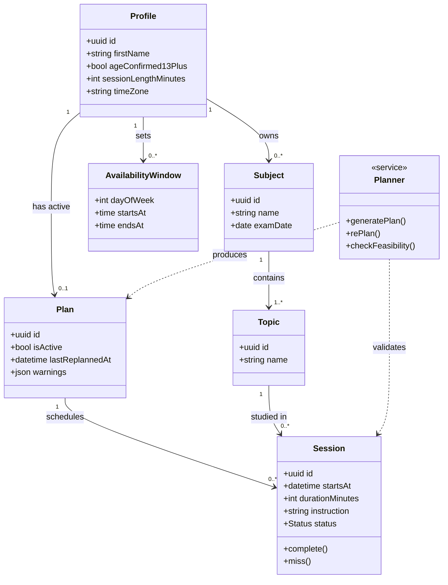

### B2.2 Session Lifecycle — State Diagram

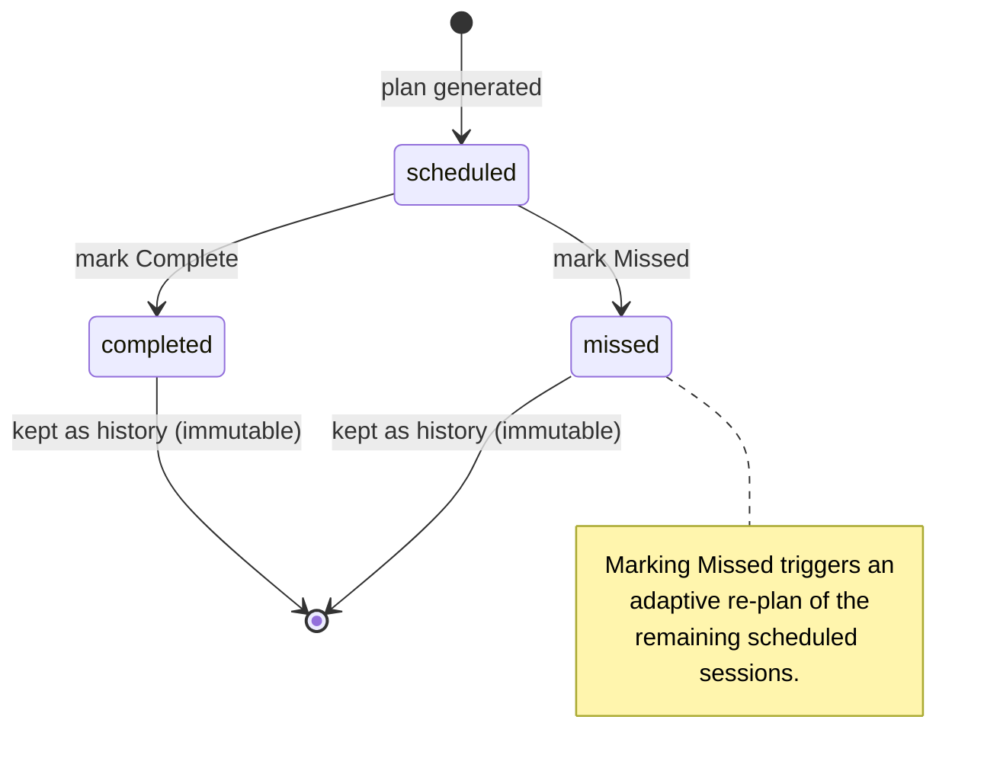

### B2.3 Sequence — Signup → Onboarding → Plan Generation

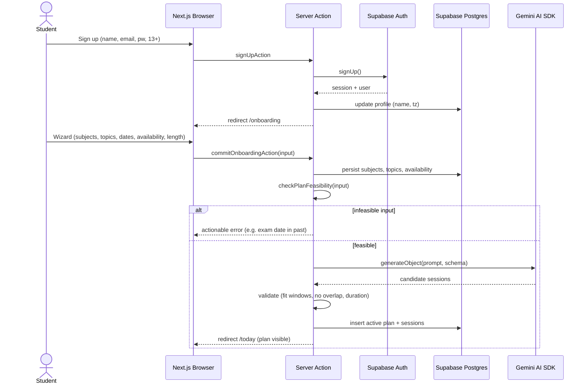

### B2.4 Sequence — Adaptive Re-plan on Missed

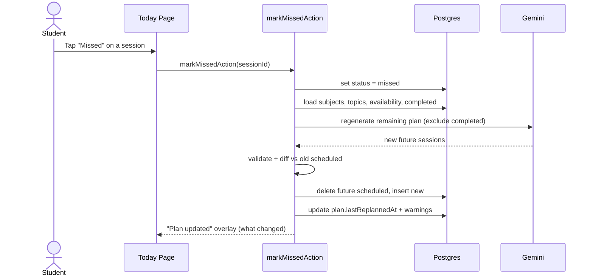

### B2.5 Use-Case Overview

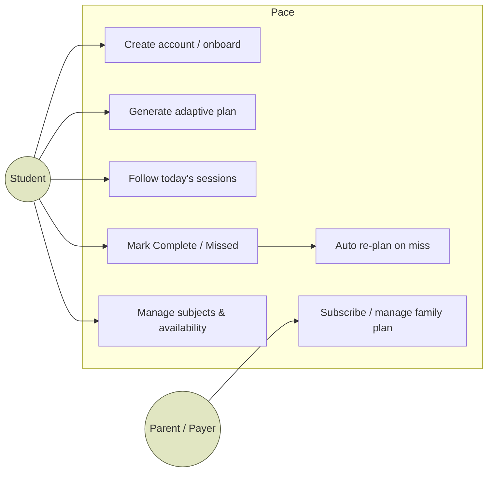

---

## B3. Business Relationship Diagram and ERD

### B3.1 Business Relationship Diagram (value exchange)

Who exchanges what with whom. Solid = money; dashed = value/service/data.

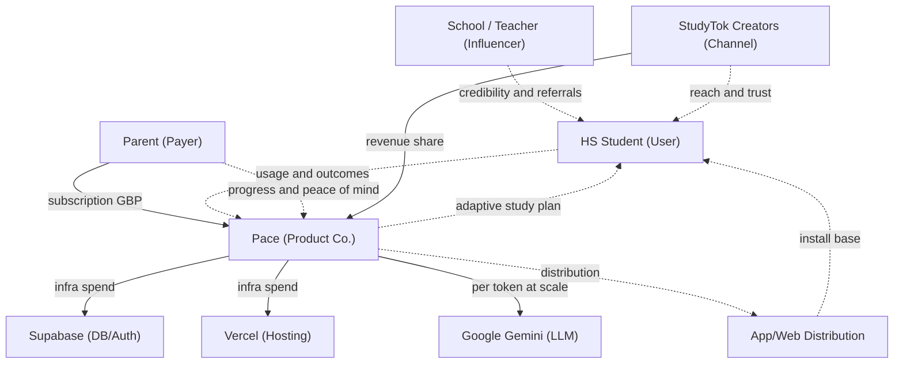

### B3.2 Conceptual ERD (High-Level — Design Level 0)

Entities and relationships only; no attributes. Answers "what things exist and how they relate."

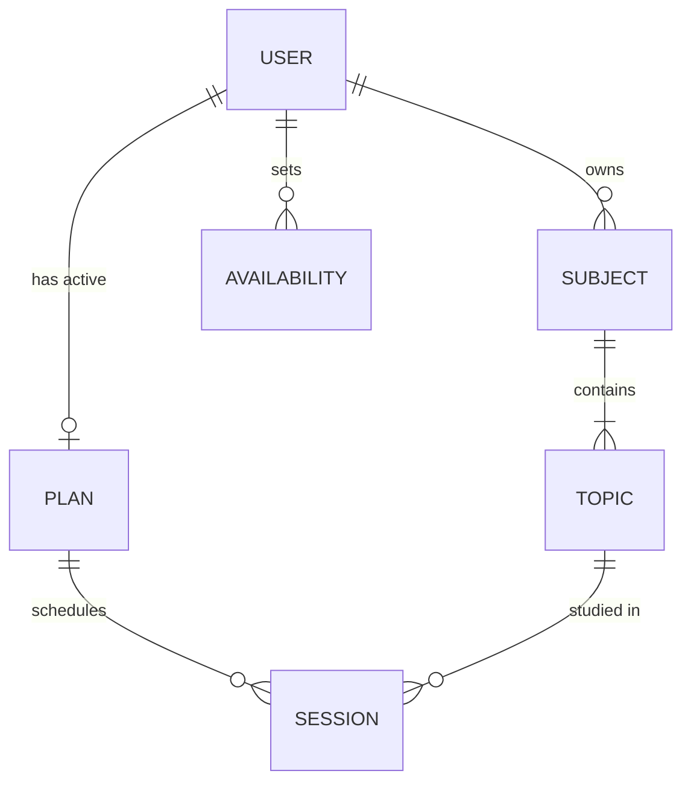

### B3.3 Logical ERD (Low-Level — Design Level 1)

Normalised (3NF), keys shown, database-agnostic types. Answers "what attributes and keys, independent of vendor."

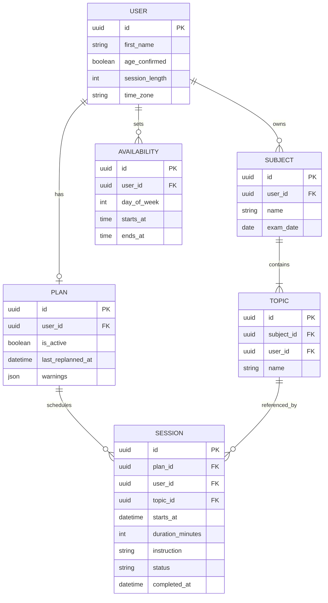

### B3.4 Physical ERD (Low-Level — Design Level 2)

Concrete Supabase/Postgres implementation: real column types, PK/FK, constraints, and Row-Level-Security note. Matches `DATABASE.md` + migration `0002_plan_warnings.sql`.

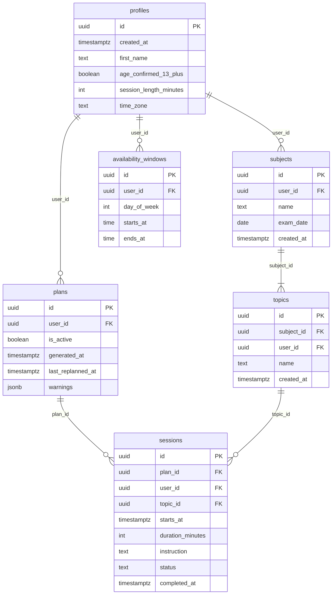

**Physical notes / constraints** (kept in prose so the ERD stays renderer-portable):

- `profiles.id` = `auth.users.id`, `ON DELETE CASCADE`; every other table's `user_id` cascades from `profiles`.
- CHECKs: `profiles.session_length_minutes IN (25,45,60)`; `availability_windows.day_of_week BETWEEN 0 AND 6` and `ends_at > starts_at`; `sessions.status IN ('scheduled','completed','missed')`.
- `plans.warnings` is `jsonb NOT NULL DEFAULT '[]'`; `exam_date`, `last_replanned_at`, `completed_at` are nullable.
- Indexes: `sessions(user_id, starts_at)`; **partial unique** `plans(user_id) WHERE is_active` (one active plan per user).
- RLS ON for every table with per-row `user_id = auth.uid()` policies (`TO authenticated`). A trigger auto-creates a `profiles` row on new `auth.users`. No passwords, analytics, or third-party identifiers stored (minors).

---

## B4. Business Research → Business Modelling

### B4.1 Operational Model

**How the business runs.** Pace is a lean, software-only, direct-to-consumer subscription business. There is no inventory, no logistics, and (in MVP) no human-in-the-loop per plan — the LLM does the work.

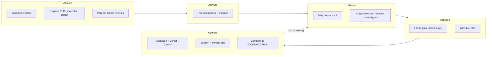

**Operating responsibilities (RACI-lite, MVP → early growth).**

| Function | MVP (founder-led) | Early growth |
|---|---|---|
| Product & Eng | Founder | Founder + 1–2 eng |
| Content / StudyTok | Founder + creators | Creator manager + creators |
| Support | Founder (async) | Part-time support |
| Compliance / Legal | Advisor + templates | Fractional counsel |
| Data / Analytics | Privacy-safe, minimal | Privacy-safe product analytics |

**Key operating constraints (from Part I):** minors as users → no ads, no surveillance, privacy-first; demand is **seasonal** around exam windows; the buyer (parent) and user (student) differ, so activation and monetisation must be designed for both.

### B4.2 P&L / Revenue Model

> **All figures below are ILLUSTRATIVE model inputs (GBP), not measured data.** They are chosen to sit inside the willingness-to-pay bands evidenced in Part I (individual student planners £3–10/mo; family plans ~£80–150/yr) and to make the model computable. Replace with real numbers after a pricing test.

**Revenue streams**

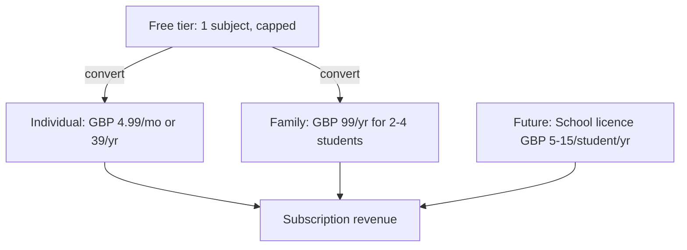

**Cost structure (variable, per paying account / month — ASSUMPTION)**

| Cost | Assumed £/paying acct/mo | Notes |
|---|---|---|
| LLM (plan gen + re-plans) | £0.05–0.20 | Gemini free tier in prototype; paid tier at scale. Few calls/user/mo. |
| Hosting (Vercel + Supabase) | £0.10–0.30 | Fluid Compute + Postgres; scales with usage. |
| Payment fees | ~3% of ARPU | Card + platform fees. |
| **Total variable (COGS)** | **~£0.30–0.65** | Implies **~85–92% gross margin**. |

**Unit economics (ILLUSTRATIVE)**

| Metric | Assumption | Value |
|---|---|---|
| ARPPU (blended ind. + family) | mix-weighted | ~£4.50/mo |
| Gross margin | after COGS | ~88% |
| Avg paid lifetime | high-churn category | 7 months |
| **LTV** (gross contribution) | ARPPU × margin × lifetime | **~£28** |
| **CAC** (blended, creator-led) | low, teen-app benchmark (Part I: Photomath) | **£4–8** |
| **LTV : CAC** | target > 3 | **~3.5–7×** (if churn assumption holds) |
| Payback | CAC / (ARPPU × margin) | ~1–2 months |

> **Biggest risk to these numbers (honest):** the *lifetime* assumption. Part I shows planner churn is high; if avg paid lifetime is 3 months not 7, LTV ≈ £12 and LTV:CAC compresses toward ~1.5–3×. Retention (adaptive re-plan, habit loop) is therefore the single most important lever — not price.

**Illustrative 3-year P&L (scenario, GBP — ASSUMPTION-DRIVEN)**

| Line | Y1 | Y2 | Y3 |
|---|---|---|---|
| Paying accounts (avg) | 1,500 | 12,000 | 45,000 |
| Revenue (ARPPU £4.5 × 12) | £81k | £648k | £2.43m |
| COGS (~12%) | (£10k) | (£78k) | (£292k) |
| **Gross profit** | **£71k** | **£570k** | **£2.14m** |
| S&M (creators, campaigns) | (£45k) | (£260k) | (£730k) |
| R&D (product/eng) | (£90k) | (£240k) | (£520k) |
| G&A (tools, legal, compliance) | (£25k) | (£70k) | (£180k) |
| **EBITDA** | **(£89k)** | **£0k** | **£710k** |

Shape, not certainty: heavy Y1 investment, ~break-even Y2, margin expansion Y3 as the software model's high gross margin drops through once CAC is amortised. Sensitivity is dominated by (1) free→paid conversion and (2) churn.

### B4.3 Go-to-Market × Scalability

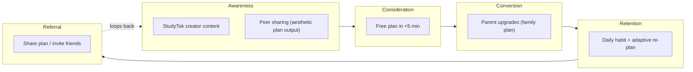

#### Business (positioning & wedge)
- **Wedge:** exam-anchored HS segment (UK A-Level/GCSE first for concreteness; US AP as expansion) — gives the adaptive re-plan a concrete reason to exist and maps onto an existing paid budget (test-prep). See Part I §13.
- **Positioning to the payer:** outcome-framed ("stay on track for your exams / don't fall behind"), never "organise yourself." Parent pays for outcomes, student uses for calm.
- **Moat over time:** retention data + re-plan quality + brand trust with a privacy-first stance for minors (a stance ad-funded competitors cannot easily copy).

#### Resource (what it takes)
- **MVP:** 1 founder-engineer; $0 stack (Vercel Hobby, Supabase Free, Gemini free tier) — see `COST.md`.
- **Early growth:** +1–2 engineers, a part-time creator/community manager, fractional legal/compliance. No sales team (PLG + creator-led).
- **Tooling stays lean and privacy-safe** (no behavioural analytics SDKs; minors).

#### Campaigns (how we acquire)
- **Primary:** TikTok Creator Marketplace, native creator content around exam season (Part I: Photomath's creator campaign drove installs at ~40% lower CPA).
- **Organic PLG:** shareable, aesthetic plan output (the StudyTok currency) as a growth surface.
- **Seasonal cadence:** concentrate spend into the 8–10 weeks before UK exam windows (and US AP), throttle off-season.
- **Referral loop:** student invites friends; family plan invites siblings.
- **Explicitly avoided:** paid ads targeting minors, surveillance/parental-control framing (Part I: 79% teen rejection of such apps).

#### Costing and Operations (what it costs to run + serve)
- **Serve cost per user is near-zero** (software; ~£0.30–0.65/paying acct/mo). The dominant cost is **acquisition (S&M)**, not COGS — so discipline is about CAC and payback, not infra.
- **Infra scales elastically** (Fluid Compute + managed Postgres); no step-function cost cliffs at HS-scale volumes.
- **Compliance is an operating cost, not optional:** architect for COPPA 2.0 (under-17) and GDPR-K now (age gate, minimal data, no ads). This is also a differentiator.

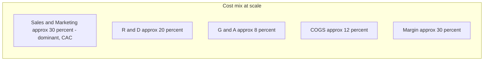

#### Growth (how it compounds)
- **Retention-first:** the adaptive re-plan and the daily "today" habit are the growth engine — every point of retention improvement moves LTV more than any price change (see the P&L sensitivity note).
- **Land-and-expand within the household:** individual → family plan (siblings) is the cheapest expansion.
- **Segment expansion after PMF:** A-Level/GCSE → AP (US) → adjacent exam-anchored segments; later, multi-exam / college-readiness framing (Part I §12) as a larger MVP.
- **Channel expansion:** creator-led → organic PLG → (much later, long-lead) school/teacher credibility and licences — a distribution play, not primary acquisition.

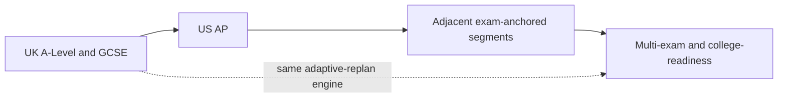

**Growth guardrails (from Part I risks):** commoditised category → win on retention + trust, not features; weak teen self-pay → monetise the parent via family plans; low organic buzz for planners → creator-led seeding is non-optional; seasonality → plan cash and campaigns around exam windows.

---

*End of Part II. Numbers are illustrative model inputs to be replaced with measured data after user interviews and a pricing test; systems diagrams reflect the implemented schema and flows in `DATABASE.md`, `ARCHITECTURE.md`, and `USER-FLOWS.md`.*

---
---

# Part III — Target Countries & Sustainable Pricing Model

> **Purpose.** Parts I and II established the problem and the business model framework. Part III answers a specific commercial question: *Which three countries should we target first, and what price gives us the best chance of converting students (via parents) while generating sustainable revenue?*
>
> **Evidence discipline.** The same labels apply: **[Fact]** = cited authoritative source; **[Analysis]** = our interpretation; **[Assumption]** = plausible but unproven. All pricing figures were verified against official sources or App Store listings on or before **2026-08-26**. Affordability comparisons use the **parent** as the primary payer context (established in Part I §8) — not the student — except where student self-pay is explicitly discussed.
>
> **Key constraint.** The MVP has one user type (student) and no parent dashboard or family-plan feature. Pricing in this document is therefore for the **initial individual/student subscription**, paid in practice by the parent. A family tier is a future upgrade.

---

## C0. Research Method & Data Limitations

Affordability data for high-school students aged 14–18 is sparse as a primary-source category. Surveys from NatWest (UK), Piper Sandler (US), Westpac (Australia), and Greenlight (US) were the strongest sources found. Key limitations:

- **Piper Sandler** reports teen *spending* (not income/allowance separately); the proprietary report is not publicly available.
- **NatWest Rooster Money** samples families already using a financial-management app — likely biased toward higher financial engagement than average.
- **No teen-specific (14–18) subscription spend figure** was found for any country from a primary source. Adult Gen Z proxies (ages 13–28 or 18–25) are used where noted.
- **UK and AUD App Store prices for Quizlet and Structured** were not confirmed directly; USD prices are confirmed. Local currency prices may differ due to VAT (UK: 20%) and Apple/Google exchange-rate policy.
- **Canada** was researched for comparison but is not recommended as a priority market (see §C1.4).

All figures that could not be confirmed from a primary or authoritative secondary source are marked **[Assumption]** or **[Vendor estimate]**.

---

## C1. Country Selection — Top Three Markets

### Selection criteria

The three markets were evaluated on eight factors, weighted for a **B2C, English-language, exam-anchored HS study-planner** at the MVP stage:

| Factor | Weight | Rationale |
|---|---|---|
| Exam anchor (fixed high-stakes dates students cannot move) | High | Core product value requires a compelling exam deadline |
| Student market size | Medium | More students = larger ceiling; but density matters more than raw count at MVP |
| Parent purchasing power | High | Primary payer; must be able to absorb $30–60/year without significant friction |
| English language | High | MVP is English-only; translation not planned |
| EdTech / app adoption | Medium | Cultural readiness for digital study tools |
| Competition intensity | Medium | Less-saturated markets offer earlier-mover advantage |
| Distribution fit (creator-led) | Low-Medium | TikTok and Instagram study culture presence |
| Regulatory simplicity | Medium | COPPA (US under-13), GDPR-K (UK/EU), PPSA (AU) — all manageable but not identical |

---

### C1.1 United Kingdom — Primary Market

**Why first:**

- **[Fact] ~3.5–3.6 million secondary students** in England alone (state + independent; state-funded secondary: ~3.2M per DfE/NFER Jan 2024 [R36]). Including Scotland, Wales and Northern Ireland: ~4.2M total across the UK [R37].
- **[Fact] The exam structure is ideal.** GCSE (Year 11, ages 15–16) and A-Level (Year 13, ages 17–18) are the UK's national high-stakes exams with fixed May–June windows and published timetables. The adaptive re-plan core is most useful precisely here: a fixed exam date that cannot move, against daily life that constantly does.
- **[Fact] 29% of secondary pupils in England and Wales now use private tutoring** (Sutton Trust 2026 data, via Ariston Education [R38]), up from 18% a decade ago. Average family tutoring spend: ~£2,200/year (~£37.45/hour × 1 session/week × ~58 weeks — Parentkind/YouGov [R39]).
- **[Fact] MyStudyLife is already priced at £4.99/mo / £29.99/yr in the UK App Store** [R40], establishing market-set price expectations in GBP.
- **[Analysis]** The UK combines a concrete exam anchor, high parental willingness-to-pay for exam preparation, an established GBP price band, and (for the product founder) natural cultural and language fit. It is the clearest go-to-market beachhead.

---

### C1.2 United States — Secondary Market

**Why second:**

- **[Fact] ~16.9 million high-school students** (public 15.5M + private 1.4M; NCES fall 2022 [R41]) — by far the largest English-language HS market in the world.
- **[Fact] AP exams (May), SAT (year-round), and ACT (year-round) provide the exam anchor.** The May AP window is the clearest fixed-date parallel to UK GCSE/A-Level. Parents already spend materially on test prep.
- **[Fact] Average SAT prep tutoring rate: $62/hour** (Wiingy market analysis [R42]); typical annual test-prep spend per student: $300–$1,500+ per course, up to $5,000–$20,000 for premium packages [R43].
- **[Fact] Teen self-reported annual spending: $2,388** (Piper Sandler 49th survey, Spring 2025, 6,450+ teens, average age 15.7 [R44]). Teen weekly allowance: approximately $13–$21/week depending on age (Greenlight 2025 [R45]).
- **[Analysis]** The US market is 4.7× larger by student count than the UK, and tutoring budgets are at least as high. The competitive landscape is also denser (more EdTech incumbents, free tools like Khanmigo and Socratic). Recommended as expansion market after UK PMF is established, or as parallel beachhead if distribution is creator-led on US platforms.

---

### C1.3 Australia — Third Market

**Why third:**

- **[Fact] ~1.86–1.90 million secondary students** (ABS Schools 2024–2025: total secondary 45.1–45.6% of 4.13–4.16M total enrolment [R46]).
- **[Fact] Strong national exam culture.** Every state and territory has a fixed high-stakes Year 12 senior certificate (HSC in NSW, VCE in Victoria, QCE in Queensland, WACE in WA, SACE in SA, etc.), each producing an ATAR for university entry [R47]. Year 12 ATAR pressure is the Australian equivalent of A-Level stress.
- **[Fact] Average weekly teen pocket money in Australia: AU$25.02/week** (Westpac survey, 1,007 Australian parents, April 2025 [R48]).
- **[Fact] Australian private tutoring market: ~AU$1.3 billion/year** (Datanyze/Tutoring.net.au [R49]); typical rates AU$30–150/hour with Cluey Learning (major online platform) charging AU$70–90/hour [R50].
- **[Fact] Spotify Student in Australia is AU$7.99/month** [R51] — a useful cultural anchor for what teens (and parents) accept as a normal monthly subscription.
- **[Analysis]** Australia combines a concrete year-12 exam anchor equivalent to A-Level, high purchasing power (among the highest globally), a large and growing tutoring market, strong English-language digital adoption, and meaningfully lower competition than the US. Market size is ~54% of the UK's secondary population — smaller, but not negligible, and less saturated by HS-specific study apps. It is the natural third market for a product that starts in the UK and expands in English-speaking exam-cultures.

---

### C1.4 Why Not Canada

Canada was researched but is not recommended as a priority market:

- **[Fact] ~1.4–1.5M estimated grades 9–12 students** — similar to Australia in size, but the estimate is less certain (no single published figure for grades 9–12 was found from Statistics Canada [R52]).
- **[Analysis]** Canada has no single national high-stakes exam. Secondary credentials are entirely provincial (Ontario's OSSSD, BC's Dogwood Diploma, etc.) with no federal ATAR-equivalent. This weakens the "fixed exam date" anchor that makes adaptive re-planning most valuable. Additionally, Canada's EdTech market is closely tied to and dominated by US tools — it adds cost (French-language requirements in Quebec for any meaningful national coverage) with limited differentiation over the US market. Better addressed after US launch as a natural geographic extension.

---

## C2. Affordability Research by Country

### C2.1 United Kingdom

| Metric | Figure | Source | Type |
|---|---|---|---|
| Secondary students (England, state-funded) | ~3.2M (Jan 2024) | DfE / NFER [R36] | [Fact] |
| Teen regular weekly pocket money (17-yr-olds) | £8.31/week | NatWest Rooster Money 2025 [R53] | [Fact] (app-user sample) |
| Teen total weekly income (all sources, 17-yr-olds) | ~£23.97/week | Statista 2024–25 [R54] | [Fact] (includes part-time work) |
| Adult UK subscription spend (16+) | £786/year (~£65.50/month) | Aqua survey 2025 [R55] | [Fact] (proxy; not teen-specific) |
| Average family tutoring spend | ~£2,200/year (~£183/month) | Parentkind/YouGov via Ariston Ed [R38] | [Fact] |
| Average hourly tutoring rate | £37.45/hour | Parentkind/YouGov survey [R39] | [Fact] |
| Students using private tutoring | 29% of secondary pupils | Sutton Trust 2026 [R38] | [Fact] |
| MyStudyLife+ (UK App Store) | £4.99/month · £29.99/year | UK App Store [R40] | [Fact] |
| Spotify Student (UK) | £5.99/month | Spotify UK [R56] | [Fact] |

**[Analysis]** At £4.99/month, Pace's recommended monthly price equals less than two hours of pocket money at the NatWest weekly average (£8.31), and equals roughly 13 minutes of professional tutoring time (at £37.45/hour). For parents paying £2,200/year for tutoring, a £29.99/year plan is approximately 1.4% of their tutoring budget — effectively invisible. The affordability case for parents is very strong. For teen self-pay it is moderate (0.6 weeks of regular pocket money per month).

---

### C2.2 United States

| Metric | Figure | Source | Type |
|---|---|---|---|
| HS students (grades 9–12) | ~16.9M | NCES [R41] | [Fact] |
| Teen self-reported annual spending | $2,388 (Spring 2025) | Piper Sandler 49th survey [R44] | [Fact] (spending, not income) |
| Teen weekly allowance (17-yr-olds) | ~$20.87/week | Greenlight 2025 [R45] | [Fact] (app-user sample) |
| Gen Z monthly subscription spend | ~$118/month (ages 13–28) | Bango survey Apr 2025 [R57] | [Fact] (proxy; includes adults) |
| Average SAT prep hourly rate | $62/hour | Wiingy/Yahoo Finance [R42] | [Fact] |
| Typical annual test prep family spend | $300–$1,500/course | IvyStrides [R43] | [Fact] (range) |
| Quizlet Plus | $7.99/month · $35.99/year | Quizlet / Brighterly [R58] | [Fact] |
| Structured Pro | $6.49/month · $19.99/year | Structured blog [R59] | [Fact] |
| Spotify Student (US) | $5.99/month | Spotify [R56] | [Fact] |
| ChatGPT Plus | $20.00/month | OpenAI [R60] | [Fact] |
| Duolingo Super | $12.99/month · $59.99/year | Duolingo Guides [R61] | [Fact] |
| Khanmigo (AI tutor, Khan Academy) | ~$4/month · ~$44/year | AI Flow review [R62] | [Fact] (estimate from review site) |

**[Analysis]** At $5.99/month, Pace is positioned below Quizlet Plus ($7.99), below Duolingo Super ($12.99), and below ChatGPT Plus ($20). It is in line with Spotify Student ($5.99) — a cultural anchor teens readily accept. For parents spending $300–$1,500 on a single test-prep course, $5.99/month ($71.88/year) is a negligible addition. US is the strongest purchasing-power market but the most competitive.

---

### C2.3 Australia

| Metric | Figure | Source | Type |
|---|---|---|---|
| Secondary students (Year 7–12) | ~1.86–1.90M (2024–2025) | ABS Schools 2025 [R46] | [Fact] |
| Teen weekly pocket money | AU$25.02/week (2025) | Westpac survey, Apr 2025 [R48] | [Fact] (commissioned survey) |
| Private tutoring market size | ~AU$1.3bn/year | Datanyze / Tutoring.net.au [R49] | [Vendor estimate] |
| Average tutoring rate (online) | AU$37–50/hour | Cluey / KIS Academics [R50] | [Fact] |
| Premium tutoring (in-person) | AU$70–90/hour (Cluey) | Cluey Learning [R50] | [Fact] |
| Spotify Student (AU) | AU$7.99/month | Spotify AU [R51] | [Fact] |
| Apple Arcade (AU) | AU$9.99/month | ThePricer [R63] | [Fact] |
| ChatGPT Plus (AU) | AU$32.98/month | FastAccess AI [R64] | [Fact] |

**[Analysis]** Australian teens have higher weekly pocket money (AU$25/week) than UK teens (£8.31/week at current exchange rates: ~AU$17). Purchasing power is strong. A $9.99/month subscription (AU) equals 0.4 weeks of average teen pocket money — the most affordable of the three markets for student self-pay. The tutoring market is large and parents are clearly willing to spend on education. Quizlet Plus and Structured AUD prices were not confirmed from primary sources and need App Store verification.

---

## C3. Competitor Pricing Landscape

All prices checked against official sources on or before **2026-08-26**. Prices in USD unless otherwise noted.

| Product | Free plan | Monthly | Annual | Notes |
|---|---|---|---|---|
| **MyStudyLife** | Yes (5 active tasks) | $6.99 (US) · £4.99 (UK) | $39.99 (US) · £29.99 (UK) | Student planner; AI generates plans; no adaptive re-plan on miss |
| **Quizlet Plus** | Yes (basic) | $7.99 | $35.99 | Flashcards + AI practice; not a planner |
| **Structured Pro** | Yes | $6.49 | $19.99 ($64.99 lifetime) | Time-blocking planner; partial manual replan; not exam-specific |
| **Power Planner** | Yes | — | $4.99 (one-time lifetime) | GPA calculator + assignment tracker; no AI; feature-frozen |
| **Khanmigo** | Free in districts | ~$4/month | ~$44/year | AI tutor (Socratic method); not a planner |
| **StudyFetch** | Yes (limited) | $11.99 | ~$4.99–7.99/month billed annually | AI notes/flashcards from PDFs; not a planner |
| **Notion Plus** | Free for students | $10/month | Billed annually | General workspace; free with school email |
| **Spotify Student** | — | $5.99 (US) · £5.99 (UK) · AU$7.99 (AU) | — | Cultural benchmark: what teens pay for a subscription they value |
| **Duolingo Super** | Yes (ads) | $12.99 | $59.99 ($119.99 family) | Habit-based learning; strong retention design |
| **ChatGPT Plus** | Yes (limited) | $20.00 (US) · AU$32.98 (AU) | — | Most capable AI; no exam-aware planning |

**[Analysis]** The student planner category clusters tightly at $4–7/month. The AI-education category sits at $4–12/month. Neither category currently ships adaptive re-planning anchored to exam dates. ChatGPT ($20) and Duolingo Super ($13) demonstrate teens and parents will pay higher for genuinely differentiated AI value — but those products have massive brand recognition. A new entrant should enter at the lower bound of the AI-education category to reduce friction on first conversion, with room to raise prices after brand establishment.

---

## C4. Country Comparison

| Factor | United Kingdom | United States | Australia |
|---|---|---|---|
| **Secondary student market** | ~4.2M (all UK) | ~16.9M | ~1.87M |
| **Exam anchor quality** | ★★★★★ GCSE / A-Level; national, fixed May–June | ★★★★☆ AP (May fixed); SAT/ACT year-round | ★★★★★ HSC/VCE/WACE etc.; state-level fixed Year 12 exams + ATAR |
| **Parent purchasing power** | High (developed economy) | Very high (highest globally) | High (comparable to UK) |
| **Teen weekly disposable income** | ~£8–24 (regular pocket money to total incl. jobs) | ~$13–21 (allowance) | ~AU$25 |
| **Parent tutoring spend** | ~£2,200/year (~£183/month) | ~$1,200–$4,000+/year | Market ~AU$1.3bn; rates AU$37–90/hour |
| **Competitor pricing band** | £4.99–6.99/month | $4.99–7.99/month | AUD pricing unconfirmed; US/UK range applies directionally |
| **Subscription culture benchmark** | Spotify Student £5.99/month | Spotify Student $5.99/month | Spotify Student AU$7.99/month |
| **Market competition intensity** | Moderate (MSL dominant; few AI entrants) | High (many EdTech incumbents) | Low–Moderate (limited HS-specific AI tools) |
| **Market opportunity** | Strong beachhead (language + exam fit + known pricing) | Largest upside; harder to penetrate | Best upside-to-competition ratio |
| **Price sensitivity (student self-pay)** | Moderate | Moderate | Low (highest pocket money relative to price) |
| **Price sensitivity (parent payer)** | Very low vs tutoring costs | Very low vs test-prep spend | Very low vs tutoring spend |
| **Recommended monthly price** | £4.99 | $5.99 | AU$8.99 |
| **Recommended annual price** | £34.99 | $39.99 | AU$54.99 |

**[Analysis]** The US has the largest absolute student market but the highest competition and most price-anchored expectations from free incumbents (Notion, Khanmigo, Socratic). The UK offers the cleanest exam anchor (GCSE/A-Level) with an established GBP price band. Australia offers the best upside-to-competition ratio: strong purchasing power, clear exam culture, and an under-served market for AI study tools. The recommended launch sequence is UK → US+AU simultaneously (both require separate App Store localisation anyway).

---

## C5. Pricing Strategy

### What the evidence recommends

**1. Freemium entry, annual-first conversion**

The evidence from competitors, teen psychology, and the business risk profile all point to the same structure:

- **Free tier** to allow students to generate a first plan and experience the core product with no payment friction. This is table-stakes in the category (every major competitor has a free tier).
- **Paid tier** that unlocks the full adaptive re-plan and multi-subject capability — the one feature no competitor ships, and the core product value.
- **Annual plan as the primary CTA** (not monthly), because planner churn is the #1 business risk. A student who pays for a year stays through the full academic-year cycle. A monthly subscriber who abandons in week three is expensive to reacquire.

**2. One global price in local currencies — not "global USD"**

Regional pricing is appropriate here for three structural reasons:

- **VAT:** UK App Store prices include 20% VAT. If USD $5.99 is listed globally, the UK-equivalent GBP price after tax is ~£5.15 — higher than MSL+ (£4.99) and above the UK category ceiling.
- **Market norms:** MSL+ already set the UK market at £4.99/month. Pricing above that creates an immediate objection.
- **App Store localisation is required anyway:** A UK, US and AU App Store presence each has a separate listing. Setting local prices is trivial additional work.
- **[Analysis]** This is NOT dynamic or aggressive regional pricing — it is simply using the local-currency equivalent that makes sense in each market, accounting for tax and purchasing-power norms. The economics convert to near-parity in USD when averaged across the year.

**3. No teen self-pay discount required**

At the recommended prices, the primary payer (the parent) finds the cost trivially affordable relative to tutoring spend. A student discount creates complexity, requires verification, and is not necessary to achieve conversion. Khanmigo and Quizlet do not require student verification for their base plan. This should be revisited when/if a family plan tier ships.

**4. Seasonal launch timing over introductory pricing**

Given the exam-anchored positioning, launch timing matters more than introductory pricing. The highest-intent moments are:
- **UK:** September (start of academic year, A-Level Year 13 begins), January (second term, GCSE cramming season), March–April (final exam sprint).
- **US:** August–September (back-to-school), December–January (AP registration period), March–May (AP exam window).
- **Australia:** January (school year starts), August–September (Year 12 exam season begins), October–November (HSC/VCE exams).

Offering a limited-time annual plan at a discount during these windows (e.g., "Start your year for £24.99" vs standard £34.99) is more targeted than a permanent student discount and creates urgency aligned with actual behaviour.

---

## C6. Recommended Prices

### Free tier

| Feature | Free |
|---|---|
| Subjects | 1 subject only |
| Topics | Unlimited within that subject |
| Plan generation | Yes — one plan at a time |
| Adaptive re-planning | No (or: 1 free re-plan to demonstrate the feature) |
| Today's dashboard | Yes |
| Study session timer | Yes |
| Plan view | Yes |
| Settings / availability edit | Yes (but re-plan not triggered without Pro) |

**Purpose:** Let the student generate a plan and experience the core value. The paywall is at the moment the plan breaks — when a session is missed and the student cannot re-plan without upgrading. This is the highest-intent moment to ask for payment.

---

### Pro tier

| | United Kingdom | United States | Australia |
|---|---|---|---|
| **Monthly** | **£4.99/month** | **$5.99/month** | **AU$8.99/month** |
| **Annual** | **£34.99/year** | **$39.99/year** | **AU$54.99/year** |
| Annual saving vs. monthly | 42% (£24.89 saved) | 44% ($31.89 saved) | 49% (AU$52.89 saved) |
| Annual cost per day | £0.096 | $0.11 | AU$0.15 |
| Revenue per paying user (annual) | £34.99 | $39.99 | AU$54.99 |
| Revenue per paying user (monthly × 7-month avg. lifetime) | £34.93 | $41.93 | AU$62.93 |

| Feature | Pro |
|---|---|
| Subjects | Unlimited |
| Adaptive re-planning on missed sessions | Yes |
| Adaptive re-planning on availability/subject changes | Yes |
| Plan warnings (topic can't fit before exam) | Yes |
| Full plan view | Yes |
| All free-tier features | Yes |

**Annual vs. monthly economics note:** At a 7-month average paid lifetime (the optimistic assumption from Part II B4.2), a monthly subscriber generates approximately the same gross revenue as an annual subscriber — but the annual subscriber has *committed* for 12 months, eliminating the 7-month churn risk. **Annual plan retention is worth more than monthly price uplift.** The recommended CTA hierarchy is: Free → Annual → Monthly (monthly as an explicit fallback for users who won't commit annually).

---

## C7. Affordability Assessment

### From the student's perspective (self-pay)

| Country | Monthly price | Teen weekly income | Monthly price as % of weekly income | Self-pay affordability |
|---|---|---|---|---|
| UK | £4.99 | £8.31 (pocket money only) / £23.97 (incl. jobs) | 60% of weekly pocket money / 21% of total | **Moderate** (pocket money only); **Affordable** (incl. part-time work) |
| US | $5.99 | $13–21/week (allowance) | 29–46% of one week's allowance | **Moderate** |
| Australia | AU$8.99 | AU$25.02/week | 36% of one week's pocket money | **Affordable** |

The monthly price is not trivial for student self-pay. For a 14–15 year old on £8.31/week, £4.99/month represents more than half a week's pocket money. This reinforces the parent-as-payer model from Part I.

### From the parent's perspective (primary payer)

| Country | Annual price | Typical tutoring hourly rate | Annual price as hours of tutoring | Parent affordability |
|---|---|---|---|---|
| UK | £34.99/year | £37.45/hour | **0.93 hours** of tutoring | **Very affordable** |
| US | $39.99/year | $62/hour | **0.65 hours** of SAT tutoring | **Very affordable** |
| Australia | AU$54.99/year | AU$37–90/hour | **0.6–1.5 hours** of tutoring | **Very affordable** |

**[Analysis]** Against the benchmark of what parents already voluntarily spend on exam preparation, the annual plan price in all three markets is negligible — less than a single tutoring session. Affordability is not a meaningful barrier for the parent payer. The conversion risk is **awareness and trust**, not price.

---

## C8. Conversion Analysis

### Price vs. conversion rate vs. LTV

A lower price increases conversion probability but reduces revenue per user. At the category's saturation and given the exam-anchored value frame, the analysis favours a price at the **upper-middle of the student planner band** (£4.99 / $5.99) rather than at the floor ($2.99) or ceiling ($9.99):

| Scenario | Monthly price (UK) | Assumed conversion rate | Monthly subscribers (1,000 free users) | Monthly MRR | Annualised |
|---|---|---|---|---|---|
| Floor pricing | £2.99 | 8% | 80 | £239 | £2,868 |
| **Recommended** | **£4.99** | **5%** | **50** | **£250** | **£2,994** |
| Upper bound | £7.99 | 3% | 30 | £240 | £2,875 |

**[Analysis]** The scenarios converge — the revenue difference between the three price points is small in the short run because conversion rate falls with price. The strategic advantage of the recommended price is not MRR uplift but **positioning**: £4.99 is the market-set price (MSL+), familiar to parents, and does not invite the "too expensive for a student" objection that £7.99 would trigger. The real revenue lever is converting monthly to annual.

### Annual vs. monthly — the retention argument

| Plan | Price | Months retained (before churn) | Gross revenue per user |
|---|---|---|---|
| Monthly (UK) | £4.99/month | 3 months (pessimistic) | £14.97 |
| Monthly (UK) | £4.99/month | 7 months (optimistic) | £34.93 |
| **Annual (UK)** | **£34.99/year** | **12 months (committed)** | **£34.99** |

**[Analysis]** The annual plan generates the *same* gross revenue as 7 months of monthly subscription — but guarantees it. Given that planner churn can be as bad as 3 months, the annual plan eliminates the worst-case outcome. **The annual plan should be the primary offer at every paywall moment, including the moment after a missed session triggers the re-plan prompt.**

### Free plan design

The free plan's job is to create the "aha moment" — the student generates a plan, follows it for a day or two, misses a session, and hits the paywall at the exact moment they need the re-plan. This is the highest-conversion moment in the product. The free plan should:
- Allow full onboarding and first plan generation
- Show them what adaptive re-planning looks like (the overlay) before asking them to upgrade
- Offer a direct annual upgrade from the paywall modal (not monthly as default)

**[Assumption]** That the paywall-at-missed-session moment converts better than an upfront paywall. This is plausible from the "trying before buying" literature but is not tested for this specific product. Instrument the paywall modal's conversion rate from day one.

---

## C9. Final Recommendation

### Recommended Target Countries

**1. United Kingdom** — Primary beachhead.
Strongest exam anchor (GCSE/A-Level), established GBP price band (MSL+ at £4.99/mo), high parent tutoring spend (£2,200/year average), ~4.2M secondary students, English-language product, and the lowest launch complexity. Build and validate here first.

**2. United States** — Second market (parallel or immediate follow-on).
Largest student market (~16.9M), highest absolute purchasing power, AP May exam window maps cleanly onto the product. More competitive EdTech landscape — enter with creator-led distribution (TikTok/YouTube Study channels) to build brand before facing platform competition. USD pricing required regardless.

**3. Australia** — Third market (parallel to US or short follow-on).
Best upside-to-competition ratio: strong exam culture (ATAR/HSC/VCE), high purchasing power, well-funded tutoring market (~AU$1.3bn), highest teen weekly pocket money of the three markets, and materially lower AI study-tool competition than the UK or US. Requires AUD App Store localisation.

---

### Recommended Pricing

| Tier | United Kingdom | United States | Australia |
|---|---|---|---|
| **Free** | £0 | $0 | AU$0 |
| **Pro — Monthly** | £4.99/month | $5.99/month | AU$8.99/month |
| **Pro — Annual** | £34.99/year | $39.99/year | AU$54.99/year |
| Annual saving | 42% | 44% | 49% |
| Revenue per annual subscriber | £34.99 | $39.99 | AU$54.99 |

**Primary CTA at every paywall:** annual plan. Monthly as explicit fallback only.

**Free tier features:** 1 subject · plan generation · today's view · study timer · static plan view.
**Pro features:** unlimited subjects · adaptive re-plan on miss · adaptive re-plan on availability/subject change · plan warnings.

---

### Regional Pricing

**Yes — use local-currency pricing for each market. Do not use a single global USD price.**

Reason: UK App Store prices include 20% VAT; a USD price converted to GBP would exceed the MSL+ market ceiling. Australia's AUD prices are conventionally set higher in nominal terms (Spotify: AU$7.99 vs $5.99 USD) and App Store localisation is required regardless. Using three local prices is a trivial addition to three App Store listings and is the standard practice of every product in this category.

---

### Pricing Confidence

**Medium.**

**What makes this medium rather than high:**
- No direct UK/AU App Store price confirmation for Quizlet and Structured in local currencies — competitor ceiling in GBP/AUD is based on MSL+ only.
- No primary-source data for teen-specific (14–18) monthly subscription spend in any country.
- The conversion rate assumptions in the scenario analysis are illustrative — actual rates are unknown.
- Australian AUD pricing is benchmarked against Spotify/Apple Arcade (lifestyle apps), not study-planner competitors, because local study-planner prices were not confirmed.

**What would raise confidence to High:**
- 5 parent pricing conversations (UK) where you name a price and measure willingness: "Would you pay £34.99/year for this?"
- Direct App Store price verification for MSL+, Quizlet, and Structured in GBP and AUD.
- One month of real conversion data from a live free tier.

---

## References (Part III)

*(Appended to the main references from Part I. Numbering continues from [35].)*

R36. NFER — "Just a little drop? Pupil numbers are falling slower than previous expectations" (secondary enrolment analysis). nfer.ac.uk. https://www.nfer.ac.uk/blogs/just-a-little-drop-pupil-numbers-are-falling-slower-than-previous-expectations/

R37. BESA — Education Statistics (UK four-nations pupil totals, 2022/23). besa.org.uk. https://www.besa.org.uk/insights/education-statistics/

R38. Ariston Education — "UK Tutoring Statistics 2026" (Sutton Trust 29% prevalence data). ariston.education. https://ariston.education/uk-tutoring-statistics/

R39. Latimer Tuition — "Private Tutor Costs UK 2026" (Parentkind/YouGov survey; £37.45/hour average). latimertuition.com. https://latimertuition.com/ed-centre/parents/finding-the-right-tutor/private-tutor-costs-uk-2026/

R40. My Study Life — MSL+ pricing page (£4.99/month · £29.99/year UK). Checked 2026-08-26. mystudylife.com. https://mystudylife.com/msl-plus/

R41. NCES — Fast Facts: Back-to-school statistics (#372), grades 9–12 enrollment (also cited as [12] in Part I). https://nces.ed.gov/fastfacts/display.asp?id=372

R42. Yahoo Finance / Wiingy — "SAT Prep Tutoring Costs" ($62/hour average). finance.yahoo.com. https://finance.yahoo.com/news/sat-prep-tutoring-costs-63-165100431.html

R43. IvyStrides — "SAT/ACT Tutoring Cost 2026" (range $300–$20,000+). ivystrides.com. https://www.ivystrides.com/blog/sat-act-tutoring-cost/

R44. Piper Sandler — "49th Semi-Annual Taking Stock With Teens® Survey" (Spring 2025; $2,388 teen annual spend; 6,450+ teens). pipersandler.com. https://www.pipersandler.com/news/piper-sandler-completes-49th-semi-annual-taking-stock-teensr-survey

R45. Greenlight — "Average Allowance by Age for Kids" ($13.15/week national average; $20.87/week at age 17). greenlight.com. https://greenlight.com/learning-center/earning/average-allowance-by-age-for-kids

R46. Australian Bureau of Statistics — "Schools 2025" (total enrolment 4,160,918; secondary 45.6%). abs.gov.au. https://www.abs.gov.au/statistics/people/education/schools/latest-release

R47. Study Australia — "Understanding Australian Qualifications" (HSC, VCE, QCE, WACE, SACE, TCE, ATAR explained). studyaustralia.gov.au. https://www.studyaustralia.gov.au/en/tools-and-resources/tips-and-advice-for-students/understanding-australian-qualifications

R48. Westpac — "Kids earning more pocket money than ever before" media release (AU$25.02/week average; 1,007 parents surveyed, Apr 2025). westpac.com.au. https://www.westpac.com.au/about-westpac/media/media-releases/2025/28-september/

R49. Tutoring.net.au — "Tutoring Statistics" (AU$1.3bn/year market). tutoring.net.au. https://tutoring.net.au/statistics/

R50. Cluey Learning — "How Much Does Tutoring Cost in Australia 2025" (AU$70–90/hour Cluey; AU$30–150/hour market range). clueylearning.com.au. https://clueylearning.com.au/blog/how-much-should-tutoring-cost/

R51. Spotify — Student plan pricing page (AU$7.99/month, Australia). spotify.com. https://www.spotify.com/au/student/

R52. Statistics Canada — "Elementary-Secondary Education Survey 2022/23" (total K–12; grades 9–12 not published as a single figure). statcan.gc.ca. https://www.statcan.gc.ca/o1/en/app/7744-elementary-secondary-education-finances-students-and-educators-20222023

R53. NatWest / Rooster Money — "Pocket Money Index 2025" (£8.31/week for 17-yr-olds; 354,238 users). natwestgroup.com. https://www.natwestgroup.com/news-and-insights/news-room/press-releases/financial-capability-and-learning/2025/jun/annual-natwest-rooster-money-pocket-money-index-reveals-industri.html

R54. Statista — "Average weekly income of children in the UK 2024-25, by age" (£23.97/week for 17-yr-olds, incl. part-time work; paywalled). statista.com. https://www.statista.com/statistics/1006191/average-value-of-pocket-money-in-the-uk-by-age

R55. Aqua Card — "Subscription Spending in 2025" (£786/year average for UK adults 16+; 2,000 people surveyed Jun–Jul 2025). aquacard.co.uk. https://www.aquacard.co.uk/building-better-credit/subscription-spending-in-2025

R56. Spotify — Student plan pricing, UK (£5.99/month) and US ($5.99/month). spotify.com/uk/student · spotify.com/us/student

R57. Bango / The Desk — "Gen Z consumer survey" (Gen Z ~$118/month on subscriptions, ages 13–28; Apr 2025). thedesk.net. https://thedesk.net/2025/04/bango-generation-z-young-consumer-survey/

R58. Brighterly — "How Much Does Quizlet Cost 2026" ($7.99/month · $35.99/year). brighterly.com. https://brighterly.com/blog/quizlet-cost/

R59. Structured — "New Pricing" blog post ($6.49/month · $19.99/year · $64.99 lifetime). structured.app. https://structured.app/blog/new-pricing

R60. Suprmind — "ChatGPT Plus Price" ($20/month USD; no current student discount). suprmind.ai. https://suprmind.ai/hub/chatgpt/pricing/chatgpt-plus-price/

R61. Duolingo Guides — "How Much is Super Duolingo" ($12.99/month · $59.99/year · $119.99/year family). duolingoguides.com. https://duolingoguides.com/how-much-is-super-duolingo/

R62. AI Flow Review — "Khanmigo AI Review 2025" (~$4/month · ~$44/year individual). aiflowreview.com. https://aiflowreview.com/khanmigo-ai-review-2025/

R63. ThePricer — "Apple Arcade Cost" (AU$9.99/month · $49.99/year AUD). thepricer.org. https://www.thepricer.org/how-much-does-apple-arcade-cost/

R64. FastAccess AI — "ChatGPT Plus Australia Price" (AU$32.98/month). fastgptplus.com. https://fastgptplus.com/en/posts/chatgpt-plus-australia-price/

---

*End of Part III. Prices should be re-verified against live App Store listings before any public announcement; App Store prices can change with 30 days' notice. The affordability and conversion-rate figures are directional estimates to be replaced with real data from a pricing test and early user cohorts.*
