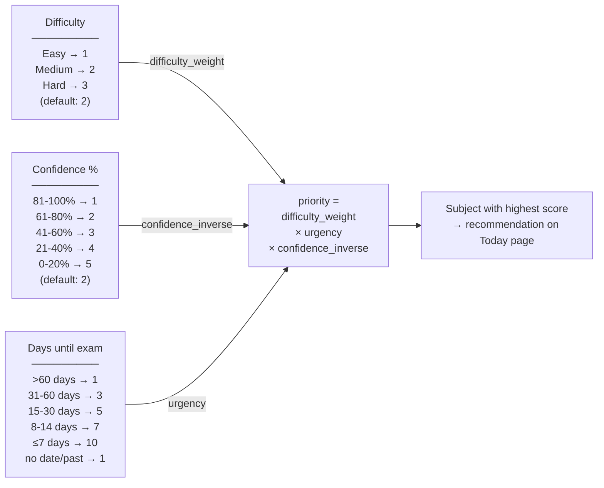

# Subject Intelligence

**What this covers:** How Pace understands the student's subjects — difficulty, confidence, and how those signals shape study recommendations.

---

## What Subject Intelligence Is

Every student experiences their subjects differently. Physics might be hard for one student and easy for another. A student sitting their Maths exam next week needs more urgency than someone whose exam is in three months.

Subject Intelligence is Pace's way of capturing that context. For each subject a student adds, they can optionally set two values:

| Field | What it means | Options |
|---|---|---|
| **Difficulty** | How hard the student finds this subject | Easy · Medium · Hard |
| **Confidence** | How confident they feel about their exam readiness | 0% – 100% (slider) |

Both fields are optional. Pace provides sensible defaults when they are not set.

---

## How Students Set These Values

Students set difficulty and confidence on the **Subjects page**. When adding a new subject, the form includes both fields. For existing subjects, an inline edit panel appears below each subject card — the student picks a difficulty level and moves the confidence slider, then saves.

Changes take effect immediately on the Today page. If a student updates their Maths difficulty from Easy to Hard, the next time they open Today, the recommendation will reflect that change.

---

## How Difficulty Affects Recommendations

Difficulty is the app's signal for how much focused effort a subject deserves. Harder subjects need more consistent attention to maintain progress.

| Difficulty | Weight |
|---|---|
| Hard | 3 |
| Medium | 2 (also used when not set) |
| Easy | 1 |

A Hard subject is given three times as much weight as an Easy one, all else being equal. This means that when Pace is choosing what to recommend, a genuinely difficult subject will regularly surface toward the top.

---

## How Confidence Affects Recommendations

Confidence captures the student's own read of their readiness. Lower confidence means more work is needed. Pace inverts the confidence score so that low confidence increases priority.

| Confidence level | Inverse weight |
|---|---|
| 0 – 20% (very low) | 5 |
| 21 – 40% (low) | 4 |
| 41 – 60% (medium) | 3 |
| 61 – 80% (moderate) | 2 |
| 81 – 100% (high) | 1 |
| Not set | 2 (moderate default) |

A student who feels 15% confident about Chemistry gets a weight of 5. A student who feels 90% confident gets a weight of 1. This pushes weaker subjects into the recommendation more often, which is where focused practice has the most impact.

---

## How the Two Signals Combine

Pace calculates a **priority score** for each subject using three factors:

```
priority = difficulty_weight × urgency × confidence_inverse
```

- **Difficulty weight** — from the table above (1–3)
- **Urgency** — derived from days until the exam (see below)
- **Confidence inverse** — from the table above (1–5)

The subject with the highest priority score becomes the recommendation on the Today page.

### Urgency from exam dates

| Days until exam | Urgency score |
|---|---|
| More than 60 days away | 1 |
| 31 – 60 days | 3 |
| 15 – 30 days | 5 |
| 8 – 14 days | 7 |
| 7 days or fewer | 10 |
| No exam date set | 1 |
| Exam has already passed | 1 |

A subject with no exam date and a subject whose exam has already passed are treated the same way — low urgency. Past exams do not create artificial pressure.



---

## Current Behavior

- Difficulty and confidence are **optional**. If not set, Pace uses medium difficulty (weight 2) and a moderate confidence default (weight 2).
- Changes to difficulty or confidence on the Subjects page are reflected on the Today page immediately.
- Subject data (including difficulty and confidence) is stored per-student and per-subject in the database. It persists until the student changes it.
- Subjects themselves are not deleted when an exam passes. They remain in the student's subject list with their stored difficulty and confidence values.

---

## Why This Matters

Without subject intelligence, a study planner treats all subjects equally. A student preparing for a hard Physics exam in five days would see the same nudge as someone reviewing a subject they already feel confident about.

With difficulty and confidence, Pace can direct the student's attention where it will have the most impact: the hard subject, the low-confidence subject, or the exam coming up next week. The student doesn't have to think about prioritisation — Pace handles it.

---

## Examples

**Example 1 — Clear winner**

A student has three subjects, no exam dates set:

| Subject | Difficulty | Confidence | Priority |
|---|---|---|---|
| Chemistry | Hard (3) | 20% (5) | 3 × 1 × 5 = **15** |
| English | Medium (2) | 50% (3) | 2 × 1 × 3 = 6 |
| PE | Easy (1) | 80% (2) | 1 × 1 × 2 = 2 |

Pace recommends **Chemistry**.

**Example 2 — Exam urgency overrides difficulty**

Same student, but Physics has an exam in 4 days:

| Subject | Difficulty | Confidence | Urgency | Priority |
|---|---|---|---|---|
| Chemistry | Hard (3) | 20% (5) | 1 (no exam) | 15 |
| Physics | Easy (1) | 90% (1) | 10 (4 days) | 10 |
| English | Medium (2) | 50% (3) | 1 (no exam) | 6 |

Pace recommends **Chemistry** — the Hard/20% combination still edges out Physics despite its urgency. If the student then changes Chemistry to Easy/90%, its priority drops to 1, and Physics (urgency 10) takes the top spot.

**Example 3 — Not set**

A student with no difficulty or confidence values set, and no exam dates:

| Subject | Difficulty | Confidence | Priority |
|---|---|---|---|
| Any subject | Medium default (2) | Moderate default (2) | 2 × 1 × 2 = 4 |

All subjects score equally. Pace picks one and shows it, but with low confidence framing (see `docs/personalized-today.md`).
