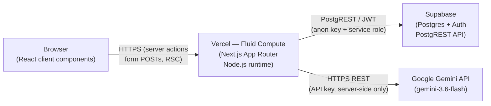
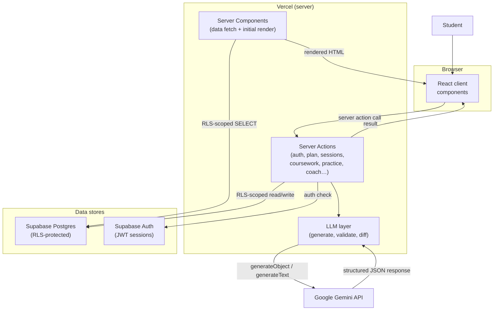
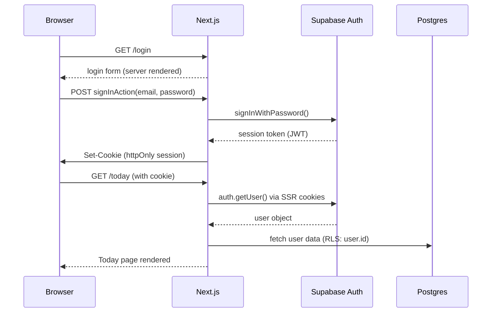
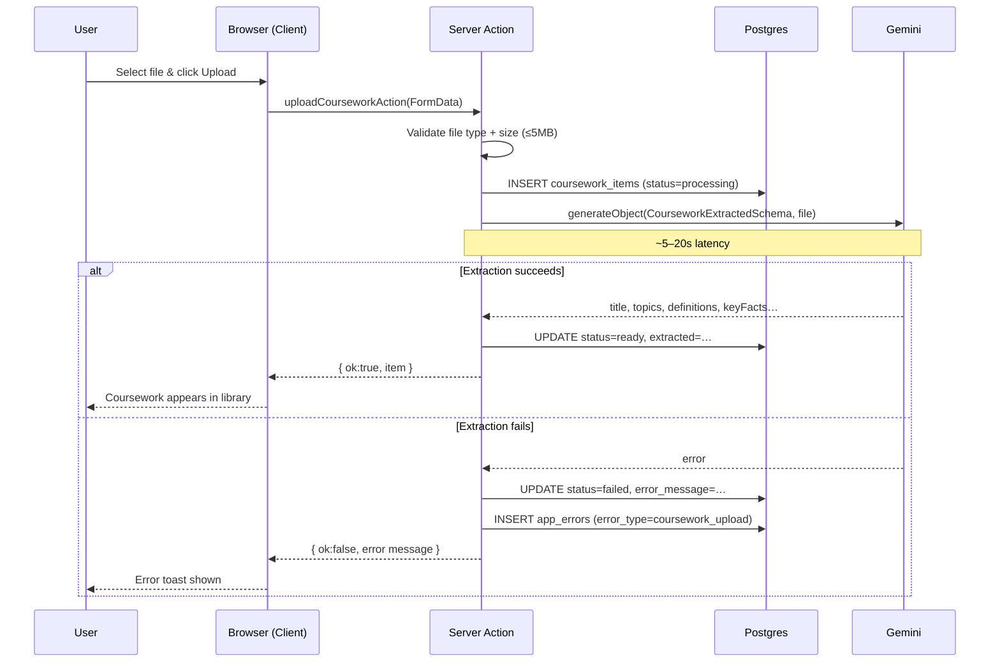
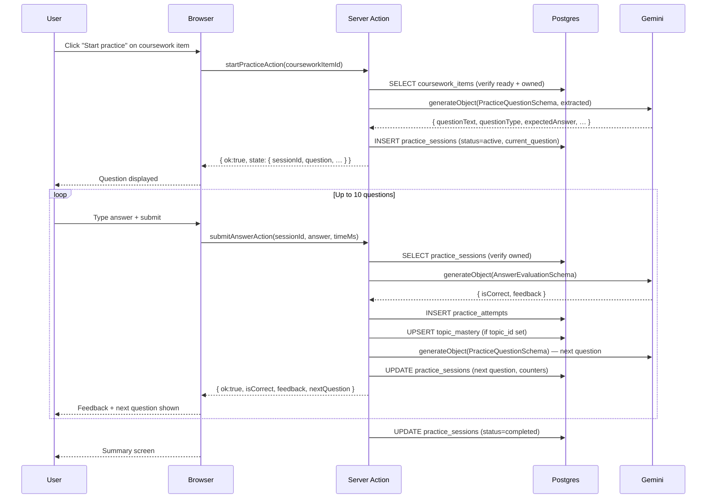
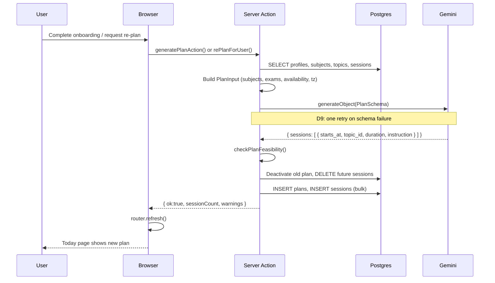
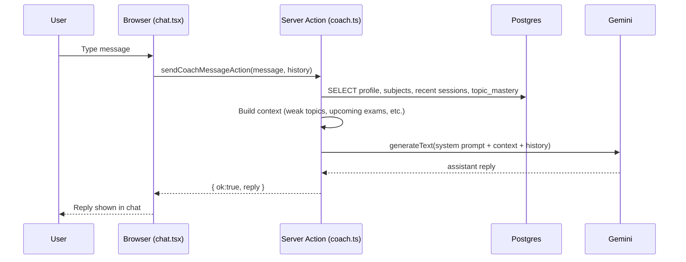

# Architecture

Last updated: 2026-09-01. Reflects commit `b9ee291` on `feat/product-modules`.

## Stack

| Layer | Technology | Notes |
|---|---|---|
| Frontend + backend | Next.js 16 (App Router) | One deployable unit |
| Hosting | Vercel (Fluid Compute) | Node.js, not Edge |
| Language | TypeScript strict | End-to-end |
| UI | React + Tailwind CSS | Mobile-first |
| Auth + database | Supabase | Managed Postgres + Auth |
| AI | Google Gemini via `@ai-sdk/google` | D14: free tier, no card required |
| Package manager | npm | D13 |

Rationale for each pick: [DECISIONS.md](../development/decisions-log.md).
D14 (Gemini) supersedes the AI section of D4 (which originally said Claude/Vercel AI Gateway).

---

## Component map

```
Browser
  │
  │  HTTPS
  ▼
Next.js on Vercel (Fluid Compute / Node.js)
  ├─ App Router pages
  │    ├─ Server Components  (data fetch, auth check, initial render)
  │    └─ Client Components  (interactive UI: forms, timers, chat)
  │
  ├─ Server Actions           (all mutations + AI calls)
  │    ├─ auth.ts             signup, login, logout
  │    ├─ onboarding.ts       wizard, profile save, plan trigger
  │    ├─ plan.ts             plan generation + re-plan
  │    ├─ sessions.ts         mark complete/missed
  │    ├─ subjects.ts         add/update/delete subjects
  │    ├─ coursework.ts       upload, AI extraction, list, fetch
  │    ├─ practice.ts         start session, submit answer, end session
  │    ├─ events.ts           session lifecycle events
  │    ├─ settings.ts         availability save
  │    ├─ admin.ts            clear app_errors (admin-only)
  │    ├─ coach.ts            AI chat
  │    ├─ personalization.ts  save/skip personalization answers
  │    └─ suggestions.ts      wizard suggestions
  │
  └─ LLM layer (server-side only)
       ├─ generate.ts         plan generation prompt + Gemini call
       ├─ validate.ts         feasibility check
       ├─ fallback.ts         on-error fallback plan
       ├─ diff.ts             detect plan changes
       ├─ schema.ts           Zod schemas for LLM output
       └─ prompt.ts           prompt-building helpers

Supabase (eu-west-2 / London region — hypothesis, not confirmed)
  ├─ Postgres          all application data (RLS-protected)
  └─ Auth              session management, JWT

Google Gemini API
  └─ gemini-3.6-flash  plan generation, coursework extraction,
                       question generation, answer evaluation, AI coach
```

---

## Infrastructure topology



All Gemini calls and all service-role Supabase calls originate from Vercel server-side code only. The browser never holds the API key or service-role key.

---

## Data flow



---

## Authentication flow



The `(app)/layout.tsx` runs `auth.getUser()` on every request to the protected shell. Unauthenticated requests are redirected to `/login`. The middleware (`src/lib/supabase/middleware.ts`) refreshes the session cookie but does NOT enforce route protection — that is each page's responsibility.

---

## Coursework flow



---

## Practice flow



---

## Plan generation flow



---

## AI coach flow



---

## Latency analysis

All times are estimates based on provider documentation and typical observed ranges. Nothing here is confirmed by measurement.

| Operation | Estimated latency | Source |
|---|---|---|
| Supabase query (simple SELECT) | 10–80ms | Postgres + PostgREST round-trip, eu region |
| Supabase query (JOIN, 100 rows) | 50–200ms | Same |
| Gemini plan generation | 8–25s | Schema-validated `generateObject`, complex prompt |
| Gemini coursework extraction | 5–20s | Multi-modal (image/PDF) prompt |
| Gemini question generation | 2–6s | Single question, small prompt |
| Gemini answer evaluation | 2–6s | Same |
| Gemini coach reply | 2–8s | Conversational with context |
| Vercel cold start (Node.js) | 200–800ms | First request after idle |

**Key bottleneck (hypothesis):** Plan generation and coursework extraction are the two longest-latency operations. Both block the user's request thread. The re-plan race condition (M3 from security audit) could amplify this — if two plan operations fire simultaneously (e.g., mark-missed + settings save), both may succeed at the DB level but produce inconsistent session sets. This is a known architectural limitation of using PostgREST without server-side transactions.

**Geographic note:** Supabase project region is assumed to be the nearest region to the Vercel deployment (both likely US or EU). If they are in different regions, add ~50–100ms per Supabase call. This is unconfirmed.

---

## Environment variables

| Variable | Used in | Notes |
|---|---|---|
| `NEXT_PUBLIC_SUPABASE_URL` | server + client | Public — anon Supabase URL |
| `NEXT_PUBLIC_SUPABASE_ANON_KEY` | server + client | Public — anon key for RLS reads |
| `SUPABASE_SERVICE_ROLE_KEY` | server only | Bypasses RLS; never sent to browser |
| `GOOGLE_GENERATIVE_AI_API_KEY` | server only | Gemini API key; never sent to browser |
| `ADMIN_EMAILS` | server only | Comma-separated admin allowlist |

The service-role key is used in two places: `createServiceClient()` in `src/lib/supabase/service.ts` (admin stats dashboard + error logging) and the admin clear-errors action. It is never imported by any client component.

---

## What is intentionally NOT in the architecture

- No microservices — one Next.js deployment
- No message queue or background worker
- No caching layer beyond Next.js defaults
- No WebSockets or realtime features
- No feature flags
- No third-party analytics or ads
- No native mobile
- No rate limiting (D19 — deferred; Gemini free-tier limits provide a natural backstop)

---

## Known architectural risks

| Risk | Severity | Status |
|---|---|---|
| Re-plan race condition — two concurrent mutations can leave zero sessions | Medium | Document/Monitor — can't fix without server-side transactions via PostgREST |
| No middleware-level route protection — a page that forgets `getUser()` is unprotected | Low | Document — all current pages check auth; enforce in code review |
| `SUPABASE_SERVICE_ROLE_KEY` missing at runtime causes admin 500 | High | Mitigated — now wrapped in try/catch; diagnostic logging added |
| Gemini free-tier rate limits (~15 rpm) block concurrent users | Medium | Monitor — acceptable at prototype scale |
