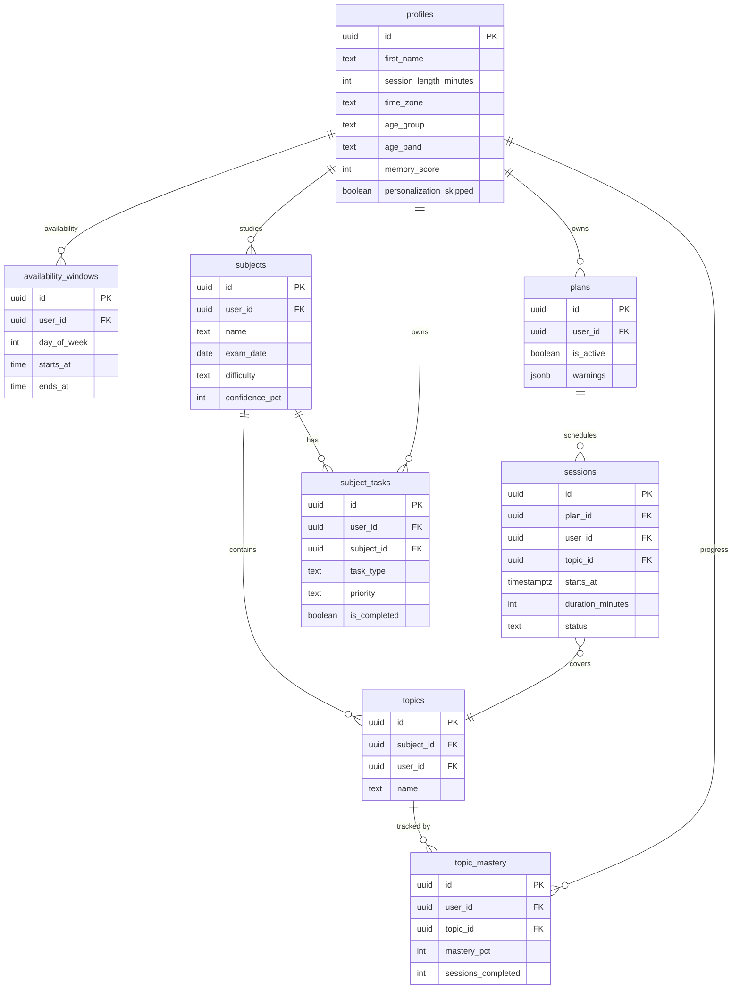
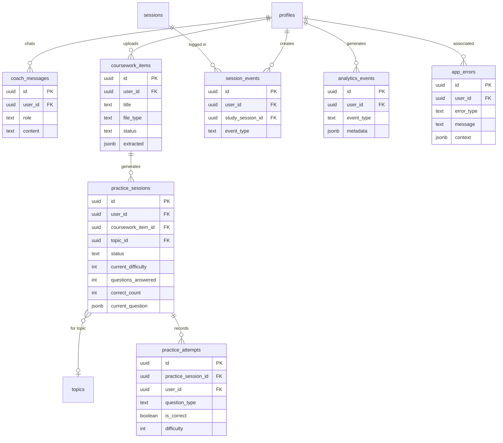

# DATABASE.md

Postgres via Supabase. Row Level Security ON for every table. Schema reflects all migrations `0001_init` through `0009_coursework`.

---

## Entity-relationship diagram

### Core planning model

### AI features model

---

## Tables

### `profiles`

One row per authenticated user, created automatically by the `on_auth_user_created` trigger.

| Column | Type | Notes |
|---|---|---|
| `id` | uuid (PK) | Matches `auth.users.id` |
| `created_at` | timestamptz | default now() |
| `first_name` | text | Captured at signup |
| `age_confirmed_13_plus` | boolean | Must be true; set at signup |
| `session_length_minutes` | int | 25, 45, or 60 (CHECK constraint). Written last in onboarding — acts as "onboarded" flag |
| `time_zone` | text | IANA timezone; detected automatically from browser at signup |
| `age_group` | text | `younger` \| `older` \| `adult` — derived from age_band for LLM personalization |
| `personalization_answers` | jsonb | Raw questionnaire answers (nullable) |
| `personalization_skipped` | boolean | true if the student skipped the personalization step |
| `personalization_completed_at` | timestamptz | When questionnaire was completed (nullable) |
| `age_band` | text | `junior` \| `intermediate` \| `senior` \| `university` \| `adult` |
| `study_habits` | text[] | Selected study habit labels |
| `biggest_challenge` | text | Single-value legacy field (nullable, superseded by `study_challenges`) |
| `study_challenges` | text[] | Multi-select challenges |
| `goal_ranking` | text[] | Ordered goal labels |
| `memory_score` | smallint | 0–100 self-assessed memory score |

### `availability_windows`

Weekly recurring available time windows. A student may have zero or more windows per day.

| Column | Type | Notes |
|---|---|---|
| `id` | uuid (PK) | |
| `user_id` | uuid (FK → profiles.id) | |
| `day_of_week` | int | 0 = Sunday, 6 = Saturday |
| `starts_at` | time | Local wall-clock time (no date) |
| `ends_at` | time | Must be `> starts_at` (CHECK constraint) |

### `subjects`

| Column | Type | Notes |
|---|---|---|
| `id` | uuid (PK) | |
| `user_id` | uuid (FK → profiles.id) | |
| `name` | text | |
| `exam_date` | date | Nullable |
| `created_at` | timestamptz | |
| `difficulty` | text | `easy` \| `medium` \| `hard` — student-set (nullable) |
| `confidence_pct` | smallint | 0–100 student-set confidence (nullable) |
| `homework_frequency` | text | Nullable, CHECK constraint |
| `project_frequency` | text | Nullable, CHECK constraint |
| `subject_duration` | text | Nullable, CHECK constraint |

### `topics`

| Column | Type | Notes |
|---|---|---|
| `id` | uuid (PK) | |
| `subject_id` | uuid (FK → subjects.id) | |
| `user_id` | uuid (FK → profiles.id) | Denormalized for RLS |
| `name` | text | |
| `created_at` | timestamptz | |

### `plans`

One plan per student; at most one active at a time (enforced by partial unique index).

| Column | Type | Notes |
|---|---|---|
| `id` | uuid (PK) | |
| `user_id` | uuid (FK → profiles.id) | |
| `is_active` | boolean | At most one `true` per user |
| `generated_at` | timestamptz | |
| `last_replanned_at` | timestamptz | Nullable |
| `warnings` | jsonb | LLM warnings (e.g., "topic won't fit before exam"). Default `[]` |

Partial unique index: `CREATE UNIQUE INDEX ON plans (user_id) WHERE is_active`.

### `sessions`

Individual scheduled study sessions belonging to a plan.

| Column | Type | Notes |
|---|---|---|
| `id` | uuid (PK) | |
| `plan_id` | uuid (FK → plans.id) | |
| `user_id` | uuid (FK → profiles.id) | Denormalized for RLS |
| `topic_id` | uuid (FK → topics.id) | |
| `starts_at` | timestamptz | Stored in UTC; displayed in user's timezone |
| `duration_minutes` | int | Matches student's chosen session length |
| `instruction` | text | e.g. "Review key definitions", "Practice problems" |
| `status` | text | `scheduled` \| `completed` \| `missed` |
| `completed_at` | timestamptz | Nullable |

Index on (`user_id`, `starts_at`).

Notes:
- Break time between consecutive sessions is not stored — it is implicit.
- Timer state (paused/elapsed) is client-side only; not persisted.
- `starts_at` uses the user's IANA timezone (`profiles.time_zone`) for display; the LLM is prompted in local time.

### `subject_tasks`

Homework, assignments, quizzes, and other workload items per subject.

| Column | Type | Notes |
|---|---|---|
| `id` | uuid (PK) | |
| `user_id` | uuid (FK → profiles.id) | |
| `subject_id` | uuid (FK → subjects.id) | |
| `task_type` | text | `homework` \| `assignment` \| `project` \| `group_work` \| `quiz` \| `exam` \| `other` |
| `title` | text | Nullable |
| `due_date` | date | Nullable |
| `frequency` | text | Nullable |
| `priority` | text | `low` \| `medium` \| `high`. Default `medium` |
| `is_completed` | boolean | Default false |
| `created_at` | timestamptz | |

### `analytics_events`

Internal app-usage events, user-scoped. Used for understanding feature adoption; not third-party analytics.

| Column | Type | Notes |
|---|---|---|
| `id` | uuid (PK) | |
| `created_at` | timestamptz | |
| `user_id` | uuid (FK → profiles.id) | |
| `event_type` | text | Free-form (no CHECK — allows new event types without migrations) |
| `metadata` | jsonb | |

### `app_errors`

Server-side errors logged for diagnostics. Readable via the admin dashboard; no RLS policies (service-role access only).

| Column | Type | Notes |
|---|---|---|
| `id` | uuid (PK) | |
| `created_at` | timestamptz | |
| `error_type` | text | e.g. `plan_generation`, `coursework_upload`, `practice_evaluation` |
| `user_id` | uuid (FK → profiles.id, nullable ON DELETE SET NULL) | |
| `message` | text | |
| `context` | jsonb | Diagnostic context (session ID, inputs, etc.) |

### `session_events`

Timer lifecycle events for study sessions (start, pause, resume, complete, abandon).

| Column | Type | Notes |
|---|---|---|
| `id` | uuid (PK) | |
| `created_at` | timestamptz | |
| `user_id` | uuid (FK → profiles.id) | |
| `study_session_id` | uuid (FK → sessions.id, nullable ON DELETE SET NULL) | The plan session being studied |
| `event_type` | text | `started` \| `paused` \| `resumed` \| `completed` \| `abandoned` |
| `metadata` | jsonb | |

### `topic_mastery`

AI-derived mastery score per topic, updated after each practice attempt. Separate from `subjects.confidence_pct` (which is student-set) so AI-inferred progress never silently overwrites the student's own judgement.

| Column | Type | Notes |
|---|---|---|
| `id` | uuid (PK) | |
| `user_id` | uuid (FK → profiles.id) | |
| `topic_id` | uuid (FK → topics.id) | |
| `sessions_completed` | int | Correct answers count. Default 0 |
| `sessions_total` | int | Total attempts count. Default 0 |
| `mastery_pct` | smallint | 0–100, updated via exponential smoothing after each attempt. Default 0 |
| `last_session_at` | timestamptz | Nullable |
| `updated_at` | timestamptz | |

Unique index on (`user_id`, `topic_id`).

### `coach_messages`

AI coach conversation history. Last 20 messages loaded on open; last 10 sent as context to the LLM.

| Column | Type | Notes |
|---|---|---|
| `id` | uuid (PK) | |
| `created_at` | timestamptz | |
| `user_id` | uuid (FK → profiles.id, ON DELETE CASCADE) | |
| `role` | text | `user` \| `assistant` |
| `content` | text | |
| `metadata` | jsonb | Default `{}` |

Composite index on (`user_id`, `created_at DESC`).

### `coursework_items`

Uploaded study material (images, PDFs, text). AI extracts structured content for practice session generation.

| Column | Type | Notes |
|---|---|---|
| `id` | uuid (PK) | |
| `created_at` | timestamptz | |
| `user_id` | uuid (FK → profiles.id) | |
| `title` | text | AI-extracted or user-provided |
| `subject_name` | text | Nullable |
| `file_type` | text | MIME type of the uploaded file |
| `status` | text | `processing` \| `ready` \| `failed`. Default `processing` |
| `extracted` | jsonb | Nullable. Topics, definitions, key facts, relationships |
| `error_message` | text | Nullable. Set on `failed` status |

Index on (`user_id`, `created_at DESC`). Files are never stored on disk or in Supabase Storage — only the extracted content is persisted.

### `practice_sessions`

One practice session per coursework item attempt. Holds state across the 10-question flow.

| Column | Type | Notes |
|---|---|---|
| `id` | uuid (PK) | |
| `created_at` | timestamptz | |
| `completed_at` | timestamptz | Nullable |
| `user_id` | uuid (FK → profiles.id) | |
| `coursework_item_id` | uuid (FK → coursework_items.id, nullable ON DELETE SET NULL) | |
| `topic_id` | uuid (FK → topics.id, nullable ON DELETE SET NULL) | Resolved from subject name for mastery tracking |
| `subject_name` | text | Denormalized display name |
| `topic_name` | text | Denormalized display name |
| `status` | text | `active` \| `completed`. Default `active` |
| `current_difficulty` | smallint | 1–3. Default 2 (medium) |
| `questions_answered` | int | 0–10. Default 0 |
| `correct_count` | int | Default 0 |
| `current_question` | jsonb | Full stored question including `expectedAnswer` (never sent to browser) |

Index on (`user_id`, `created_at DESC`).

### `practice_attempts`

One row per question answered in a practice session.

| Column | Type | Notes |
|---|---|---|
| `id` | uuid (PK) | |
| `created_at` | timestamptz | |
| `practice_session_id` | uuid (FK → practice_sessions.id, ON DELETE CASCADE) | |
| `user_id` | uuid (FK → profiles.id, ON DELETE CASCADE) | |
| `question_text` | text | |
| `question_type` | text | `recall` \| `understanding` \| `application` \| `comparison` \| `problem_solving` \| `find_mistake` \| `changed_detail` |
| `concept_tested` | text | |
| `user_answer` | text | |
| `is_correct` | boolean | Nullable (null if AI evaluation failed and fallback was inconclusive) |
| `response_time_ms` | int | Nullable |
| `difficulty` | smallint | 1–3 at time of answer. Default 2 |
| `ai_feedback` | text | 2–3 sentence feedback from Gemini (or keyword-fallback message) |

Indexes on `practice_session_id` and (`user_id`, `created_at DESC`).

---

## Row Level Security

For every user-owned table, the policy is uniform:

- `SELECT / INSERT / UPDATE / DELETE`: `user_id = auth.uid()` (or `id = auth.uid()` for `profiles`)
- Policy applied `TO authenticated`

Exception: `app_errors` has RLS enabled but **no user-level policies** — it is only accessible via the service-role key (admin dashboard). This prevents users from reading or modifying error logs.

---

## Referential integrity

- `profiles` → cascade-delete everything user-owned on account deletion (via the Supabase Auth cascade).
- `subjects` → cascade-delete `topics` and `subject_tasks`.
- `plans` → cascade-delete `sessions`.
- `practice_sessions` → cascade-delete `practice_attempts`.
- `coach_messages` → cascade on user delete.
- `coursework_items` → set `practice_sessions.coursework_item_id = NULL` on delete.
- `topics` → set `sessions.topic_id` and `practice_sessions.topic_id = NULL` on delete (they still exist; the topic reference is lost).
- `sessions` → set `session_events.study_session_id = NULL` on delete.

---

## Data we intentionally do not store

- **Passwords** — handled by Supabase Auth; we never see them.
- **IP addresses** — beyond what Supabase Auth logs by default.
- **Third-party analytics or advertising IDs** — no tracking SDKs (N3.1).
- **Parent-facing records** — no multi-user or guardian visibility.
- **Third-party identifiers** — no OAuth tokens beyond the Supabase session.
- **Timer / focus state** — the study session countdown is client-side only; pausing or leaving the page resets it.
- **File content** — uploaded coursework files are passed to Gemini for extraction but never written to disk or Supabase Storage. Only the extracted JSON is persisted.

---

## Migrations

All schema changes are append-only SQL migration files in `supabase/migrations/`, applied in order.

| File | Changes |
|---|---|
| `0001_init.sql` | `profiles`, `availability_windows`, `subjects`, `topics`, `plans`, `sessions`; RLS; trigger |
| `0002_plan_warnings.sql` | `plans.warnings` column |
| `0003_personalization.sql` | Personalization columns on `profiles`; `difficulty` + `confidence_pct` on `subjects` |
| `0004_extended_onboarding.sql` | Extended wizard columns on `profiles` + `subjects`; `app_errors`; `session_events` |
| `0005_subject_tasks.sql` | `subject_tasks`; `analytics_events` |
| `0006_challenges_multiselect.sql` | `profiles.study_challenges` array; back-fill from `biggest_challenge` |
| `0007_topic_mastery.sql` | `topic_mastery` |
| `0008_coach.sql` | `coach_messages` |
| `0009_coursework.sql` | `coursework_items`; `practice_sessions`; `practice_attempts` |

Applied locally via `npx supabase start` (all migrations run automatically) or `npx supabase db reset`. Applied to production via `npx supabase db push`.
