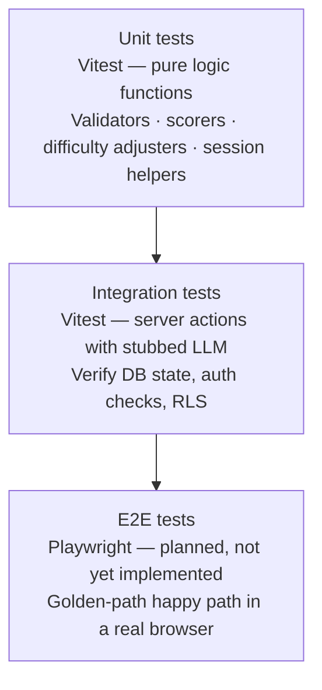

# TESTING.md

Testing is part of every feature, not a phase at the end. Tests exist to protect behavior that matters.

---

## Testing pyramid

In priority order:

1. **Unit tests** for pure logic (schedule validation, schema parsing, availability math, difficulty adjustment, personalization scoring).
2. **Integration tests** for server actions (plan generation, mark-missed, practice session flow). LLM is always stubbed — never call a real LLM in CI.
3. **E2E test** (Playwright, planned) — one happy-path covering signup → onboarding → dashboard → mark a session missed.

The current test suite (34 files, 420 tests) covers unit and server-action logic via Vitest. Playwright E2E is specified but not yet implemented.

No tests for framework code, third-party libraries, or trivial getters/setters.

---

## Tools

- **Unit + integration**: Vitest.
- **End-to-end**: Playwright (planned).
- **LLM stubbing**: stub module or `msw`. LLM calls in tests are always stubbed — never call a real LLM in CI.

---

## What must be tested for each requirement

Referencing the requirement IDs in [REQUIREMENTS.md](../requirements/requirements.md):

| Requirement | Test type | What to verify |
|---|---|---|
| F2 (auth) | Integration | Signup rejects non-13+; login works; logout clears session. |
| F3 (form) | Unit + integration | Form validation rejects empty subjects; accepts valid input. |
| F4 (plan gen) | Integration | With stubbed LLM: valid schema in → sessions stored in DB. Invalid LLM output → retry, then user-facing error. |
| F5 (today view) | Unit | Filters sessions to today only, sorted chronologically. |
| F6 (complete/missed) | Integration | Complete sets `status=completed` and does not re-plan. Missed sets `status=missed` and triggers re-plan. |
| F7 (adaptive) | Integration | Completed sessions preserved. Future sessions re-issued. Warning surfaces when a topic cannot fit. |
| F8 (full plan) | Unit | Groups sessions by date correctly. |
| F9 (availability) | Integration | Editing availability triggers re-plan. |
| N2 (security) | Integration | A user cannot read or modify another user's sessions (RLS test). |
| N3 (privacy) | Integration | Delete account removes all rows across tables. |
| Practice (PR-10) | Unit | Session does not complete before question 10. Generation failure does not falsely mark session complete. |
| Practice (PR-6) | Unit | Keyword fallback produces a result when AI evaluation is unavailable. |
| Practice (PR-7) | Unit | Difficulty adjusts correctly for correct+fast, correct+slow, incorrect answers. |

---

## Test-writing rules

1. One behavior per test. Descriptive test names.
2. Tests are independent — no shared mutable state between test files.
3. Never test implementation details (private functions, exact SQL). Test observable behavior.
4. LLM outputs in tests are canned fixtures; parsing the fixture must go through the same schema the production code uses.
5. Every bug that ships gets a regression test before the fix is merged.

---

## Manual QA before releases

Before merging to `main`, the author manually runs the golden path in the browser:

1. Sign up as a fresh user.
2. Complete the onboarding wizard with 2 subjects, 3 topics each, one exam date next week.
3. Verify today's dashboard shows sessions.
4. Mark one session missed; verify the re-plan overlay appears and the schedule updates.
5. Upload a coursework file; verify it reaches `ready` status.
6. Start a practice session; answer 3 questions.
7. Open the AI Coach; send a message; verify a reply arrives.
8. Update availability in Settings; verify re-plan runs.
9. Log out, log back in, confirm state persists.

---

## CI test rules

- CI runs the full Vitest suite on every PR.
- Merge is blocked if any test fails.
- No flaky tests are tolerated — a flaky test is either fixed or deleted, not retried.
