# Market Research Report v2 — HS-Focused: Adaptive Study Planner

**Phase:** 1 — Problem Validation (revised, high-school-only scope)
**Date:** 2026-08-23
**Status:** Complete. Awaiting explicit approval to move to Phase 2 (Product Definition).

**Hypothesis under test:** *"High school students need a study planner that automatically adapts when their real-life schedule changes or they fall behind."*

**Research limitation:** Reddit is blocked by policy in this environment (confirmed directly). Where "HS student voice" evidence would normally come from r/GetStudying, r/APStudents, r/6thForm, r/ADHD, that channel was unavailable. Evidence below leans on Pew, Stanford Challenge Success, App Store/Play Store reviews, education research, and industry data. This is a genuine gap.

---

## 1. Is this a real problem? — YES, moderately strong

### FACTS specific to high schoolers
- **56% of HS students** consider homework a primary source of stress; **59%** say they have too much homework; **57%** report homework prevents adequate sleep. Average HS homework: **2.8 hours/night** (3.2h with AP). ([ASCD / Stanford Challenge Success](https://www.ascd.org/el/articles/give-teens-more-downtime-and-support-with-time-management))
- **55%** of HS students identify "procrastination or time management" as a major stressor. **81%** multitask during homework (36% social media, 28% streaming). ([EdWeek](https://www.edweek.org/leadership/opinion-students-struggle-with-time-management-schools-can-help/2020/02))
- **86%** of HS students report procrastinating on assignments (student paper citing Magoosh; directionally consistent with peer-reviewed reviews at [PMC](https://www.ncbi.nlm.nih.gov/pmc/articles/PMC10297372/)).
- **27%** of teens feel extreme stress during the school year vs. 13% in summer; teen anxiety disorders affect ~31.9% of teens and have tripled over 20 years. ([Compass Health](https://compasshealthcenter.net/blog/teen-mental-health-statistics/))
- **Executive function is developmentally underdeveloped** in this age group. The prefrontal cortex is still maturing through adolescence and into early adulthood; planning ability specifically continues developing throughout HS. ([Frontiers in Psychology](https://www.frontiersin.org/journals/psychology/articles/10.3389/fpsyg.2017.00903/full), [PMC](https://www.ncbi.nlm.nih.gov/pmc/articles/PMC10546024/)) This is the **strongest evidence-based reason to target HS specifically** rather than adults — HS students are literally still growing the brain regions the product would offload.
- For the ADHD subset (~3–7.8% of adolescents), organizational and planning deficits are the **strongest predictors of GPA**. ([PMC](https://pmc.ncbi.nlm.nih.gov/articles/PMC3619433/))
- Planning fallacy is well-documented (students underestimate task time by ~50%+); documented in college samples, generalizes to HS as plausible. ([Decision Lab](https://thedecisionlab.com/biases/planning-fallacy))

### ASSUMPTIONS (plausible but not directly measured for HS)
- That "missed session → cascading abandonment of the whole plan" is a specific, common HS behavior. The mechanism is plausible from procrastination + overwhelm literature, but I did not find a study isolating this variable for HS students.
- That the *specific* pain is "planning" rather than "starting" (procrastination/initiation). Section 4 shows initiation may be a bigger raw pain than replanning.

### INTERPRETATION
The problem is real — HS students are demonstrably overloaded, stressed about time, and developmentally underequipped for the planning cognition. The developmental-neuroscience angle is genuinely stronger for HS than for adults, which is a defensible "why this age group" thesis. **But**: from "stressed about time" to "will use/pay for an adaptive replanner" is still a logical leap the evidence does not directly close.

---

## 2. How strong is the problem? — Moderate

**Signals in favor (FACT-supported):**
- Real, quantified pain (stress, homework hours, procrastination rates)
- Developmental basis specific to age group
- Multiple 2025-2026 planner products are shipping "adaptive re-planning" as a headline feature (Wellpin, PowerPlanner "Recovery Mode", Reclaim.ai) — market validation that founders believe it's real, though not proof of user pull.

**Signals against:**
- StudyTok content is dominated by Notion/GoodNotes/Quizlet aesthetics and AI content, NOT dedicated planners. No dedicated study-planner has captured teen mind-share the way Notion has. ([TikTok StudyTok](https://www.tiktok.com/discover/studytok))
- Median **70% of users discontinue lifestyle/planner apps** in the early period across the category. ([PMC](https://www.ncbi.nlm.nih.gov/pmc/articles/PMC11694054/))
- ADHD-planner literature says teens use planners "twice, then it joins the graveyard on the third screen." ([ADDitude](https://www.additudemag.com/high-school-planner-motivate-adhd-teen/))
- Direct student-voiced evidence for "I abandon my plan when I miss a session and need adaptive replanning" is thin/absent in accessible sources. This is the **hypothesis to validate with actual user interviews**, not treat as proven.

**INTERPRETATION:** The problem is real but not acute. Adaptive replanning is *plausibly* a felt pain but reads more strongly as a "founder-obvious" feature than a user-articulated one. The hypothesis passes as worth testing, but is not yet validated as the primary pain.

---

## 3. Who exactly within HS students experiences it most?

Evidence points to three overlapping sub-segments:

1. **HS students with ADHD / executive function challenges** (~3-8% clinically, more with sub-clinical EF struggles). Sharpest, most mechanistic pain match. Vocal parent-buyer community (ADDitude, TeensWithADHD, etc.). Highest willingness to pay via parents.
2. **HS students preparing for high-stakes exams with fixed dates** (SAT/ACT/AP in US; GCSE/A-Level in UK; IB globally; matriculation exams elsewhere). Adaptive re-planning has genuine value when the exam date can't move but daily life can. Existing $575M+ test prep market with proven WTP. ([Global Market Statistics](https://www.globalmarketstatistics.com/market-reports/test-preparation-market-13673))
3. **College-bound HS students juggling grades + tests + extracurriculars + application deadlines** across all 4 years. Highest perceived-value frame (see Section 4).

**Weakest fit:** the generic "average HS student" — the person our current hypothesis names. Evidence suggests this segment has the pain but too weakly and inconsistently to make a compelling commercial wedge.

---

## 4. What is the strongest product angle?

The parallel research explicitly ranked 10 candidate HS problems. The current adaptive-replanning hypothesis ranked as a **real but under-motivated feature** — it works best when *housed inside* a higher-stakes frame that gives the plan a concrete objective. Top-ranked angles:

**Rank 1: College application readiness** (grades + tests + extracurriculars + deadlines, 4-year roadmap). Same adaptive-scheduling engine, but wrapped in the objective function parents and teens actually care about. Willing-to-pay is proven (test prep + independent counselors $200-$5000+). CollegeCountdown ($) and Findmyorbit are early competitors; category is not saturated yet.

**Rank 2: Exam-anchored adaptive prep** (SAT/ACT/AP or GCSE/A-Level/IB). Fixed exam date + fluctuating life = the natural home for adaptive re-planning. Concrete success metric (a score). Parents already pay for this.

**Rank 3: The stated hypothesis (adaptive replanner, generic)**. Still viable but weakest of the three — no concrete anchor, no fixed success metric, competes against free general tools.

**Companion features to layer in either #1 or #2 (evidenced as necessary, not sufficient on their own):**
- Task-initiation / "Just Start" mode — 86% procrastination rate, initiation is a distinct problem from planning
- Integrated AI subject help — **69% of HS students used ChatGPT for schoolwork by May 2025** (up from ~25% in 2024, ~12% in 2023). ([College Board / Pew via Fortune](https://fortune.com/2026/02/25/teens-use-ai-for-schoolwork-pew-research-study/)) A planner without this will feel obsolete by 2027.
- Google Classroom / Canvas import — arguably table-stakes; manual assignment re-entry is the #1 abandonment driver across competitors
- Aesthetic, shareable schedule output (StudyTok / Notion template culture) — critical for teen adoption

**INTERPRETATION:** The single strongest angle by evidence is **exam-anchored adaptive planning** — it keeps the technical core of your hypothesis intact, has fixed dates that make adaptive re-planning genuinely valuable, has proven WTP, and is more MVP-shaped than college readiness (which requires a 4-year data model). College readiness is the stronger long-term frame but a much bigger MVP.

---

## 5. Who would pay? — Parent primarily, teen secondarily

### FACTS
- School parents' self-reported willingness to pay for tutoring: **~$357/month**. ([EdChoice 2025](https://www.edchoice.org/2025-a-kaleidoscope-view-of-k12-tutoring-in-america/))
- ~1 in 12 parents plan to pay for tutoring in back-to-school spend; ~13% plan AI tutoring/camps. ([Prodigy](https://www.prodigygame.com/main-en/blog/back-to-school-spending-report))
- **58% of parents approve AI for homework help**; **~20%** cite "child might fall behind" as their reason for paying for AI homework subscriptions. ([Pew via Fortune](https://fortune.com/2026/02/25/teens-use-ai-for-schoolwork-pew-research-study/))
- US HS grades 9-12 = **62.2%** of the $4.32B US online private tutoring market. ([Grand View Research](https://www.grandviewresearch.com/industry-analysis/us-online-private-tutoring-market-report))
- Teens' self-reported annual spend: ~$2,213/year; **37%** are employed part-time. ([Piper Sandler Teen Survey 2025](https://www.pipersandler.com/news/piper-sandler-completes-50th-semi-annual-teen-survey))
- Duolingo Super: **$13.99/mo / $83.99/yr; family $119.99/yr**. Teen-app benchmark for willingness to pay.
- MyStudyLife+: **$4.99/mo / $29.99/yr; Family $49.99-99.99/yr**. Photomath Plus: **$9.99/mo / $69.99/yr**.

### INTERPRETATION
- **Parents pay for outcomes** (grades, "not falling behind," test scores, college prep) — not for process ("organize yourself"). Positioning must be outcome-anchored to unlock parent-tier WTP; otherwise it collapses to app-tier ($5-10/mo).
- **Realistic price bands**: Individual $4.99-9.99/mo or $29.99-69.99/yr; family plan $79.99-149.99/yr for 2-4 kids; school license $5-15/student/year if pursued.
- **Family-plan-to-parent is the single most viable direct-monetization motion** given teen self-pay economics are weak and Apple Family Sharing gates minor purchases anyway.
- Direct school/district sales are a long-lead credibility play (12-24 months), not a startup's primary revenue channel.

---

## 6. What existing alternatives are we competing against?

### Direct competitors (HS-facing dedicated planners)
None of these ship automatic re-planning when a session is missed — this is the confirmed category gap:

| Product | Pricing | HS fit | Adaptive re-plan? | Notable weakness |
|---|---|---|---|---|
| MyStudyLife (+Scout AI) | Free / $4.99mo / Family $99.99yr | Strong (rotating timetables) | AI generates plans; does NOT auto-replan | Paywalling core features, bugs, data loss complaints |
| myHomework | Free / $4.99/yr | Strong | No | Dated, list-only |
| Structured | Free / ~$3/mo / $100 lifetime | Medium | No | No school calendar model |
| Power Planner | Free / one-time ~$1.99 | Strong | No | Feature-frozen |
| iStudiez Pro | Free / subscription for sync | Strong | No | Pricing backlash |
| Egenda / School Planner (daldev) | Free | Medium (Android) | No | Basic homework agenda only |

### Indirect competitors (what HS students actually use instead)
- **ChatGPT** — 54-69% of HS students use it for schoolwork; free, unlimited, no purpose-built for scheduling but "good enough" for one-off "what should I study tonight" prompts
- **Google Classroom / Canvas / Schoology** — school-issued, mandatory, surfaces *what* is due but not *when to work on it*
- **Notion + StudyTok templates** — heavy setup cost, static plans, aesthetic-driven adoption
- **Google Calendar** — free, universal, 100% manual
- **Paper planners / bullet journals** — Gen Z hybrid-analog cohort is real (400M+ BuJo views on TikTok)
- **Seneca Learning** (UK, 14M+ users) — dominates as *content* tool for GCSE/A-Level; no planning layer
- **Forest / Flora** — 60M+ / 2M+ users respectively; own the Pomodoro/focus-session slot

### Key competitive insight
**Adaptive re-planning is the confirmed category gap.** Not a single mainstream dedicated HS planner ships it. This is the strongest single differentiation opportunity found. Companion gaps: LMS-native import (only Shovel, targeted at college), true difficulty-aware sequencing (only UWorld, medical-only), and aesthetic/shareable output (only Notion, not a planner).

---

## 7. Would parents pay? — Yes, but only if outcome-framed

### FACTS
- Parents demonstrably pay for tutoring at HS level (avg $357/mo school-parent WTP for tutoring)
- 20% of parents cite "child might fall behind" as reason for paying for AI homework subscriptions
- Family plan models work (Duolingo family, SplashLearn ~$135/yr for 3 kids)
- HS grades 9-12 dominate the US online tutoring market (62.2%)

### FACTS working against parent adoption of "planner"
- Parental homework intervention is documented to be *counterproductive* when intrusive
- **79% of teen reviews of parental control apps are ≤2 stars**; teens sabotage or abandon products that feel like surveillance
- Free planner apps for teens (MyStudyLife Family Connect) exist but haven't hit critical mass

### INTERPRETATION
A "study planner" positioned to parents will sell weakly. The *same product* positioned as "AI SAT/AP prep coach" or "college readiness system" will sell far better because it maps onto an existing paid budget category and an outcome parents already value. **Framing is worth more than features here.**

---

## 8. How would we reach HS students realistically?

### FACTS
- **TikTok**: Photomath's TikTok Creator Marketplace campaign got 11B+ creator-content impressions, 76.7K+ iOS installs, 40% reduction in CPA — TikTok became their primary social channel. ([TikTok Case Study](https://ads.tiktok.com/business/en-US/inspiration/photomath-lowers-campaign-costs))
- **49% of US teens use TikTok**; 70% of TikTok users say they discover new products there.
- **StudyTok** is a durable, teen-native community around studying.
- Peer influence dominates Gen Z app choice; Notion's teen adoption ran through peer-shared template culture, not paid marketing.
- iOS captures disproportionate subscription revenue (~22-35% higher paying propensity vs. Android).

### INTERPRETATION
Realistic playbook: **iOS-first launch → TikTok Creator Marketplace with native creator content → aesthetic/shareable plan output as an organic growth surface → family-plan positioning to parents via back-to-school and parent-community channels.** Avoid ads (regulatory drift). School-mandated deployment is a long-lead credibility play, not primary acquisition.

**Aesthetics and voice are existential, not decorative.** Products that read as "for kids" or feature heavy parent-surveillance framing will be actively rejected by 14-18 year olds.

---

## 9. Ethical / legal constraints (must inform the MVP)

### FACTS
- **COPPA** applies to under-13. FTC finalized major amendments effective April 22, 2026, adding biometrics as PII, requiring separate consent for data sharing to advertisers. Penalties up to $53,088 per violation. ([IAPP](https://iapp.org/news/a/ftc-finalizes-coppa-rule-amendments))
- **COPPA 2.0** (extending protection to under-17) passed the Senate March 2026, not yet law but is a live regulatory risk.
- **GDPR-K** (EU): digital consent age varies 13-16 by country. Blanket 16+ EU gate is cheapest for a startup.
- **Apple**: new accounts for under-18 must join Family Sharing; parental consent gated for purchases/IAP.
- **Ads with minors** are increasingly regulated; free-with-ads is high-risk for teen products.

### INTERPRETATION
Architect data handling **as if COPPA 2.0 (under-17) will apply within 18-24 months**. Set app age rating 12+ or 17+, avoid Kids Category. No behavioral advertising SDKs. Freemium/family-plan monetization, not ads.

---

## 10. Can we build a useful MVP in 1-3 weeks? — Yes, at reduced scope

### What is achievable in 1-3 weeks (for a beginner/intermediate developer with AI-assisted engineering)
- Landing page + study-plan form
- LLM-generated schedule from inputs (subjects, exam date, hours available, session-length preference)
- "Today's plan" dashboard
- Mark tasks complete
- **Adaptive re-planning trigger** (when a session is skipped/missed, regenerate the remainder) — this is the differentiator and is technically an LLM call with the updated state
- Basic account/persistence

### What is NOT achievable in 1-3 weeks (and should be explicitly out of MVP)
- Google Classroom / Canvas import (auth complexity, terms, per-district variation)
- Native mobile apps (start web-first)
- Difficulty-aware prioritization tied to actual performance data (would need a quiz/tracking loop)
- Family/parent account model
- Payments (defer until product-market fit signal)
- Compliance-grade data handling (build with reasonable privacy defaults, defer formal COPPA/GDPR-K rigor until adoption warrants it)
- Content generation (flashcards, quizzes, summaries) — a big scope creep; leave for later

**INTERPRETATION:** A 1-3 week web MVP is realistic *if* we scope tightly to: (1) input form, (2) LLM plan generation, (3) plan display + completion tracking, (4) re-plan on missed session. Everything else waits.

---

## 11. Strongest differentiation

By evidence, three differentiators stand out:

1. **Automatic adaptive re-planning on missed sessions** — confirmed gap across every HS-facing competitor profiled; matches your hypothesis directly.
2. **Frame around a concrete exam or outcome** (SAT/AP/GCSE/A-Level/IB, or college readiness) — dramatically increases perceived value vs. a generic planner.
3. **Low-friction ingestion** (photo/PDF of syllabus or timetable → parsed into the plan) — addresses the #1 recurring complaint (manual setup burden) across MyStudyLife, Motion, Notion.

**INTERPRETATION:** Any one of these alone is a real edge; combining #1 with #2 in the MVP is the highest-leverage move because it hits both the technical gap and the willingness-to-pay unlock at once.

---

## 12. Is there a better HS-specific problem we haven't considered?

Yes — two candidates ranked higher than the original hypothesis in the alternatives investigation:

**College application readiness** (grades + tests + extracurriculars + deadlines, 4-year roadmap). Highest perceived value, clearest parent-buyer motivation, existing paid comparables ($200-$5000+ counselors). Downside: needs a 4-year data model, harder MVP.

**Exam-anchored adaptive prep** (specific exam → fixed date → adaptive plan → daily execution). Preserves the core technical hypothesis, gives it a concrete anchor, matches an existing paid budget category ($575M+ test prep market). More MVP-shaped than college readiness.

**INTERPRETATION:** Neither invalidates your hypothesis — both *contain* your hypothesis as their engine. They just frame it around something users already pay for.

---

## 13. Validation score

| Criterion | Score /5 | Reasoning |
|---|---|---|
| Problem severity (HS-specific) | 3.5 | Real, quantified, but not the top pain HS students name |
| Frequency | 3.5 | Recurring around exam periods; falls-behind cycle is normalized |
| Existing demand evidence | 3 | Real for stress/time; softer for "adaptive replan" specifically |
| Competition | 2.5 | Crowded on planners overall, but the *adaptive-replan* slot is a confirmed gap |
| Differentiation potential | 4 | Adaptive re-planning + LMS import + exam anchor is a defensible triple |
| Developmental/age-specificity | 4.5 | Strongest single argument — HS is genuinely the right age for this |
| Willingness to pay (via parent) | 3.5 | Real, but only if outcome-framed |
| Willingness to pay (teen direct) | 2 | Teens don't reliably pay for utilities; Spotify/TikTok Premium win the wallet |
| Technical feasibility | 4.5 | LLM + scheduling logic is well within reach |
| MVP buildability (1-3 wk) | 4 | Achievable at tight scope |
| Distribution feasibility | 3.5 | TikTok playbook is real (Photomath); demanding but reproducible |
| Regulatory risk | 3 | COPPA 2.0 is a live risk; manageable if architected for it |

**Overall read:** Stronger than the generic-student version, but still not obvious-yes. The adaptive-replan hypothesis holds up better for HS than for "students in general," and the developmental-neuroscience angle gives it a genuinely defensible "why this segment" — but the evidence still points toward wrapping it in an exam or outcome frame to unlock real WTP.

---

## 14. BUILD / PIVOT / KILL

**Recommendation: BUILD, with a scope adjustment.**

Not KILL — the developmental-neuroscience case for targeting HS students specifically is genuinely strong, adaptive re-planning is a confirmed category gap, and the technical MVP is achievable at your scope in 1-3 weeks.

Not the original PIVOT (to med students / ADHD adults) — you've explicitly constrained the market to HS students, and within that constraint, this is defensible.

**But the "BUILD" comes with a strong recommendation to narrow further:** instead of "adaptive study planner for HS students generally," anchor the MVP to a **specific fixed-date exam context** (recommended: AP exams in the US, or A-Level / GCSE in the UK — whichever you have better access to for user interviews). This preserves your entire technical hypothesis and MVP scope, but:
- Gives the adaptive re-planning feature a concrete reason to exist (the exam date can't move)
- Matches an existing paid budget category ($575M+ test prep)
- Gives you a testable success metric (did the student cover the syllabus, did their practice score improve)
- Makes marketing dramatically easier ("AI AP Chemistry study coach" is more concrete than "AI study planner")
- Still lets you generalize to college readiness or multi-exam mode later

**Alternative BUILD framing worth considering: HS students with ADHD** — same mechanism, sharpest pain, largest reachable community. The main risk is regulatory/ethical sensitivity around targeting a medical demographic in marketing.

**What I would NOT recommend building:**
- The fully generic "AI study planner for all HS students" without a frame — evidence says this collapses into the crowded planner category and struggles to monetize.
- A parent-surveillance product (79% of teen reviews of such apps are ≤2 stars).
- A free-with-ads model given regulatory drift for minors.

---

## Explicit next-phase gate

Per your gate system: **STOP here. I have not moved to Phase 2.** I need you to:

1. Confirm you've read and understood this report (or ask questions).
2. Tell me whether you want to:
   - **BUILD as originally scoped** ("adaptive study planner for HS students generally") — defensible but weakest of the three
   - **BUILD with an exam anchor** (recommended — e.g. AP or A-Level) — preserves your hypothesis and MVP, adds a frame
   - **BUILD with an ADHD anchor** — sharpest mechanistic fit, some marketing sensitivity
   - **BUILD with a college-readiness frame** — highest perceived value, largest MVP
   - **Something else** — push back, adjust, or explore a different angle
3. Explicitly approve moving to Phase 2 (Product Definition / Requirements).

I will not touch Phase 2 (product spec, features, architecture, coding, Git, CI/CD) until you tell me to.

---
---

# Part II — Business & Systems Modelling (Pace)

> **Purpose.** Part I (above) validated the *problem* and recommended a BUILD/PIVOT decision. Part II turns that validated hypothesis into the **systems** and **business** artifacts a founder/engineer needs to design, price, staff, and scale the product. It is a companion to the product docs (`PRODUCT.md`, `ARCHITECTURE.md`, `DATABASE.md`, `USER-FLOWS.md`).
>
> **Evidence discipline (unchanged from Part I).** Every quantitative figure in the business model below is an **ASSUMPTION / illustrative model input**, not measured data, unless it carries an inline citation from Part I. They exist so the model *runs*; treat them as dials to be replaced with real numbers after user interviews and a pricing test. Nothing here is a forecast or a promise.
>
> **Diagrams** are written in Mermaid and render on GitHub and most Markdown viewers.

---

## B0. Business Index

| # | Artifact | What it answers | Section |
|---|---|---|---|
| 1 | Glossary | What do the domain + commercial terms mean? | [B1](#b1-glossary) |
| 2 | Domain Class Diagram (UML) | What are the core objects and their relationships? | [B2.1](#b21-domain-class-diagram-uml) |
| 3 | Session Lifecycle (State) | How does a study session change state? | [B2.2](#b22-session-lifecycle--state-diagram) |
| 4 | Sequence — Onboard & Generate | How does a plan get built end-to-end? | [B2.3](#b23-sequence--signup--onboarding--plan-generation) |
| 5 | Sequence — Adaptive Re-plan | What happens when a session is missed? | [B2.4](#b24-sequence--adaptive-re-plan-on-missed) |
| 6 | Use-Case Overview | Who does what with the system? | [B2.5](#b25-use-case-overview) |
| 7 | Business Relationship Diagram | Who exchanges what value with whom? | [B3.1](#b31-business-relationship-diagram-value-exchange) |
| 8 | Conceptual ERD | High-level entities (no attributes) | [B3.2](#b32-conceptual-erd-high-level--design-level-0) |
| 9 | Logical ERD | Normalised entities + keys, DB-agnostic | [B3.3](#b33-logical-erd-low-level--design-level-1) |
| 10 | Physical ERD | Actual Supabase/Postgres tables + types | [B3.4](#b34-physical-erd-low-level--design-level-2) |
| 11 | Operational Model | How the business runs day-to-day | [B4.1](#b41-operational-model) |
| 12 | P&L / Revenue Model | How money comes in and goes out | [B4.2](#b42-pl--revenue-model) |
| 13 | Go-to-Market × Scalability | How we acquire and grow, and what it costs | [B4.3](#b43-go-to-market--scalability) |

---

## B1. Glossary

### Domain / product terms

| Term | Definition |
|---|---|
| **Pace** | The product: an adaptive AI study planner for high-school students (ages ~14–18). |
| **Adaptive re-plan** | Automatic regeneration of *future* study sessions when a session is missed or availability/subjects change. Completed and missed sessions are immutable history. |
| **Session** | A single scheduled block of study for one topic, at a fixed length (25/45/60 min), with a short instruction (e.g. "Active recall"). |
| **Session status** | One of `scheduled`, `completed`, `missed`. |
| **Plan** | The active collection of a user's scheduled sessions between "now" and the last exam date. One active plan per user. |
| **Availability window** | A recurring weekly time block (e.g. Mon 16:00–18:00) inside which sessions may be scheduled. |
| **Warning** | A machine-generated note that a topic cannot fit before its exam given current availability (surfaced, never silently dropped). |
| **Onboarding wizard** | The 5-step + review flow that captures subjects, topics, exam dates, availability, and session length. |
| **Quiet Mentor** | Product/brand personality: calm, editorial, non-gamified, distraction-free. |
| **Feasibility pre-check** | A guard that rejects impossible inputs (past/today exam date, windows shorter than the session length) with an actionable message before the LLM is called. |

### Business / commercial terms

| Term | Definition |
|---|---|
| **ICP** | Ideal Customer Profile — the specific user/buyer we optimise for (here: exam-anchored HS student; parent as payer). |
| **Payer vs User** | The **user** is the student; the **payer** is typically the parent (family plan). A classic split-incentive market. |
| **Freemium** | Free tier to drive adoption; paid tier unlocks the full adaptive plan / multiple subjects. |
| **ARPU / ARPPU** | Average Revenue Per User / Per *Paying* User. |
| **CAC** | Customer Acquisition Cost — blended cost to acquire one paying account. |
| **LTV** | Lifetime Value — gross contribution from an account over its lifetime. |
| **Gross margin** | Revenue minus direct cost of serving (LLM + hosting + payment fees). |
| **Churn** | Rate at which paying accounts cancel. High in the planner category (Part I). |
| **CM (Contribution Margin)** | Revenue per account minus variable cost per account. |
| **GTM** | Go-To-Market — the acquisition and distribution strategy. |
| **PLG** | Product-Led Growth — the product itself (shareable output, referrals) drives acquisition. |
| **StudyTok** | The study-focused community on TikTok; a primary organic channel (Part I). |
| **Seasonality** | Demand concentrated around exam windows (e.g. UK GCSE/A-Level May–June; US AP May). |

---

## B2. UML & Sequence Diagrams

### B2.1 Domain Class Diagram (UML)

The core objects and their multiplicities. Mirrors `DATABASE.md`; behaviour (methods) shown at the level of the server actions.

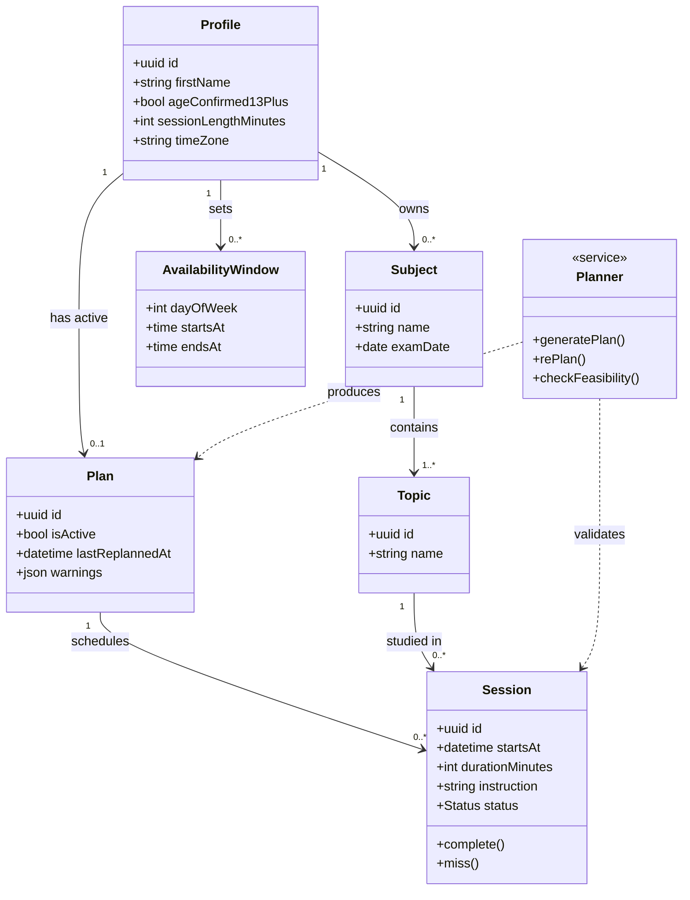

### B2.2 Session Lifecycle — State Diagram

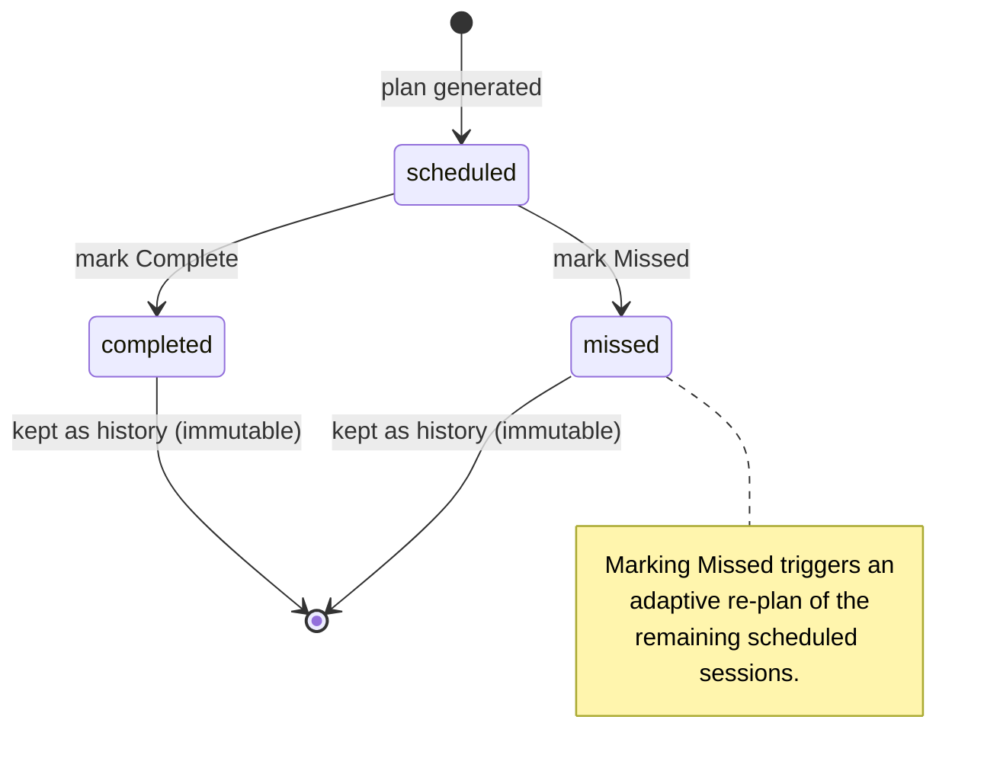

### B2.3 Sequence — Signup → Onboarding → Plan Generation

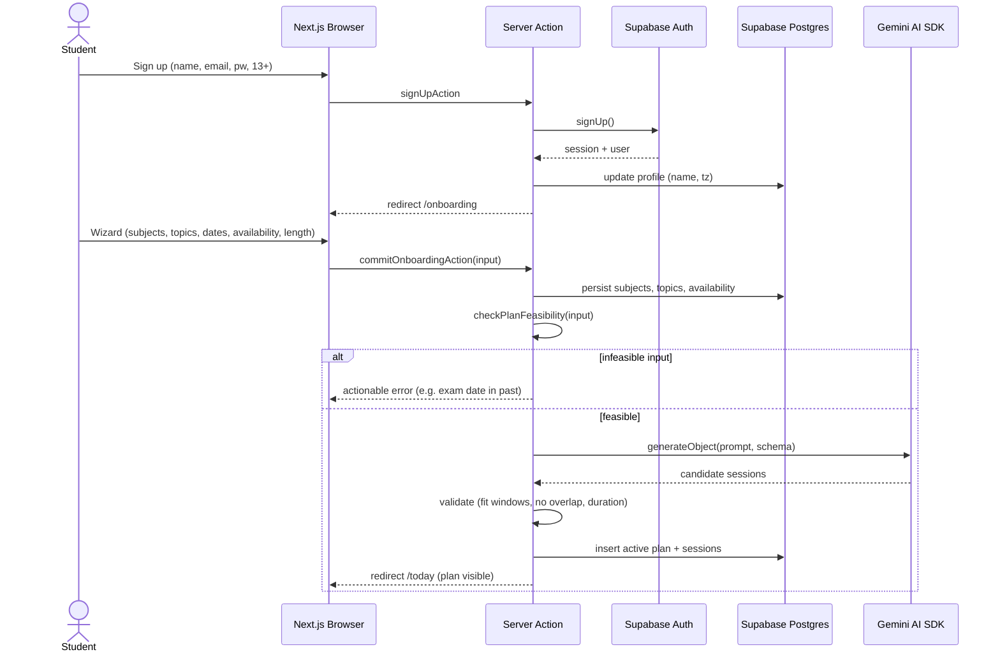

### B2.4 Sequence — Adaptive Re-plan on Missed

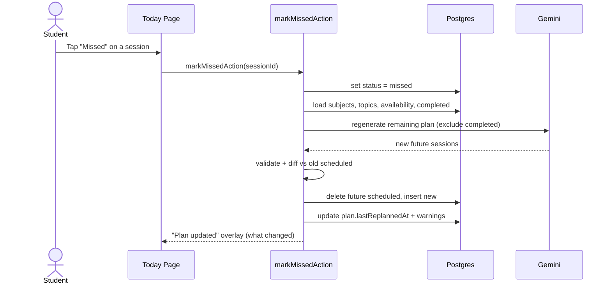

### B2.5 Use-Case Overview

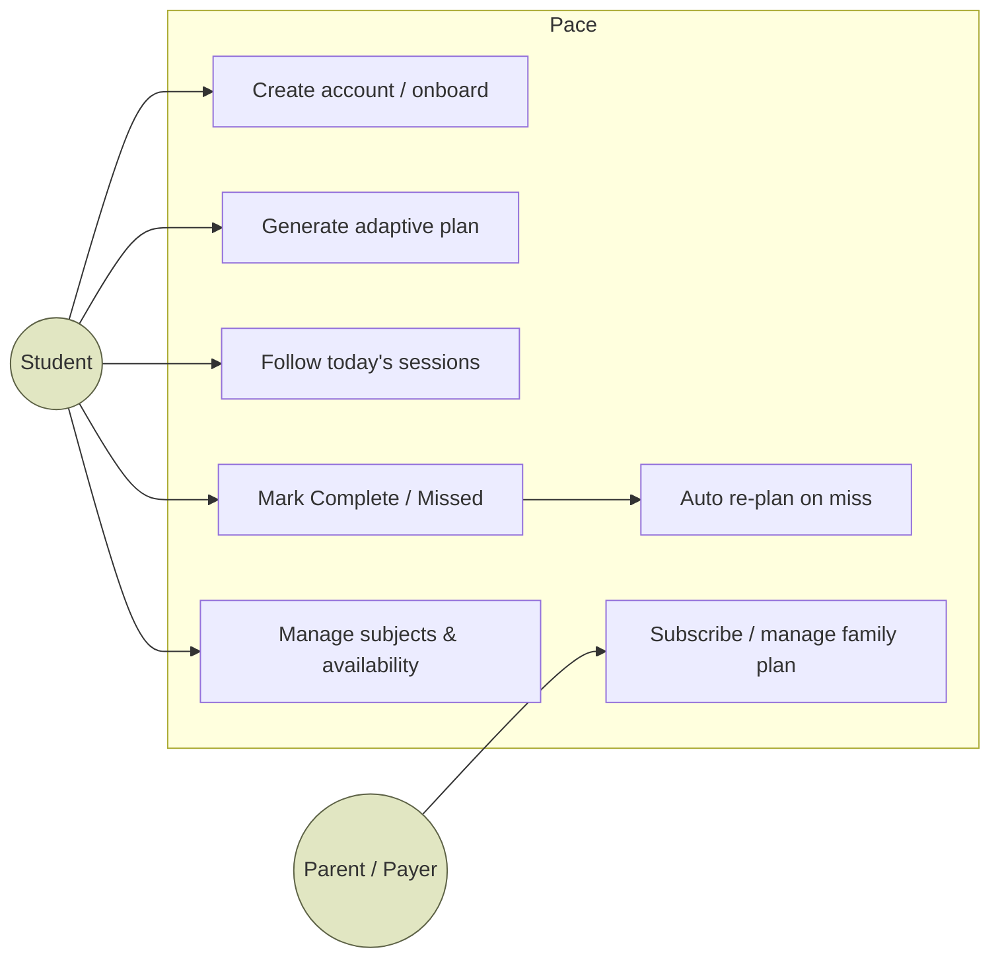

---

## B3. Business Relationship Diagram and ERD

### B3.1 Business Relationship Diagram (value exchange)

Who exchanges what with whom. Solid = money; dashed = value/service/data.

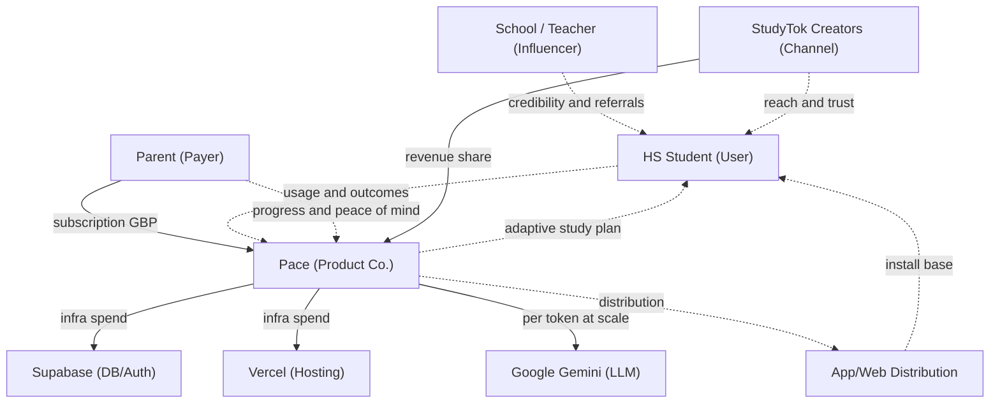

### B3.2 Conceptual ERD (High-Level — Design Level 0)

Entities and relationships only; no attributes. Answers "what things exist and how they relate."

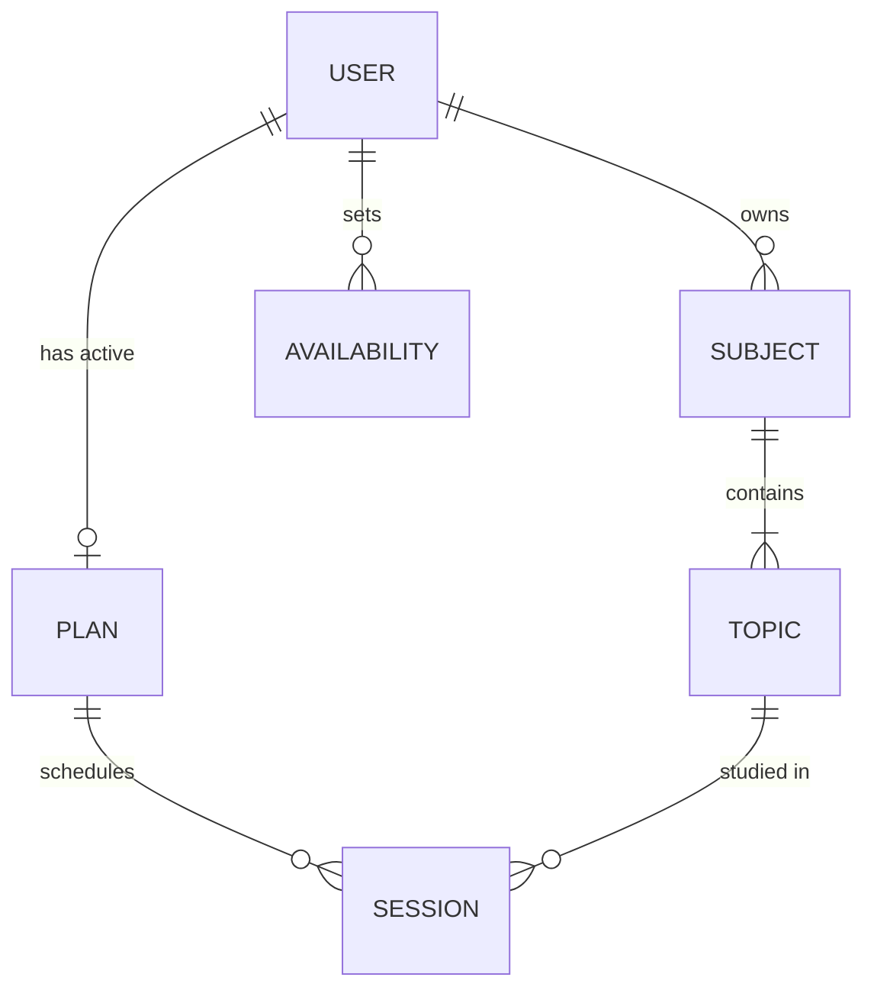

### B3.3 Logical ERD (Low-Level — Design Level 1)

Normalised (3NF), keys shown, database-agnostic types. Answers "what attributes and keys, independent of vendor."

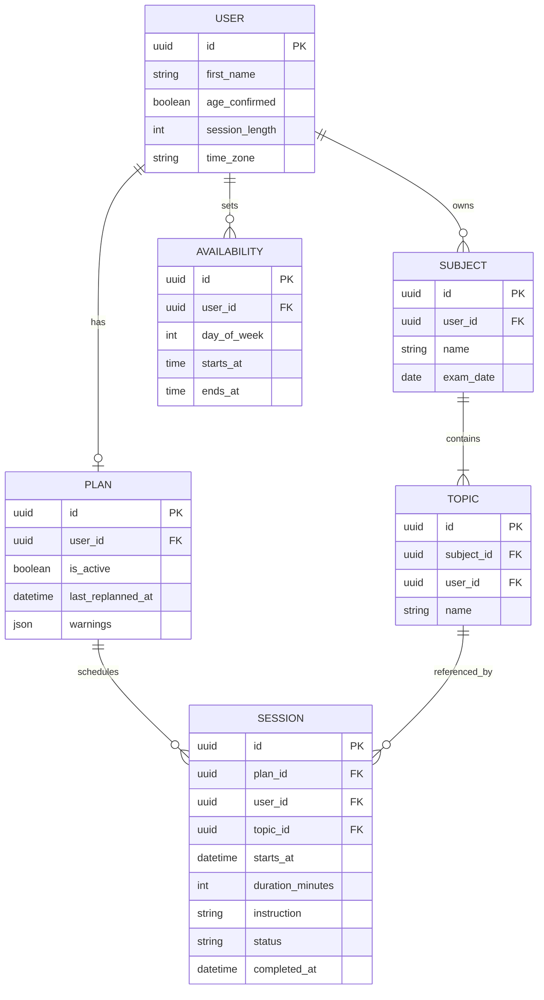

### B3.4 Physical ERD (Low-Level — Design Level 2)

Concrete Supabase/Postgres implementation: real column types, PK/FK, constraints, and Row-Level-Security note. Matches `DATABASE.md` + migration `0002_plan_warnings.sql`.

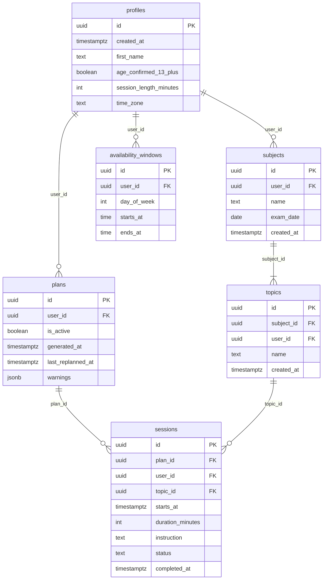

**Physical notes / constraints** (kept in prose so the ERD stays renderer-portable):

- `profiles.id` = `auth.users.id`, `ON DELETE CASCADE`; every other table's `user_id` cascades from `profiles`.
- CHECKs: `profiles.session_length_minutes IN (25,45,60)`; `availability_windows.day_of_week BETWEEN 0 AND 6` and `ends_at > starts_at`; `sessions.status IN ('scheduled','completed','missed')`.
- `plans.warnings` is `jsonb NOT NULL DEFAULT '[]'`; `exam_date`, `last_replanned_at`, `completed_at` are nullable.
- Indexes: `sessions(user_id, starts_at)`; **partial unique** `plans(user_id) WHERE is_active` (one active plan per user).
- RLS ON for every table with per-row `user_id = auth.uid()` policies (`TO authenticated`). A trigger auto-creates a `profiles` row on new `auth.users`. No passwords, analytics, or third-party identifiers stored (minors).

---

## B4. Business Research → Business Modelling

### B4.1 Operational Model

**How the business runs.** Pace is a lean, software-only, direct-to-consumer subscription business. There is no inventory, no logistics, and (in MVP) no human-in-the-loop per plan — the LLM does the work.

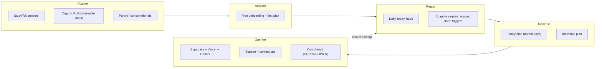

**Operating responsibilities (RACI-lite, MVP → early growth).**

| Function | MVP (founder-led) | Early growth |
|---|---|---|
| Product & Eng | Founder | Founder + 1–2 eng |
| Content / StudyTok | Founder + creators | Creator manager + creators |
| Support | Founder (async) | Part-time support |
| Compliance / Legal | Advisor + templates | Fractional counsel |
| Data / Analytics | Privacy-safe, minimal | Privacy-safe product analytics |

**Key operating constraints (from Part I):** minors as users → no ads, no surveillance, privacy-first; demand is **seasonal** around exam windows; the buyer (parent) and user (student) differ, so activation and monetisation must be designed for both.

### B4.2 P&L / Revenue Model

> **All figures below are ILLUSTRATIVE model inputs (GBP), not measured data.** They are chosen to sit inside the willingness-to-pay bands evidenced in Part I (individual student planners £3–10/mo; family plans ~£80–150/yr) and to make the model computable. Replace with real numbers after a pricing test.

**Revenue streams**

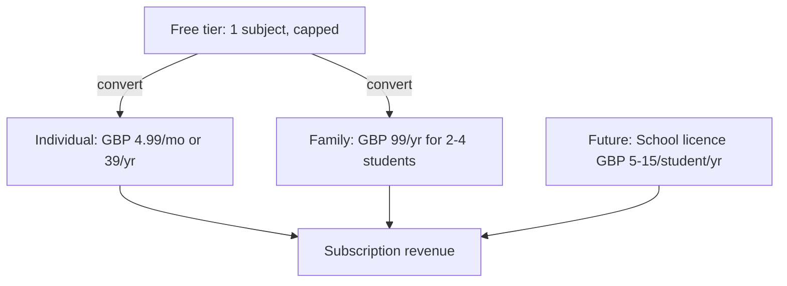

**Cost structure (variable, per paying account / month — ASSUMPTION)**

| Cost | Assumed £/paying acct/mo | Notes |
|---|---|---|
| LLM (plan gen + re-plans) | £0.05–0.20 | Gemini free tier in prototype; paid tier at scale. Few calls/user/mo. |
| Hosting (Vercel + Supabase) | £0.10–0.30 | Fluid Compute + Postgres; scales with usage. |
| Payment fees | ~3% of ARPU | Card + platform fees. |
| **Total variable (COGS)** | **~£0.30–0.65** | Implies **~85–92% gross margin**. |

**Unit economics (ILLUSTRATIVE)**

| Metric | Assumption | Value |
|---|---|---|
| ARPPU (blended ind. + family) | mix-weighted | ~£4.50/mo |
| Gross margin | after COGS | ~88% |
| Avg paid lifetime | high-churn category | 7 months |
| **LTV** (gross contribution) | ARPPU × margin × lifetime | **~£28** |
| **CAC** (blended, creator-led) | low, teen-app benchmark (Part I: Photomath) | **£4–8** |
| **LTV : CAC** | target > 3 | **~3.5–7×** (if churn assumption holds) |
| Payback | CAC / (ARPPU × margin) | ~1–2 months |

> **Biggest risk to these numbers (honest):** the *lifetime* assumption. Part I shows planner churn is high; if avg paid lifetime is 3 months not 7, LTV ≈ £12 and LTV:CAC compresses toward ~1.5–3×. Retention (adaptive re-plan, habit loop) is therefore the single most important lever — not price.

**Illustrative 3-year P&L (scenario, GBP — ASSUMPTION-DRIVEN)**

| Line | Y1 | Y2 | Y3 |
|---|---|---|---|
| Paying accounts (avg) | 1,500 | 12,000 | 45,000 |
| Revenue (ARPPU £4.5 × 12) | £81k | £648k | £2.43m |
| COGS (~12%) | (£10k) | (£78k) | (£292k) |
| **Gross profit** | **£71k** | **£570k** | **£2.14m** |
| S&M (creators, campaigns) | (£45k) | (£260k) | (£730k) |
| R&D (product/eng) | (£90k) | (£240k) | (£520k) |
| G&A (tools, legal, compliance) | (£25k) | (£70k) | (£180k) |
| **EBITDA** | **(£89k)** | **£0k** | **£710k** |

Shape, not certainty: heavy Y1 investment, ~break-even Y2, margin expansion Y3 as the software model's high gross margin drops through once CAC is amortised. Sensitivity is dominated by (1) free→paid conversion and (2) churn.

### B4.3 Go-to-Market × Scalability

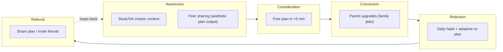

#### Business (positioning & wedge)
- **Wedge:** exam-anchored HS segment (UK A-Level/GCSE first for concreteness; US AP as expansion) — gives the adaptive re-plan a concrete reason to exist and maps onto an existing paid budget (test-prep). See Part I §13.
- **Positioning to the payer:** outcome-framed ("stay on track for your exams / don't fall behind"), never "organise yourself." Parent pays for outcomes, student uses for calm.
- **Moat over time:** retention data + re-plan quality + brand trust with a privacy-first stance for minors (a stance ad-funded competitors cannot easily copy).

#### Resource (what it takes)
- **MVP:** 1 founder-engineer; $0 stack (Vercel Hobby, Supabase Free, Gemini free tier) — see `COST.md`.
- **Early growth:** +1–2 engineers, a part-time creator/community manager, fractional legal/compliance. No sales team (PLG + creator-led).
- **Tooling stays lean and privacy-safe** (no behavioural analytics SDKs; minors).

#### Campaigns (how we acquire)
- **Primary:** TikTok Creator Marketplace, native creator content around exam season (Part I: Photomath's creator campaign drove installs at ~40% lower CPA).
- **Organic PLG:** shareable, aesthetic plan output (the StudyTok currency) as a growth surface.
- **Seasonal cadence:** concentrate spend into the 8–10 weeks before UK exam windows (and US AP), throttle off-season.
- **Referral loop:** student invites friends; family plan invites siblings.
- **Explicitly avoided:** paid ads targeting minors, surveillance/parental-control framing (Part I: 79% teen rejection of such apps).

#### Costing and Operations (what it costs to run + serve)
- **Serve cost per user is near-zero** (software; ~£0.30–0.65/paying acct/mo). The dominant cost is **acquisition (S&M)**, not COGS — so discipline is about CAC and payback, not infra.
- **Infra scales elastically** (Fluid Compute + managed Postgres); no step-function cost cliffs at HS-scale volumes.
- **Compliance is an operating cost, not optional:** architect for COPPA 2.0 (under-17) and GDPR-K now (age gate, minimal data, no ads). This is also a differentiator.

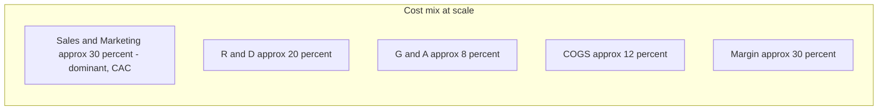

#### Growth (how it compounds)
- **Retention-first:** the adaptive re-plan and the daily "today" habit are the growth engine — every point of retention improvement moves LTV more than any price change (see the P&L sensitivity note).
- **Land-and-expand within the household:** individual → family plan (siblings) is the cheapest expansion.
- **Segment expansion after PMF:** A-Level/GCSE → AP (US) → adjacent exam-anchored segments; later, multi-exam / college-readiness framing (Part I §12) as a larger MVP.
- **Channel expansion:** creator-led → organic PLG → (much later, long-lead) school/teacher credibility and licences — a distribution play, not primary acquisition.

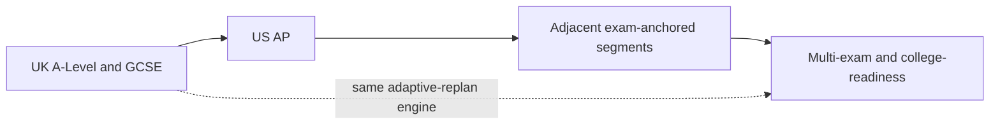

**Growth guardrails (from Part I risks):** commoditised category → win on retention + trust, not features; weak teen self-pay → monetise the parent via family plans; low organic buzz for planners → creator-led seeding is non-optional; seasonality → plan cash and campaigns around exam windows.

---

*End of Part II. Numbers are illustrative model inputs to be replaced with measured data after user interviews and a pricing test; systems diagrams reflect the implemented schema and flows in `DATABASE.md`, `ARCHITECTURE.md`, and `USER-FLOWS.md`.*
